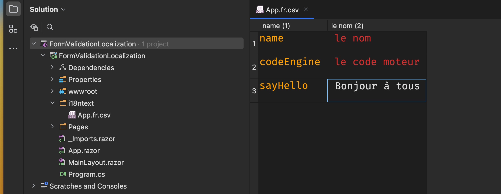
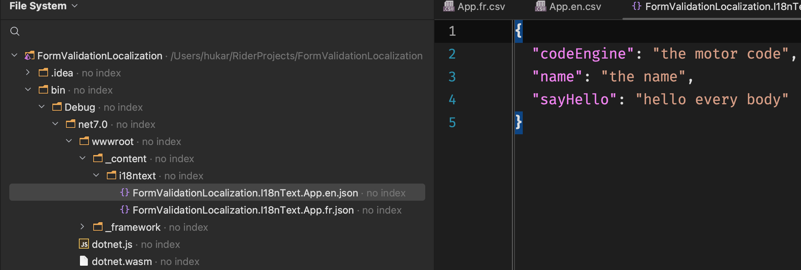
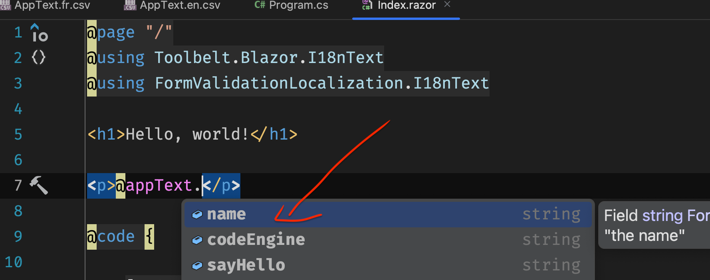

# 16.2 `i18ntext`

https://github.com/jsakamoto/Toolbelt.Blazor.I18nText

Utilisation de fichier `json` et `csv` pour la traduction.

## Installation

```bash
dotnet add package Toolbelt.Blazor.I18nText
```

On créé ensuite un dossier `i18ntext` dans lequel je vais ajouter un fichier `csv`

### `ResourceName.cultureCode.[csv|json]`

`App.fr.csv`

```csv
name, le nom
codeEngine, le code moteur
sayHello, Bonjour à tous
```



Le `plugin` : `CSV Editor` me permet d'avoir un super affichage sur `Rider`.

> Le fichier `csv` doit être encodé en `UTF-8`.

Il faut maintenant `build` le projet.

Les fichiers `csv` sont automatiquement transformés en fichier `json` et ajouter dans le dossier `wwwroot` de l'exécutable:




## Congiguration

Dans `Program.cs`

```cs
using Toolbelt.Blazor.Extensions.DependencyInjection;

// ...

builder.Services.AddI18nText();
```


## Utilisation dans un `Composant`

```cs
@using Toolbelt.Blazor.I18nText
@using FormValidationLocalization.I18nText
    
    // ...
    
@code {

    [Inject]
    public I18nText I18NText { get; set; } = default!;

    AppText appText = new();

    protected override async Task OnInitializedAsync()
    {
        appText = await I18NText.GetTextTableAsync<AppText>(this);
    }
}
```

On peut maintenant utiliser l'objet `appText` dans la partie `template` ou `code` du `composant`, et on a l'`intellisense`



On peut aussi utiliser la syntaxe avec `key string`:

```cs
appText["codeEngine"]
```


## Modifier la langue courante: `SetCurrentLanguageAsync`

### Créer un `selector`

```ruby
@using Toolbelt.Blazor.I18nText
@using FormValidationLocalization.I18nText
```

```html
<select @onchange="SelectCulture">
    <option disabled>@appText.selectLang</option>
    @foreach (var culture in supportedLangCode)
    {
        <option value="@culture">@culture</option>
    }
</select>
```

```cs
[Inject]
public I18nText I18NText { get; set; } = default!;

string[] supportedLangCode = new[] { "fr", "en", };

AppText appText = new();

protected override async Task OnInitializedAsync()
{
    appText = await I18NText.GetTextTableAsync<AppText>(this);
}

async Task SelectCulture(ChangeEventArgs evt)
{
    var langCode = (string?)evt.Value!;
    var selectedCulture = new CultureInfo(langCode);

    CultureInfo.DefaultThreadCurrentCulture = selectedCulture;
    await I18NText.SetCurrentLanguageAsync(langCode);
}
```


### Modifier la `culture` au démarrage

`Program.cs`

```cs
// ...
using Toolbelt.Blazor.Extensions.DependencyInjection;
using Toolbelt.Blazor.I18nText;

// ...

builder.Services.AddI18nText();

var app = builder.Build();

var I18nText = app.Services.GetRequiredService<I18nText>();

CultureInfo.DefaultThreadCurrentCulture = new CultureInfo("fr");
await I18nText.SetCurrentLanguageAsync("fr");

await app.RunAsync();
```

