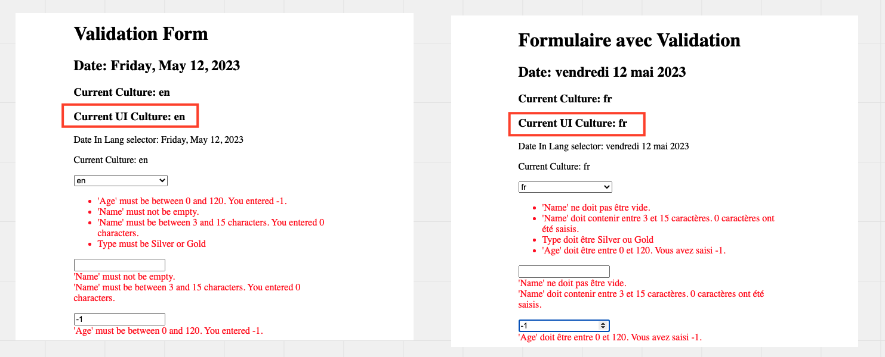
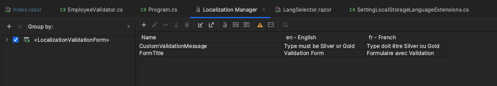
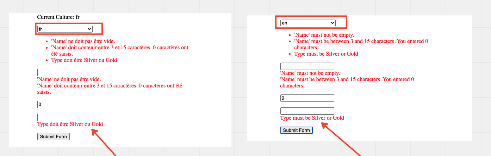

# 16.3 `FluentValidation` et la `localization`


## `Localization` de base

`FluentValidation` possède une `Localization` de ses messages de base.

Celle-ci fonctionne avec `CurrentUICulture`.




## Traduire les `Custom Message`

La méthode `WithMessage` accepte une `lambda` en paramètre pour gérer la traduction (`Localization`):

```cs
WithMessage(e => localizer["CustomValidationMessage"])
```

Voici un exemple complet de `validator`:

```cs
using FluentValidation;
using LocalizationValidationForm.Model;
using LocalizationValidationForm.Resources;
using Microsoft.Extensions.Localization;

namespace LocalizationValidationForm.Validators;

public class EmployeeValidator : AbstractValidator<Employee>
{
    public EmployeeValidator(IStringLocalizer<Data> localizer)
    {
        RuleFor(e => e.Name)
            .NotEmpty().Length(3, 15);
        RuleFor(e => e.Age)
            .InclusiveBetween(0, 120);
        RuleFor(e => e.EmployeeType)
            .MustAsync(IsValidType).WithMessage(e => localizer["CustomValidationMessage"]);
    }

    private static async Task<bool> IsValidType(string employeeType, CancellationToken token)
    {
        var supportedTypes = new[] { "Silver", "Gold" };
        await Task.Delay(2000, token);

        return supportedTypes.Contains(employeeType);
    }
}
```

`IStringLocalizer` est passé par `injection de dépendance` dans le constructeur du `validator`.

C'est possible grâce à cette ligne dans `Program.cs`:

```cs
builder.Services.AddLocalization();
```

Les traductions sont donc dans des fichiers `.resx` :



Et sont affichées comme message d'erreur dans la langue définie par `CurrentUICulture`:




