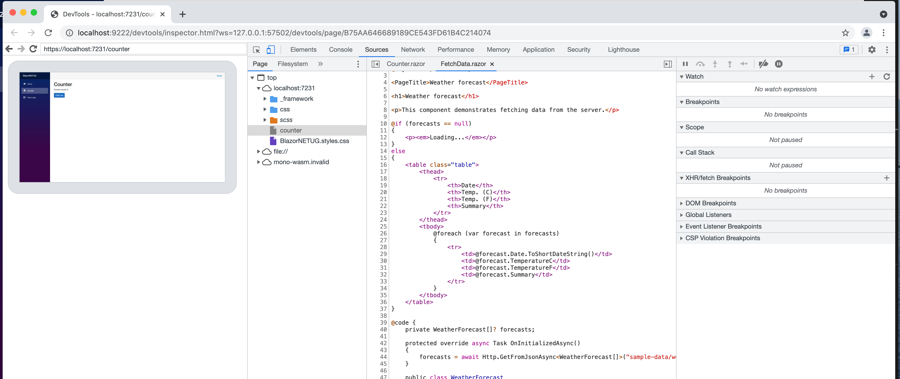
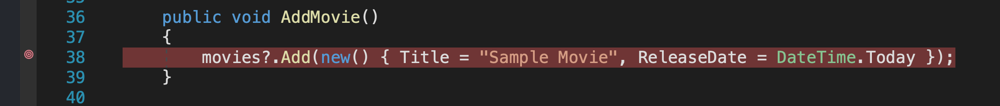
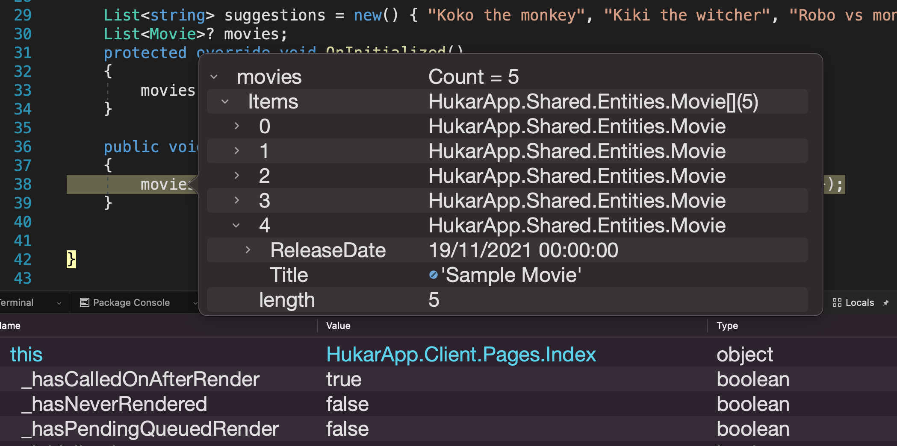
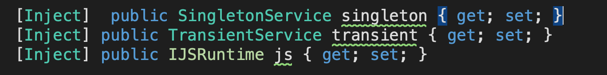
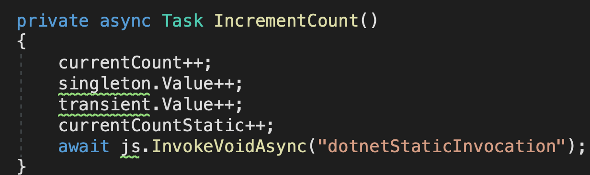
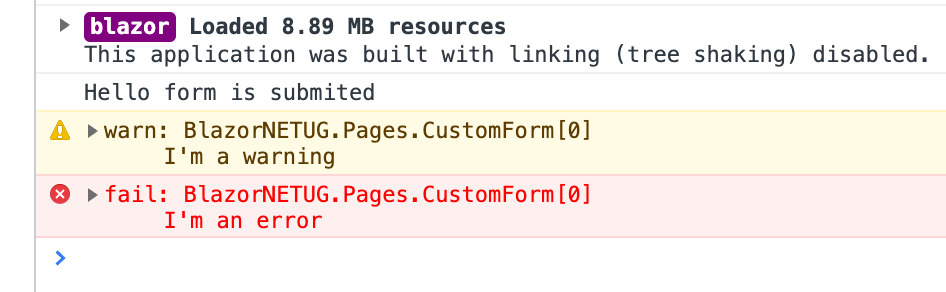

# AA Astuces

## Debugger dans Google Chrome

Il faut exécuter cette commande :

```bash
open -n /Applications/Google\ Chrome.app --args --remote-debugging-port=9222 --user-data-dir=/var/folders/q4/7nvwsl8s0rz348t_ymlnft_m0000gn/T/blazor-chrome-debug https://localhost:7231/
```

Puis on tape `cmd + shift + d` dans la vue.



/Applications/Google Chrome.app/Contents


## Debugger dans une application `--hosted`

Dans le projet `Server` et dans `Properties/launchSettings.json` on doit vérifier d'avoir cette ligne `inspectUri` :

```json
"profiles": {
      "HukarApp.Server": {
        // ...
        "inspectUri": "{wsProtocol}://{url.hostname}:{url.port}/_framework/debug/ws-proxy?browser={browserInspectUri}",
```

Cette ligne est inscrite dans le template créé en `Dotnet CLI`.

On peut donc (dans `Visual Studio for Mac`) mettre un `breakpoint` :



Et on lance le Debbuger :



On peut ainsi suivre la valeur des variables.

> Cela ne fonctionne pas encore dans `VSCode`


## Afficher une date correctement : `ToString("format")`

```cs
<p>@spiderman.releaseDate.ToString("dd MMMM yyyy")</p>
```

`M` un nombre => `7`

`MM` deux nombres => `07`

`MMM` en lettre abrégé => `jul.`

`MMMM` en lettre => `juillet`


## Simuler une tâche asynchrone : `Task.Delay`

On peut vouloir tester le comportement de l'application si une tâche prend un certain temps.

Pour cela on utilise `Task.Delay(<temps ms>)` avec un temps en millisecondes :

```cs
protected async override Task OnInitializedAsync()
{
  await Task.Delay(3000) // 3 secondes
    // ...
}
```


## `ERR_SSL_VERSION_OR_CIPHER_MISMATCH`

https://github.com/dotnet/aspnetcore/issues/18236

C'est un problème avec les certificats.

Pour réinitialiser ses certificats :

```bash
dotnet dev-certs https --clean
dotnet dev-certs https
dotnet dev-certs https --trust
```

Si le bug persiste on modifie le fichier `.csproj` en ajoutant :

```cs
<PropertyGroup>
  <UseAppHost>false</UseAppHost>
</PropertyGroup>
```


## `warning` avec `nullable enable`

Dans les cas où on injecte un service, on a un `warning` :  



On doit alors utiliser `?` et `!`pour éviter ce comportement :

```cs
[Inject]  public SingletonService? singleton { get; set; }
[Inject] public TransientService? transient { get; set; }
[Inject] public IJSRuntime? js { get; set; }
```

 `?`rend un type `nullable`.

On a maintenant des `warning` à l'utilisation des services :



On utilise l'opérateur `!` (`null-forgiving`) :

```cs
singleton!.Value++;
transient!.Value++;
await js!.InvokeVoidAsync("dotnetStaticInvocation");
```


## `Console.WriteLine`

L'utilisation de `Console.WriteLine` dans un `composant` permet d'écrire dans la console du navigateur et non dans celle du processus `.net`.

Le `Console.WriteLine` doit être obligatoirement dans une fonction et non à la racine du bloc `@code`.

> Un bloc `@code` contient les membres du composant :
>
> - Champs et Propriété
> - Méthodes

On peut aussi utiliser un `ILogger<Type>` :

```cs
@inject ILogger<CustomForm> _logger

<EditForm OnValidSubmit="HandleValidSubmit">
    <button type="submit">Submit</button>
</EditForm>

@code {
  void HandleValidSubmit()
  {
    Console.WriteLine("Hello form is submited");
    _logger.LogWarning("I'm a warning");
    _logger.LogError("I'm an error");
  }
}
```




## `DEBUG` conditionnel

Une constante `DEBUG` est définie tant qu'on n'est pas en `RELEASE`.

On peut l'utiliser pour pouvoir écrire des parties seulement pour le `DEBUG`.

On peut centraliser sa valeur dans `AppState.razor` par exemple :

```cs
<CascadingValue Value="this">
    @ChildContent
</CascadingValue>

@code {
    [Parameter] public RenderFragment? ChildContent { get; set; }

    // DEBUG mode or not (for template)
    public bool IsDebug { 
        get {
            #if DEBUG
            return true;
            #else
            return false;
            #endif
        }
    }
```

Et on l'utilise dans un `composant` :

```cs
@if(State!.IsDebug)
{
  <MudSelectItem Value="@(new Designee() { Id = 667, Name = "Titi"})">
    Titi
  </MudSelectItem>
}
```

On peut ainsi avoir des valeurs seulement pour le `DEBUG`.
