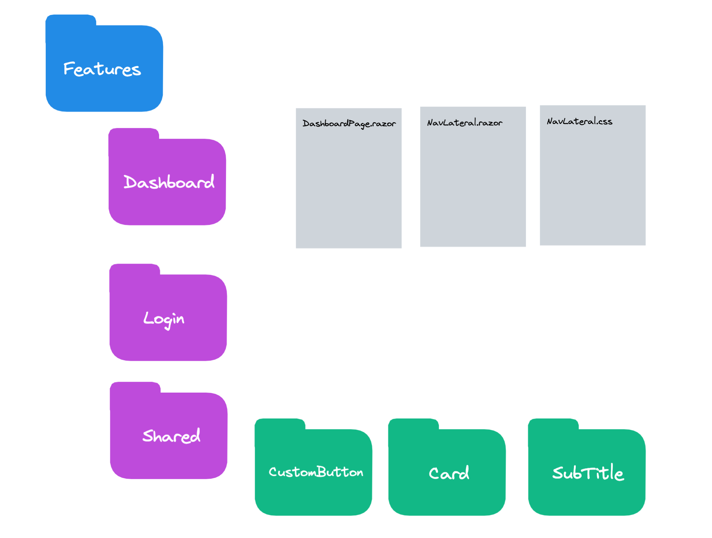
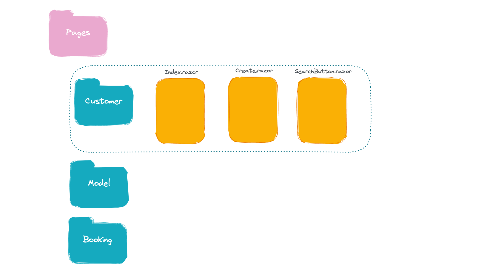

# CC `Blazor` architecture

`Blazor` n'est pas basé sur les conventions mais sur la reflection, on peut donc mettre les différents composants là où on veut.

L'organisation de l'application est totalement de la responsabilité du dévelopeur.


## Organisation par `Features`



On peut ajouter le suffixe `Page` pour désigner un composant `page`.

### Organiser par table

On peut aussi organiser par `entity` ayant une table en `DB`.




## Version `--hosted`

La version `--hosted` se divise en `3` projets

- `Client`
- `Server`
- `Shared`

Il est intérressant de placer son `Domain` dans `Shared` pour avoir les classes accessible dans le `Client` et le `Server`.


### Classe `BaseDomainModel` : classe d'`audit`

Il est intérressant d'avoir une classe réunissant les propriétés que toutes les entités du `Domain` possède.

```cs
public abstract class BaseDomainModel
{
  public int Id { get; set; }
  public string CreatedBy { get; set; } = String.Empty;
  public DateTime DateCreated { get; set; }
  public string UpdatedBy { get; set; } = String.Empty;
  public DateTime DateUpdated { get; set; }
}
```

On a des classes du `Domain` ainsi simplifiées :

```cs
namespace Shared.Domain;

public class Make : BaseDomainModel
{
    public string Name { get; set; } = String.Empty;
}
```


## Créer une classe avec les `Endpoints`

Pour éviter les  `"constantes magiques"`  dans le code, il est bien d'organiser le chemin des `Endpoints` dans une classe `static`.

C'est une sorte d'`Enum` de `string`.

On peut les ranger dans le dossier `Static` par exemple.

```cs
public static class Endpoints
{
    private static string Prefix = "api";
    
    public static string MakesEndpoint = $"{prefix}/makes/";
    public static string CustomersEndpoint = $"{prefix}/customers/";
	public static string VehiclesEndpoint = $"{prefix}/vehicles/";
	// ...
}
```

On peut comme ça facilement retrouver ses `Endpoints` avec l'`Intellisense`.

### Utilisation

```cs
protected async override Task OnInitializedAsync()
{
    Makes = await httpClient.GetFromJsonAsync<List<Make>>(Endpoints.MakesEndpoint);
}
```

```cs
await httpClient.DeleteAsync($"{Endpoints.MakesEndpoint}/{makeId}");
```

