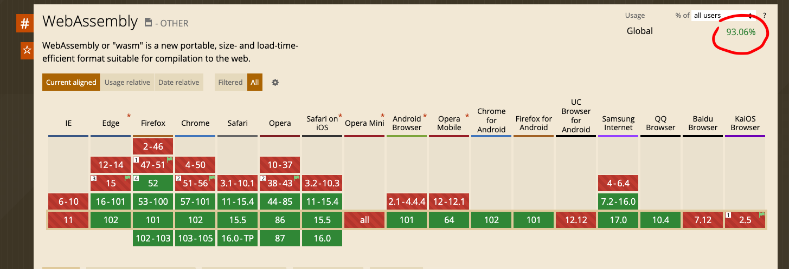
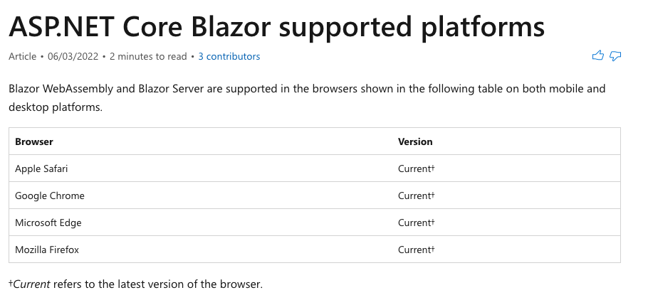
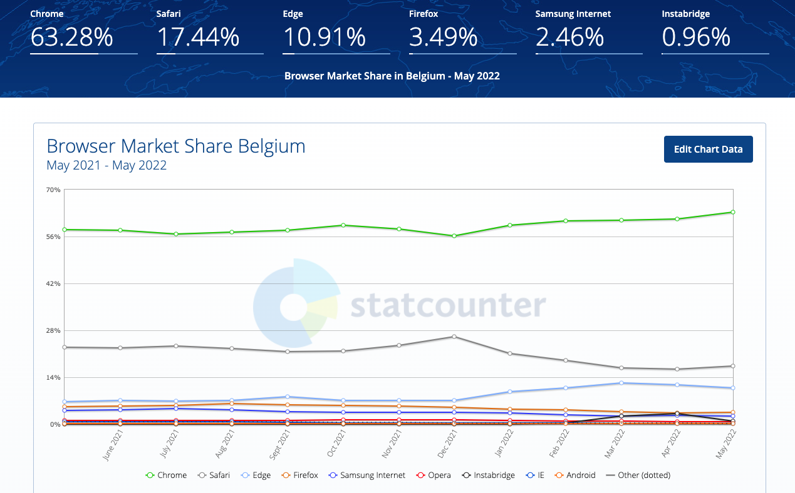

# EE `Blazor wasm` Compatibilité et performance

Sur Caniuse :

https://caniuse.com/wasm

On voit une compatibilité de 93,06% des navigateurs.

### Sur le site de Microsoft `.net`

### Remarque sur le site `Pluralsight`

Par Gill Cleeren aussi MVP en Belgique (Anvers ??)

> ### Q: Does Blazor support all major browsers today?
>
> A: It really depends on the hosting model of Blazor you are going to use. If you plan to use Blazor WebAssembly (WASM), then your browser needs to have support for WASM. That is the case for all modern browsers, including on mobile. Your Blazor WASM application will run fine on Chrome, Edge, Firefox, Safari and also on the mobile variants of these.
>
> However, Internet Explorer doesn’t support WASM and therefore can’t run client-side Blazor apps. If this is important for your case, then you can still use Blazor server-side. In that case, the code executes on the server and then there is no client-side support required for WASM.

## Navigateurs utilisés en Belgique

Données du site :

https://gs.statcounter.com

### Données par version de navigateur

D'après le fichier `csv` récupéré sur `statcounter.com`

| version navigateur                | %  |
| ---------------------- | ----- |
| Chrome 101.0           | 32,02 |
| Chrome for  Android    | 14,43 |
| Safari iPhone          | 11,94 |
| Edge 101               | 9,96  |
| Chrome 100.0           | 8,43  |
| Chrome 102.0           | 3,87  |
| Safari 15.4            | 2,36  |
| Firefox 100.0          | 2,35  |
| Samsung  Internet 17.0 | 1,49  |
| Instabridge  21.9      | 0,96  |
| Chrome 99.0            | 0,89  |

On voit que ce début de liste représente déjà presque `90 %` (`87,74 %`) et sont tous compatibles (sauf `Instabridge` où je n'ai pas d'info).

Pour le reste de la liste `ie 11` ne représente que `0,17 %` et on peut facilement ajouter à la grosse louche `4` ou `5 %` de navigateurs compatible (peut être plus).

Bref on avoisine certainement les `95 %` de navigateurs compatible avec `WebAssembly` et de ce fait compatible avec `Blazor Wasm`.

