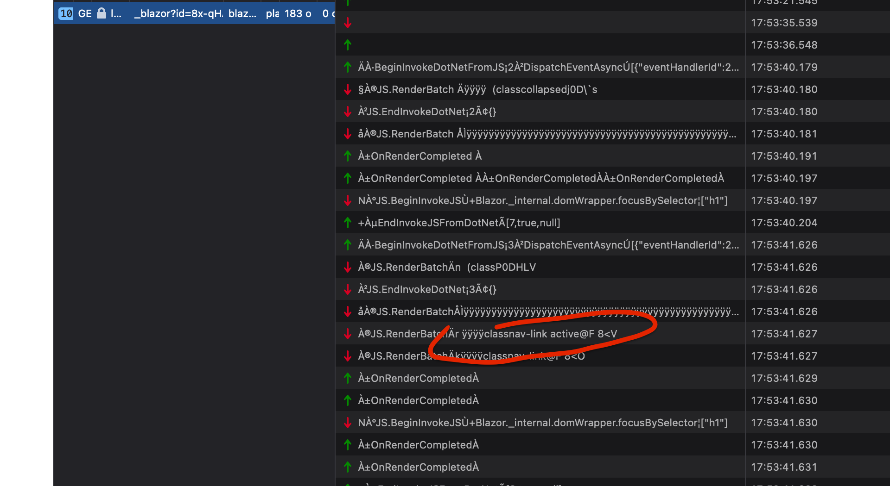
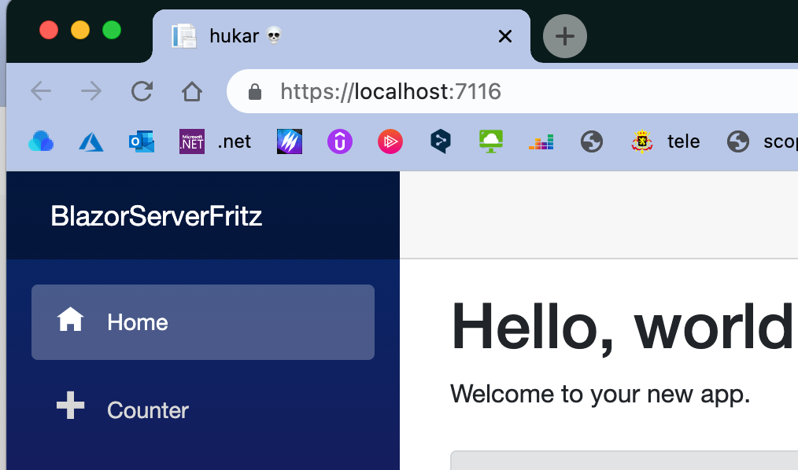
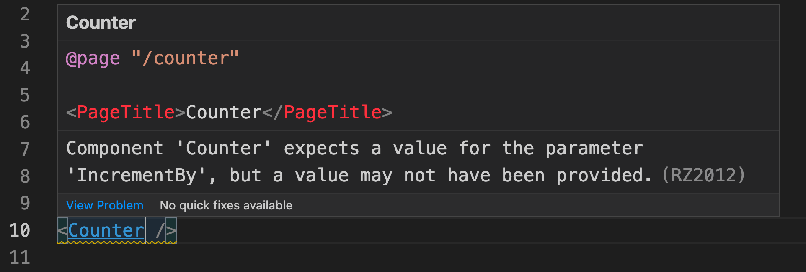
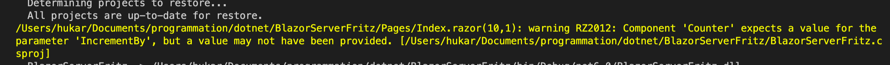
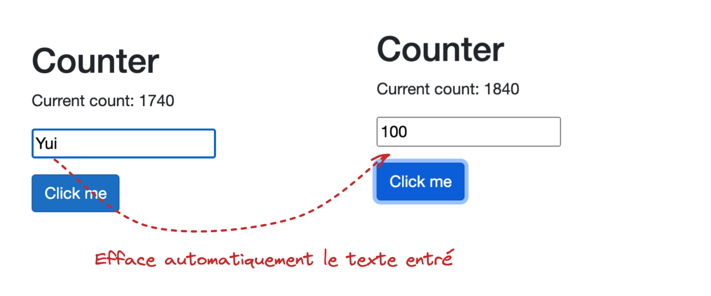

# 01 Get started building applications with `Blazor`

## `Ahead-Of-Time` compilation : `AOT`

On peut dire compilation à l'avance. C'est une possibilité de `Blazor`.


Avec `Blazor Wasm` tout ce qui est envoyé au navigateur peut-être décompilé.

Si on a besoin de cacher le code, il vaut mieux utiliser `Blazor Server`.


## `MAUI` et `Blazor`

Dans le futur il sera possible pour une application `Blazor` d'être "copiée" dans une application `MAUI` un peu à la façon d'`Electron`.


## Static Web Site

`Blazor Wasm` peut être hébergé sur un serveur web statique comme `React` ou `Angular`.


## `Blazor Server`

Le rendu du site est créer sur le serveur (comme avec `PHP` ou `.net MVC`).

On le voie dans le fichier `_Host.cshtml` : `SereverPrerendered`

```html
@page "/"
@namespace BlazorServerFritz.Pages
@addTagHelper *, Microsoft.AspNetCore.Mvc.TagHelpers
@{
    Layout = "_Layout";
}

<component type="typeof(App)" render-mode="ServerPrerendered" />
```

Le `html` nécessaire aux modifications de la page est transmit via un `WebSocket` :



Toute la logique est exécutée sur le serveur.

Une connexion permanente "repeint" la page en envoyant le `html` requis par l'action envoyée.

### La connexion est obligatoire : cela renforce la sécurité


## `<base href="" />`

```html
<head>
	<base href="~/" />
```

Défini à partir de où commence le routage.


## `<PageTitle>`

Modifie le titre de la page.

```html
<PageTitle>hukar 💀</PageTitle>
```




## Composant

Si on nomme un fichier `QuelqueChose.razor` alors celui-ci peut-être utilisé dans un autre fichier `razor` comme `HTML Tag` :

```html
<QuelqueChose Title="hello quelque chose" />
```


## Custom Attribut des Composants : `[Parameter]`

Un composant peut avoir un custom attribut :

```html
<QuelqueChose Citation="Hello les gars" />
```

`QuelqueChose.razor`

```cs
<p>@Citation</p>
    
@code {
    [Parameter]
    public string? Citation { get; set; }
}
```

### On écrit dans la partie template la valeur d'une propriété avec `@`.


## `<HeadContent>`

On peut dans chaque page `Blazor` ajouter du contenu pour la balise `<head>` avec `<HeadContent>`.

```html
@page "/mypage"

<PageTitle>My page</PageTitle>
<HeadContent>
	<meta name="description" content="my super page" />
</HeadContent>
```


## `@onclick`

À chaque fois qu'une méthode du composant est appelée par un événement `Blazor` (avec `@` comme `@onclick`), la vue est repeinte (re-rendue) 

>  comme si la méthode `        StateHasChanged();` était appelée.


## `[EditorRequired]`

Spécifie à l'éditeur que le paramètre est obligatoire.

```cs
[Parameter]
[EditorRequired]
public int IncrementBy { get; set; } = 1;
```



C'est une indication dans l'éditeur (`warning`) mais cela ne génère pas d'erreur.



Cela crée un `warning` de compilation aussi.


## `Component` et `Page`

Les `Page`sont des `Component` et peuvent être utilisés dans d'autres `Pages`.


## `@bind`

Modèle de `two way data binding` :

```html
<input type="text"  @bind="IncrementBy">
```

Il semble que `Blazor` ne permettent l'entrée que du type `bindé` ici `int`.




