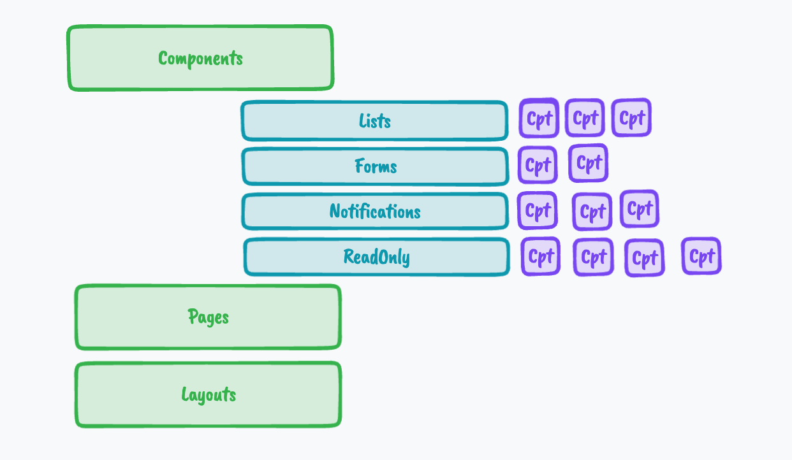
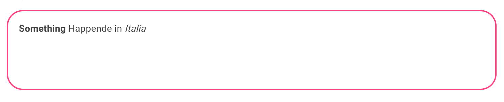
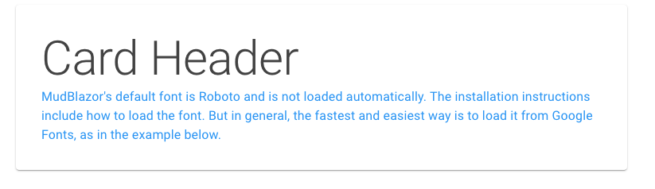
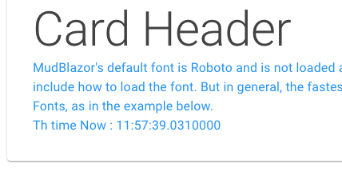
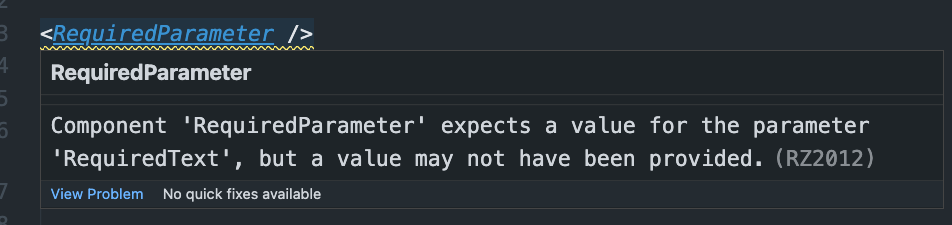

# 02 `Component`, `Layout` et `Style`

> Attention de ne pas coupler les composants directement avec le fournisseur de données (`database`, `api`, ...) mais plutôt d'utiliser des services.
>
> Ainsi un composant n'est pas limité par l'environnement qui l'emploie (`Blazor Wasm`, `Blazor Server`, `Blazor MAUI`) et peut être utilisé quel que soit le type de projet.


## Organisation des `components`




## `Child Component` : `RenderFragment`

```html
<HuCard>
    <HuCardHeader>My Super Title</HuCardHeader>
    <HuCardContent>My super hyper content</HuCardContent>
</Hucard>
```

`HuCard.cs`

```cs
<div class="pa-4 border-2 border-solid mud-border-secondary rounded-xl">
    @ChildContent
    <hr class="py-8" />
</div>

@code {
    [Parameter] public RenderFragment? ChildContent { get; set; }
}
```

On **doit** utiliser une propriété avec le nom `ChildContent`.

Utilisation dans un autre élément :

```html
<HuCard>
    <p><b>Something</b> Happende in <i>Italia</i></p>
</HuCard>
```




## Deux `RenderFragment`s

On peut vouloir placer plusieurs "fenêtres" dans son composant, c'est possible en nommant chaque `RenderFragment` :

`Card.razor`

```cs
<MudPaper class="mx-8 pa-8">
    <MudText Typo="Typo.h2">
        @CardHeader
    </MudText>    
    <MudText Typo="Typo.body1" Color="Color.Info">
        @CardBody
    </MudText>
</MudPaper>

@code {
    [Parameter] public RenderFragment? CardHeader { get; set; }
    [Parameter] public RenderFragment? CardBody { get; set; }
}
```

Ensuite lorsqu'on utilise notre composant `Card.razor`

```cs
<Card>
    <CardHeader>
        Card Header
    </CardHeader>
    <CardBody>
        MudBlazor's default font is Roboto and is not loaded automatically. The installation instructions include how to load the font. But in general, the fastest and easiest way is to load it from Google Fonts, as in the example below.
    </CardBody>
</Card>
```



Si on n'utilise pas des balises supplémentaire comme `<CardHeader>` et `<CardBody>`, il faut nommer notre `RenderFragment` : `ChildContent` obligatoirement (et pas besoin d'utiliser de balises supplémentaires).


### Exécuter du code dans un `RenderFragment`

On peut exécuter une méthode directement dans la partie `RenderFragment` :

```cs
	// ...
	<SecondCardBody>
        MudBlazor's default font is Roboto and is not loaded automatically. The installation instructions include how to load the font. But in general, the fastest and easiest way is to load it from Google Fonts, as in the example below.
        <hr />
        Th time Now : @DateTime.Now.TimeOfDay
    </SecondCardBody>
</SecondCard>
```




## `EditorRequired`

Permet de rendre un paramètre obligatoire :

```cs
<p>
    @RequiredText
</p>

@code {
    [Parameter] [EditorRequired]
    public string RequiredText { get; set; } = string.Empty;
}
```

Cela créé un `warning` visible dans l'éditeur




## `Collection` et `RenderFragment`

On veut pouvoir boucler sur un élément passer par l'intermédiaire d'un `RenderFragment`.

### Composant boucle : `MultiPet.razor`

```cs
<MudText Typo="Typo.h2">Multi Pet Render Fragment</MudText>

    @if(PetContent is not null && Pets is not null)
{
    @foreach(var pet in Pets)
    {
        @PetContent(pet)
    }
}

@code {
    [Parameter] public List<string>? Pets { get; set; }
    [Parameter] public RenderFragment<string>? PetContent { get; set; }
}
```

On ajoute un type à `RenderFragment` et on lui donne un nom.


### Composant `Item` : `DisplayPet.razor`

```cs
<MudCard class="mt-3">
    <MudCardContent>
        <MudText Typo="Typo.body1">@Pet</MudText>
    </MudCardContent>
</MudCard>

@code {
    [Parameter] public string? Pet { get; set; }
}
```

Il reçoit un `Pet` en `Parameter`.


### Utilisation dans une page

```cs
<MultiPet Pets="pets">
    <PetContent Context="p">
        <DisplayPet Pet="@p"></DisplayPet>
    </PetContent>
</MultiPet>
    
@code {
    List<string> pets = new() { "tiger", "monkey", "cobra"};
}
```

Le `RenderFragment<string>` de vient une balise `<PetContent>`.

On utilise la propriété `Context` pour récupérer le `pet` passé par la boucle `@foreach` de `MultiPet.razor`.


## Version générique : les `Templates`

Création d'une liste générique.

Dans une `Page`

```html
<ListTemplate TItem="Pet" Items="PetCollection">
	<ItemContent Context="item">
    	<MyCard HeaderText="item.Title">
        	@item.Content
        </MyCard>
    </ItemContent>
</ListTemplate>
```


### `ListTemplate.razor`

```cs
@typeparam TItem
    
@if(ItemContent is not null && Items is not null)
{
    @foreach(var item in Items)
    {
        @ItemContent(item)
    }
}

@code {
    [Parameter] public RenderFragment<TItem> ItemContent { get; set; }
    [Parameter] public ICollection<TItem> Items { get; set; }
}
```

On utilise `@typeparam` pour faire de la généricité dans notre composant.

Le `Type` est donc passer par un paramètre `TItem` et la collection via `Items`:

```html
<ListTemplate TItem="Pet" Items="pepets">
```


### Utilisation avec un composant dans une page

`PetCard.razor`

```cs
<MudCard class="ma-4 d-inline-flex">
    <MudCardContent>
        <MudText Typo="Typo.h5">@Pet?.Title</MudText>
        <hr>
        <MudText Typo="Typo.body1">@Pet?.Name</MudText>
    </MudCardContent>
</MudCard>

@code {
    [Parameter] public Pet? Pet { get; set; }
}
```

C'est simplement le composant `Card` affichant chaque `Pet`.

Dans la page :

```cs
<ListTemplate TItem="Pet" Items="pepets">
    <ItemContent Context="p">
    	<PetCard Pet="p"></PetCard>
    </ItemContent>
</ListTemplate>

@code {
    List<Pet> pepets = new() {
        new("Super Cat", "Minouchi"),
        new("Amazing monkey", "Toyo"),
        new("Hyper marvelous cobra", "Kaï"),
    };
}
```

On doit passer le type avec la propriété `TItem` correspondant à l'attribut `@typaparam` du composant `ListTemplate.razor`.

Le `record` servant de modèle :

`Pet.cs`

```cs
namespace MudBlazorTest.Models;

public record Pet(string Title, string Name);
```


## Nouveau `Layout`

Un `Layout` est un composant qui hérite de `LayoutComponentBase`

On peut ensuite l'utiliser avec la directive `@layout HukarLayout`.


## Service

### Création du `service`

```cs
using MudBlazorTest.Models;

namespace MudBlazorTest.Data;

public class PetRepository
{
    List<Pet> Pets =  new() {
        new("Super Cat", "Minouchi"),
        new("Amazing monkey", "Toyo"),
        new("Hyper marvelous cobra", "Kaï"),
        new("Tchouk Tchouk Mouse", "Maoussa"),
    };

    public List<Pet> Get() => Pets;
}
```

C'est ici qu'on peut par la suite lancer son appel à l'api :

```cs
public List<Pet> Get() => HttpClient.GetFromJson<IEnumerable<Pet>>("/api/pets");
```


### Enregistrement du `Service`

On enregistre son `service` le fichier `Program.cs` :

```cs
// ...

builder.Services.AddScoped(sp => new HttpClient { BaseAddress = new Uri(builder.HostEnvironment.BaseAddress) });
builder.Services.AddMudServices();
builder.Services.AddScoped<PetRepository>();
```


## Utilisation du `service` avec `@inject`

```cs
@page "/counter"
@layout HukarLayout
@inject PetRepository repo
    
<ListTemplate TItem="Pet" Items="@repo.Get()">
    <ItemContent Context="p">
    <PetCard Pet="p"></PetCard>
    </ItemContent>
</ListTemplate>
```


## Utiliser un nouveau `Layout`

### Créer un nouveau `layout`

Un `Layout` est un simple composant `Blazor` qui hérite de `LayoutComponentBase`

Il faut mettre en haut du composant `@inherits LayoutComponentBase`.

Le contenu de la page est injecté via la variable `@Body`.


### Utilisation dans une page

Il suffit d'utiliser la directive `@layout` :

```cs
@page "/counter"
@inject RobotRepository repo
@layout HukarLayout // <= ici

<PageTitle>Counter</PageTitle>
```

