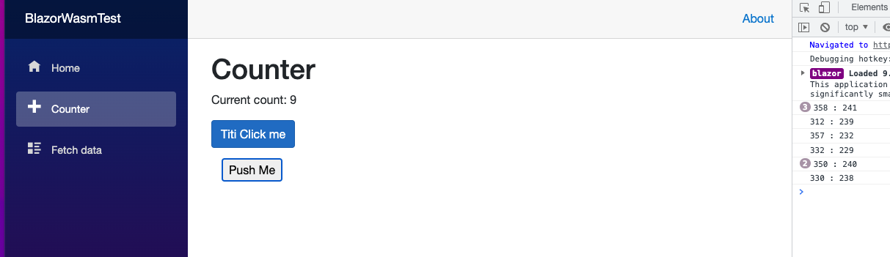
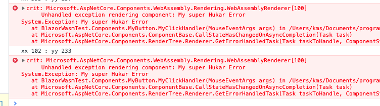
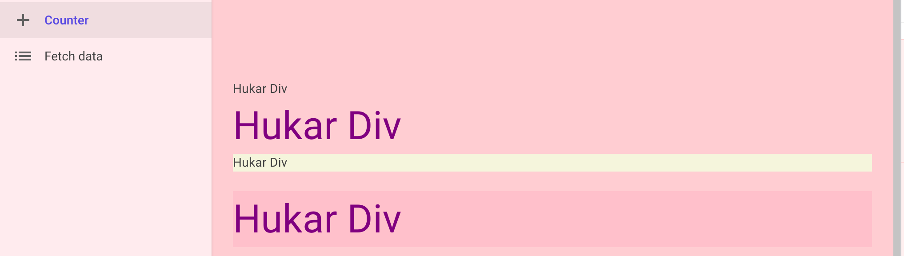

# 03 `event` et `state`

## `@onclick`

> `MudBlazor` permet d'utiliser `OnClick` (ce qu'on va voire) mais aussi `@onclick` sur ses propres composants (comment font-ils ???)

###  `EventCallback`

Dans une page :

```cs
<MyButton OnClick="IncrementCount">Push Me</MyButton>

@code {
	private int currentCount = 0;

    private void IncrementCount()
    {
        currentCount++;
    }
}
```

Dans `MyButton.razor`

```cs
<div style="padding:8px;margin:6px;">
    <button style="padding: 2px 8px" @onclick="OnClick">
    	@ChildContent
    </button>
</div>

@code {
    //[Parameter] public EventCallback OnClick { get; set; }
    [Parameter] public EventCallback OnClick { get; set; }
    [Parameter] public RenderFragment? ChildContent { get; set; }
}
```

On peut ainsi exécuter une méthode du parent grâce à un événement du composant enfant.

Il est possible d'enclencher le `EventCallback` depuis une méthode du composant enfant :

```cs
<div style="padding:8px;margin:6px;">
    <button style="padding: 2px 8px" @onclick="MyClickHandler">
    	@ChildContent
    </button>
</div>

@code {
    //[Parameter] public EventCallback OnClick { get; set; }
    [Parameter] public EventCallback<MouseEventArgs> OnClick { get; set; }
    [Parameter] public RenderFragment? ChildContent { get; set; }

    public async Task MyClickHandler(MouseEventArgs args)
    {
        Console.WriteLine($"{args.ClientX} : {args.ClientY}");
        await OnClick.InvokeAsync(args);
    }
}
```

 `InvokeAsync` notifie le parent de l'événement et lui passe `args`.

C'est une action `async` car elle fait intervenir la communication avec `javascript` (c'est lui qui capte le clic sur le bouton).

Toute action d'interopabilité est par essence `async`.




Un `EventCallback` peut être simple ou générique comme `EventCallback<MouseEventArgs>`.


### Utilisation de `MouseEventArgs`

On veut incrémenter de `10` si la touche `shift` est enfoncée :

```cs
<MyButton OnClick="IncrementCount">Push Me</MyButton>
@code {
    private int currentCount = 0;

    private void IncrementCount(MouseEventArgs args)
    {
        if(args.ShiftKey == true) currentCount += 10;
        else currentCount++;
    }
}
```


## Les erreurs

Les erreurs sont renvoyées dans la console `javacsript` :

```cs
public async Task MyClickHandler(MouseEventArgs args)
{
    Console.WriteLine($"xx {args.ClientX} : yy {args.ClientY}");
    throw new Exception("My super Hukar Error");
    await OnClick.InvokeAsync(args);
}
```



> Voire `Error Bundary`


## Composant programmatique

On peut créer entièrement en code un composant

`HandCodedComponent.cs`

```cs
using Microsoft.AspNetCore.Components;
using Microsoft.AspNetCore.Components.Rendering;

namespace BlazorWasmTest.Components;

public class HandCodedComponent : ComponentBase
{
    protected override void BuildRenderTree(RenderTreeBuilder builder)
    {
        builder.
        builder.AddContent(1, "Hello from Hu Card Coded Element");
        
        base.BuildRenderTree(builder);
    }
}
```

On peut ensuite l'utiliser comme ceci :

```html
<button class="btn btn-primary" @onclick="IncrementCount">
    Titi Click me
</button>
<br>
<HandCodedComponent />
```


# Attribute splatting

C'est la possibilité de récupérer les attributs d'un composant.

On obtient un `dictionary` où la clé est le nom de l'attribut.

## Exemple simple avec `class` et `style`

`HukarDiv.razor`

```cs
<div style="@(Values != null && Values.ContainsKey("style") ? Values["style"] : "")">
    <p class="@(Values != null && Values.ContainsKey("class") ? Values["class"] : "")">Hukar Div</p>
</div>

@code {
    [Parameter(CaptureUnmatchedValues = true)]
    public Dictionary<string, object>? Values { get; set; }
}
```

`HukarDiv.razor.css`

```css
.hukar {
    font-size: 44px;
    color: purple;
}
```


Dans le parent :

```cs
<HukarDiv />
<HukarDiv class="hukar" />
<HukarDiv style="background-color:beige" />
<HukarDiv class="hukar" style="margin-top:22px;background-color:pink;" />
```




## Utiliser `@onclick` dans un composant à soi.

On doit pour cela passer les attributs du donnés par le `parent` au `composant` à l'intérieur de son `template`.

#### On utilise `[Parameter(CaptureUnmatchedValues = true )]`.

`HuButton.razor`

```cs
<div>
    <button @attributes="AdditionalAttributes">Hello</button>
</div>

@code {
    [Parameter(CaptureUnmatchedValues = true)] public Dictionary<string, object> AdditionalAttributes { get; set; }
}
```

Dans le parent :

```cs
<HuButton @onclick="DoSomething" />


@code {
    public void DoSomething()
    {
        Console.WriteLine("Do Something !!!");
    }
}
```

La directive `@attributes` permet de placer tous les attributs récupérés.

`CaptureUnmatchedValues = true` est obligatoire pour que cela fonctionne.  


## `Cascading Parameters`

On utilise une balise `<CascadingValue Name="..." Value="...">` pour passer des données aux composants imbriqués :

```cs
<CascadingValue Name="BodyBgColor" Value="@("lightBlue")">
    <CascadingValue Name="BodyFontColor" Value="@("purple")">
    	<HuCard HeaderText="Blazor Cascading">
    		Yo !!
    	</HuCard>
    </cascadingValue>
</CascadingValue>
```

Pour passer des `string` on doit utiliser l'écriture `@("myString")`.

Dans mon composant je récupère les données avec `[CascadingParameter(...)]` :

#### `[CascadingParameter(Name ="BodyBgColor")]`

```cs
<div class="pa-4 border-2 border-solid mud-border-secondary rounded-xl ma-2 d-inline-block pink lighten-5">
    <MudText Typo="Typo.h3" style="@($"background-color:{BgColor};color:{Color};")">
        @HeaderText
    </MudText>
    <hr style="@($"border:1px solid {Color}")" class="my-3" />
    <p>@ChildContent</p>
    
</div>

@code {
    [Parameter] public string HeaderText { get; set; } = string.Empty;
    [Parameter] public RenderFragment? ChildContent { get; set; }
    [CascadingParameter(Name ="BodyBgColor")] 
    public string BgColor { get; set; } = string.Empty;
    [CascadingParameter(Name ="BodyFontColor")] 
    public string Color { get; set; } = string.Empty;
}
```


## `State`

On peut utiliser une classe `State` et l'utiliser comme un service :

`State.cs`

```cs
namespace TestSelectText.Models;

public class State
{
   public int CounterCount { get; set; } 
}
```

On l'ajoute au conteneur de service :

`Program.cs`

```cs
// ...
builder.Services.AddScoped<State>();

await builder.Build().RunAsync();
```

Puis on peut l'utiliser dans ses composants :

```cs
@inject State State
    
<MudText Class="mb-4">Current count: @State.CounterCount</MudText>
    
<MudButton 
    Color="Color.Primary" 
    Variant="Variant.Filled" 
    @onclick="IncrementCount">Click me</MudButton>
    
@code {
    private void IncrementCount()
    {
        State.CounterCount++;
    }
```

Maintenant le compte est retenu même si on change de page.
