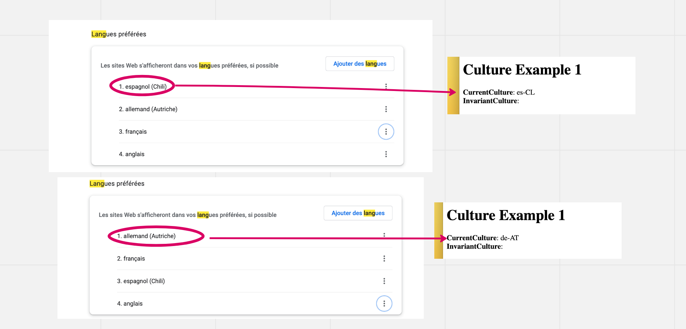
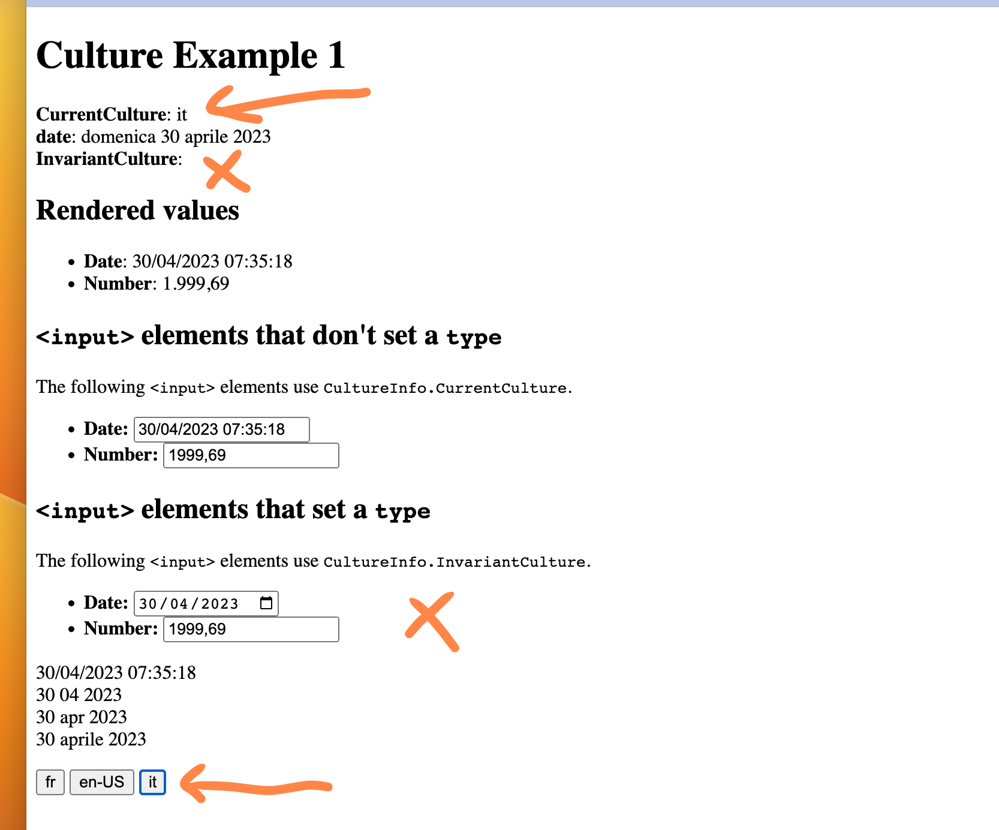
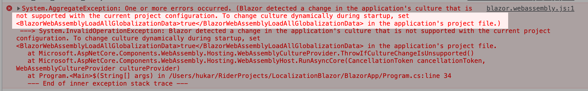
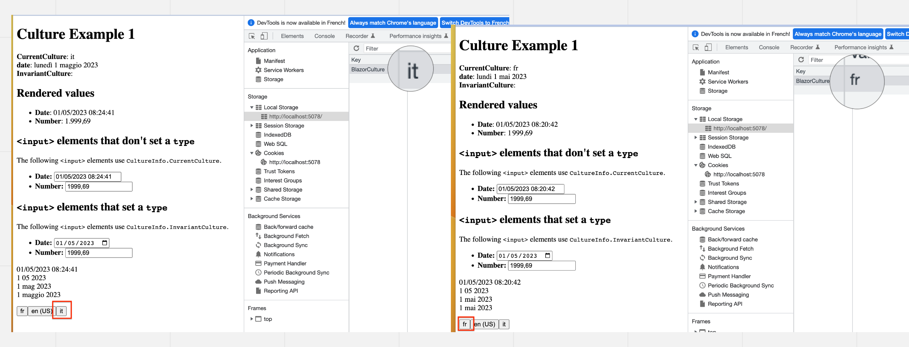
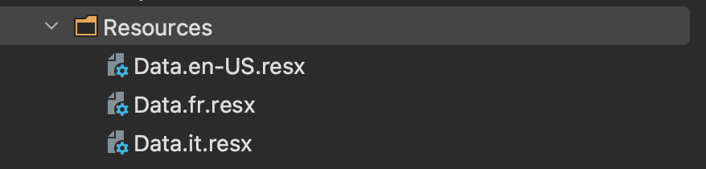

# 04 `Localization` et `Globalization`

## `Globalization`

C'est la fonctionnalité qui gère l'affichage correcte suivant la `culture` du format des `nombres` et des `dates` et `heures`.

Pour activer la `Globalization` dans `Blazorwasm` on doit ajouter ces lignes:

```xml
<PropertyGroup>
  <BlazorWebAssemblyLoadAllGlobalizationData>true</BlazorWebAssemblyLoadAllGlobalizationData>
</PropertyGroup>
```


## `Localization`

C'est la partie qui s'occupe des `traductions`.


## Formatter une `date`

```cs
var dt = DateTime.Now;
```

```html
<p>
    @dt<br/>
    @dt.ToString("d MM yyyy")<br/>
    @dt.ToString("d MMM yyyy")<br/>
    @dt.ToString("d MMMM yyyy")
</p>
```


## `Current Culture`

La `CurrentCulture` est fixée par le réglage du navigateur:

```html
@using System.Globalization

<p>
    <b>CurrentCulture</b>: @CultureInfo.CurrentCulture<br/>
    <b>InvariantCulture</b>: @CultureInfo.InvariantCulture<br/>
</p>
```




## Définir la culture par défaut en `javascript`

Mettre `autostart` à `false` dans `index.html`:

```html
<script src="_framework/blazor.webassembly.js" autostart="false"></script>
```

Puis ajouter le script à la suite:

```html
<script>
  Blazor.start({
    applicationCulture: 'it'
  });
</script>
```

```html
<p>
    <b>CurrentCulture</b>: @CultureInfo.CurrentCulture<br/>
    <b>date</b>: @dt.ToLongDateString()<br/>
    <b>InvariantCulture</b>: @CultureInfo.InvariantCulture<br/>
</p>
```


## Modifier la `Current Culture`

```html
<p>
    @foreach (var culture in new[] { "fr", "en-US", "it" })
    {
        <button @onclick="@(() => SelectLang(culture))">@culture</button>
    }
</p>
```

```cs
void SelectLang(string lang)
{
    switch (lang)
    {
        case "fr":
            CultureInfo.CurrentCulture = new CultureInfo("fr");
            break;
        case "en-US":
            CultureInfo.CurrentCulture = new CultureInfo("en-US");
            break;
        case "it":
            CultureInfo.CurrentCulture = new CultureInfo("it");
            break;
    }
}
```

Ici seul la `CurrentCulture` est changé, pas l'`InvariantCulture` nécessaire pour les `Input` de type `Date` et `Number`.



> ## Remarque
>
> Je ne vois aucune différence si à la place de `CurrentCulture`, je `set` `DefaultThreadCurrentCulture`:
>
> ```cs
> switch (lang)
> {
>     case "fr":
>         CultureInfo.DefaultThreadCurrentCulture = new CultureInfo("fr");
>         break;
> // ...
> ```
>
> 


### Les propriétés `DisplayName`, `EnglishName` et `NativeName`

Elles ne fonctionnent pas en `Blazor Wasm`:

```html
<p>
    @foreach (var culture in supportedCultures)
    {
        <b>Name:</b> @culture.Name <br/>
        <b>Display Name:</b> @culture.DisplayName <br/>
        <b>English Name:</b> @culture.EnglishName <br/>
        <b>Native Name:</b> @culture.NativeName <br/>
    }
</p>
```

```cs
CultureInfo[] supportedCultures = new[]
{
    new CultureInfo("fr"),
    new CultureInfo("en-US"),
    new CultureInfo("it"),
};
```


En comparaison, voici ce qu'on obtient dans une application `Console`:

```cs
using System.Globalization;

CultureInfo[] supportedCultures = new[]
{
    new CultureInfo("fr"),
    new CultureInfo("en-US"),
    new CultureInfo("it"),
};

foreach (var culture in supportedCultures)
{
    Console.WriteLine($"Name: {culture.Name}");
    Console.WriteLine($"Display Name: {culture.DisplayName}");
    Console.WriteLine($"English Name: {culture.EnglishName}");
    Console.WriteLine($"Native Name: {culture.NativeName}\n");
}
```

```
Name: fr
Display Name: français
English Name: French
Native Name: français

Name: en-US
Display Name: anglais (États-Unis)
English Name: English (United States)
Native Name: English (United States)

Name: it
Display Name: italien
English Name: Italian
Native Name: italiano
```


## Enregistrer la culture en `Local Storage` : `JsInterop`

Dans `index.html`

```html
<script>
	window.blazorCulture = {
        get: () => window.localStorage['BlazorCulture'],
        set: (value) => window.localStorage['BlazorCulture'] = value
    }
</script>
```

Dans un composant `Blazor`:

```cs
[Inject]
public NavigationManager NavigationManager { get; set; } = default!;
[Inject]
public IJSRuntime JSRuntime { get; set; } = default!;

private CultureInfo Culture
{
    get => CultureInfo.CurrentCulture;
    set
    {
        if(CultureInfo.CurrentCulture != value)
        {
            var js = (IJSInProcessRuntime)JSRuntime;
            js.InvokeVoid("blazorCulture.set", value.Name);
            
            NavigationManager.NavigateTo(NavigationManager.Uri, forceload: true);
        }
    }
}
```

`forceload: true` permet de recharger l'application et d'exécuter `Program.cs` pour rendre compte du code ci-dessous.

Dans `Program.cs` on retrouve la `culture` stockée dans `Local Storage`:

```cs
var host = builder.Build();

CultureInfo culture;
var js = host.Services.GetRequiredService<IJSRuntime>();
var result = await js.InvokeAsync<string>("blazorCulture.get");

if(result != null)
{
    culture = new CultureInfo(result);
}
else    
{
    culture = new CultureInfo("en-US");
    await js.InvokeVoidAsync("blazorCulture.set", "en-US");
}

CultureInfo.DefaultThreadCurrentCulture = culture;
CultureInfo.DefaultThreadCurrentUICulture = culture;
```

Ici j'ai une erreur explicite:



```xml
<PropertyGroup>
  <BlazorWebAssemblyLoadAllGlobalizationData>true</BlazorWebAssemblyLoadAllGlobalizationData>
</PropertyGroup>
```



Pour définir la `culture` de manière dynamique, sans recharger la `page`, je peux tout simplement écrire:

### `CultureInfo.DefaultThreadCurrentCulture = value;`

```cs
private CultureInfo _Culture
    {
        get => CultureInfo.CurrentCulture;
        set
        {
            if (CultureInfo.CurrentCulture != value)
            {
                var js = (IJSInProcessRuntime)JSRuntime;
                js.InvokeVoid("blazorCulture.set", value.Name);
                
                NavigationManager.NavigateTo(NavigationManager.Uri/*, forceLoad:true*/);
                CultureInfo.DefaultThreadCurrentCulture = value; // <- ici
                CultureInfo.DefaultThreadCurrentUICulture = value; // <- ici
            }
        }
    }
```

> Je ne sais pas si cela à une incidence mais dans la `doc microsoft` on utilise `DefaultThreadCurrentCulture` plutôt que `CurrentCulture`.


## `Translation`

On ajoute `AddLocalization()` dans `Program.cs`

```cs
builder.Services.AddLocalization();
```

Il faut aussi ajouter un `package`: `Microsoft.Extensions.Localization`

```bash
dotnet add package Microsoft.Extensions.Localization
```

On utilise des fichiers `resx`, on les importe par injcetion comme ceci:

```cs
@inject IStringLocalizer<Data> Localizer
```

avec des fichiers comme ceci:



Puis on les utilise avec la syntaxe d'un tableau associatif:

```ruby
<p>
    @Localizer["MyKeyName"]
</p>
```

Pour que cela focntionne, on est obligé de recharger la `page`:

```cs
private CultureInfo _Culture
{
    get => CultureInfo.CurrentCulture;
    set
    {
        if (CultureInfo.CurrentCulture != value)
        {
            var js = (IJSInProcessRuntime)JSRuntime;
            js.InvokeVoid("blazorCulture.set", value.Name);

            NavigationManager.NavigateTo(NavigationManager.Uri, forceLoad:true); // <- ici
            // CultureInfo.DefaultThreadCurrentCulture = value;
            // CultureInfo.DefaultThreadCurrentUICulture = value;
        }
    }
}
```

À ce moment ci, le `forceload` est obligatoire pour charger le bon fichier `.resx`.

Les deux dernières lignes ne sont donc plus utiles.


## `Blazor Internationalization(I18n) Text`

https://github.com/jsakamoto/Toolbelt.Blazor.I18nText

C'est une alternative aux fichiers `.resx`.

- Utilise des fichiers `json` ou `csv`
- Possède l'intellisense pour la traduction : `MyText.MyLabelOne`


## `Humanizr`

https://github.com/Humanizr/Humanizer

Plein d'utilitaire pour transformer les `string` de manière plus lisible pour un humain.

Par exemple:

```cs
"Long text to truncate".Truncate(10) => "Long text…"
```

```cs
DateTime.UtcNow.AddHours(-30).Humanize() => "yesterday"
DateTime.UtcNow.AddHours(-2).Humanize() => "2 hours ago"
```

Plusieurs `localisation` sont disponibles.

```cs
TimeSpan.FromMilliseconds(1299630020).Humanize(3) => "2 weeks, 1 day, 1 hour"
```


