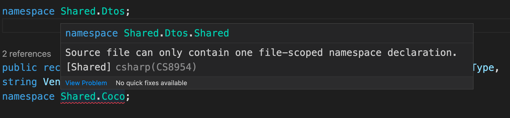
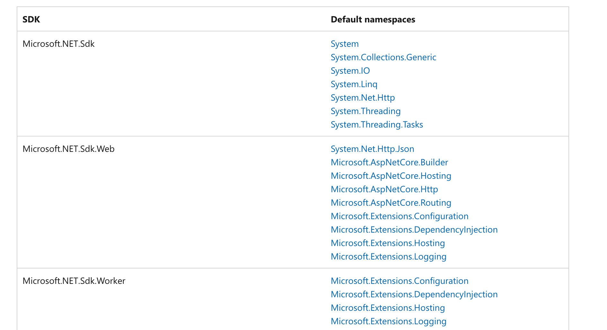
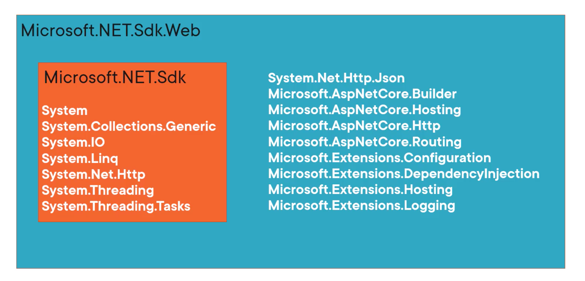
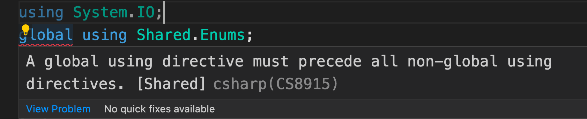

# 01 `Namespaces`

`c# 10` nécessite au moins `.NET 6`.


## Déclarer un `namespace` : file scoped `namespace`

`file scoped namespace`

```cs
namespace Shared.Dtos; 

// ...
```

Normal `namespace`

```cs
namespace Shared.Dtos
{
    // ...
}
```

On réduit d'une indentation l'enesmble du code.

Le `namespace` s'applique à tout le fichier.

Il doit être placé en haut après les `using`.

Deux `namespaces` de type `file scoped` ne peuvent être déclarés dans le même fichier.




## Comment imbriquer des `namespaces`

```cs
namespace Shared.Dtos
{
    public record BaseDto( ... );
        
    namespace Events
    {
        public record EventDto( ... ); // Shared.Dtos.Events
    }
}
```

Ce n'est pas possible, il faut deux fichiers :

`namespace Shared.Dtos` fichier 1

`namespace Shared.Dtos.Events` fichier 2

`c#` comprend que `Events` est un `namespace` enfant de `Shared.Dtos` :

```cs
using Shared.Dtos;
    
var eventDto = new Events.EventDto( ... );
```


## Implicit `Using`

```xml
<PropertyGroup>
        <TargetFramework>net6.0</TargetFramework>
		<ImplicitUsings>true</ImplicitUsings>
```

Activé par défaut dans `.NET 6`.

Les `implicit usings` dépendent du type de `Sdk` du projet :

```xml
<Project Sdk="Microsoft.NET.Sdk">
```

```xml
<Project Sdk="Microsoft.NET.Sdk.Web">
```

```xml
<Project Sdk="Microsoft.NET.Sdk.BlazorWebAssembly">
```

On a la liste ici :

https://docs.microsoft.com/en-us/dotnet/core/project-sdk/overview#implicit-using-directives

Il n'y a pas d'`implicit usings` pour `Sdk.BlazorwebAssembly`.



Les `Sdk` s'imbriquent :




## Ajouter ou retirer des `Implicit Usings`

Toujours dans le fichier `.csproj`

```cs
<Project Sdk="Microsoft.NET.Sdk.Web">

    // ...
	<ItemGroup>
        <Using Remove="System.IO" />
		<Using Include="Api.Entities"/>
	</ItemGroup>
    // ...
```

### `<Using Remove="System.IO" />`

### `<Using Include="Api.Entities"/>`


## `Global Usings`

C'est un `using` appliqué globalement à tout le projet.

```cs
global using Shared.Enums;

namespace Shared.Dtos; 
 
public record DtoBase (int Id, DateTimeOffset Date, string Name, EventType EventType, string Venue);
```

Il n'est plus utile d'utiliser ailleurs dans le projet un `using Shared.Enums`.

Un `global using` doit être déclaré avant un `using` dans le même fichier :



> ### ! Attention
>
> Déclaré ainsi un `global using` est valide au niveau du code **mais** il est très difficile de savoir où le `global using` a été déclaré !!!


## Créer un fichier `GlobalUsings.cs`

Le nom du fichier n'a pas d'importance, mais regrouper tous les `global using` dans un même fichier est une manière organisée de les utiliser.

`MyGlobalUsings.cs`

```cs
global Using Api.EntiTies;
global Using Api.ModelDtos;
global Using Shared.Filters;
global Using Appplication.Request;
// ...
```


## Suggestion d'organisation

Utiliser les `Implicit Usings` pour les `namespaces` externe `System` et  `Microsoft`.

Utiliser `GlobalUsings.cs` pour les namespaces créé dans l'application et les librairies tiers.


## Création d'alias avec `global using`

On peut vouloir créer un alias pour éviter les conflit avec une autre librairie :

```cs
// GlobalUsings.cs
global using ThreadingTimer = System.Threading.Timer;
```

```cs
// OtherFile.cs
public class SomeClass
{
    public void StartTimer()
    {
        var timer = new ThreadingTimer();
    }
}
```


## Utilisation de `static` avec `global using`

L'utilisation de `using static` permet d'utiliser les membres statiques d'une classe sans y faire référence.

```cs
// GlobalUsings.cs
global using static System.Math;
```

```cs
// OtherFile.cs
public class SomeClass
{
    public decimal ToAbsolute(decimal value) => Abs(value);
}
```

