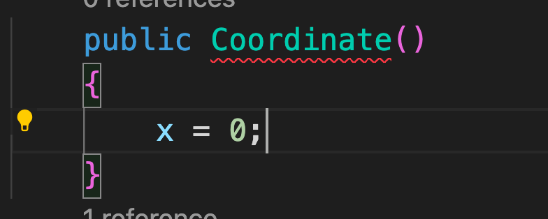
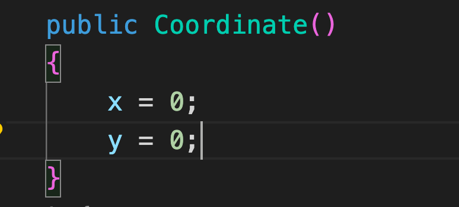
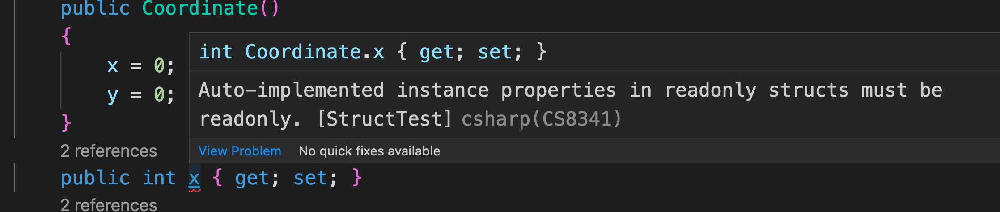
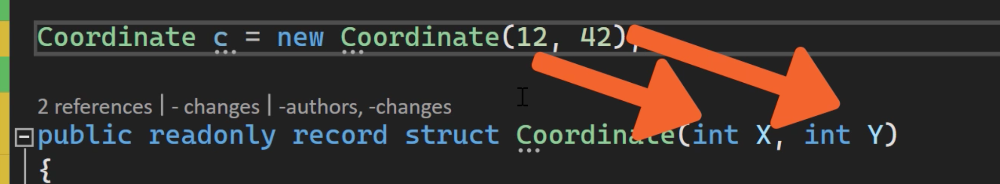
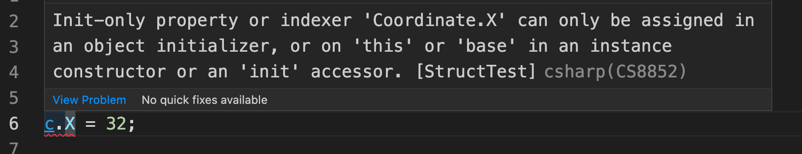
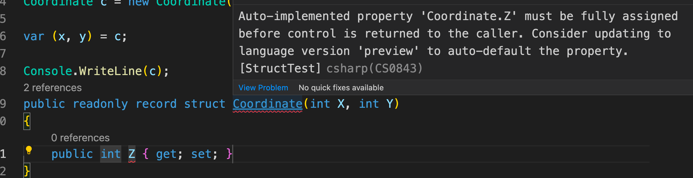
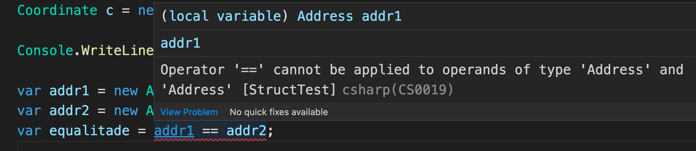

# 03 `struct`

C'est un `value Type` et pas un `Reference Type` contrairement à une `Class`.

`DateTime` est un cas très utilisé de `struct` dans `.net`.

Une `struct` n'est pas `Garbage Collectée` mais simplment détruite à la fin d'un block d'exécution (une méthode).

Une `struct` ne supporte pas l'`Héritage`.

Utilisé pour des données liées (heure, date, coordonnées).


## `Constructor`

```cs
Coordinate c = new Coordinate();

Console.WriteLine(c);

public struct Coordinate
{
    public int x { get; set; }
    public int y { get; set; }
}
```

La `struct` possède un `Constructor` par défaut qui ressemble à ça :

```cs
public Coordinate()
{
    x = default; // pour int = 0
    y = default;
}
```

Avant `c# 10` on ne pouvait pas redéfinir le `Constructor` par défaut.

Maintenant c'est possible mais il faut donner une valeur à chaque membre.






## Rendre une `struct` immutable

On peut utiliser le mot clé `readonly`

```cs
public readonly struct Coordinate
{
    // ...
}
```



Les `Membres` doivent aussi être rendus `readonly`.

```cs
public readonly struct Coordinate
{
    public Coordinate()
    {
        x = 0;
        y = 0;
    }
    public int x { get; }
    public int y { get; }
}
```

On a une erreur maintenant si on souhaite donner une valeur différente de `0` à l'initialisation :


### Nouveau mot clé `init`

`init` précise un membre ne peut être assigné que pendant l'assignation.

```cs
public int x { get; init; }
public int y { get; init; }
```


## `with`  : copie avec changement de valeur(s)

On veut copié une `struct` mais avec des valeurs différentes

```cs
Coordinate c = new Coordinate { x = 5, y = 12};
Coordinate cChange = c with { x = 12 };
```

`with` a été introduis dans `c# 9` avec les `record`.

Il s'utilise maintenant aussi avec les `struct` et les `record struct`.

Il est utile pour copier des `struct` possédant beaucoup de membres avec seulement quelque changements d'un `struct` à l'autre.


## `record struct`

```cs
public record struct Coordinate
{
    public int x { get; init; }
    public int y { get; init; }
}
```

Les `record` lié au `class` apportait l'immutabilité et était très prtique pour définir des `Dtos`.

Il faut maintenant ajouter le mot clé `class` pour ne pas les confondre avec les `record struct`.

```cs
public record class DtoBase (int Id, DateTimeOffset Date, // ...
```

On peut utiliser les `positional properties` plutôt que les `explicit properties` et ainsi avoir une syntaxe plus compacte :

```cs
public record struct Coordinate(int X, int Y);
```

> Les `positional properties` doivent respecter la position lors de l'assignation :
>
> 

Les `record struct` sont `mutable`, un `getter` et un `setter` sont **synthétisé** par le compilateur.

```cs
Coordinate c = new Coordinate(5,89);

c.X = 32; // Setter

Console.WriteLine(c); // Getter
```


### `readonly record struct`

On peut rendre notre `record struct` immutable avec le mot clé `readonly` :

```cs
public readonly record struct Coordinate(int X, int Y);

Coordinate c = new Coordinate(5,89);
```




### `Synthesized Deconstructor`

```cs 
Coordinate c = new Coordinate(5,89);
var (x, y) = c;
```


### Mixer `positional property` et `explicit property`

Le `constructor` générer automatiquement pour un `record struct` ne dépend que des `positional properties` :



Il faut en fait donner explicitement une valeur de départ à la `Property` :

```cs
public readonly record struct Coordinate(int X, int Y)
{
    public int Z { get; init; } = 0;
}
```


### `object initializer`

On peut assigner les valeurs à la fois grâce au paramètre des `positional properties` et de l'`objet initializer`pour les `explicit properties`.

```cs
Coordinate c = new Coordinate(5,89) { Z = 61 };
```

 

## Méthode synthétisée

### `ToString`

La méthode `ToString` est synthétisée pour afficher le `record struct` sous forme de `json`

```cs
Coordinate c = new Coordinate(5,89) { Z = 61 };

Console.WriteLine(c); // équivalent à Console.WriteLine(c.ToString())
```

```json
Coordinate { X = 32, Y = 89 }
```

On peut overrider `ToString`

```cs
public readonly record struct Coordinate(int X, int Y)
{
    public int Z { get; init; } = 0;

    public override string ToString()
    {
        return $"{X} -- {Y} -- {Z}";
    }
}
```

```bash
5 -- 89 -- 61
```


### `Equals`

Exemple avec des `readonly struct` classique (pas `record`) :

```cs
public readonly struct Address
{
    public string Street { get; init; }
    public int StreetNumber { get; init; }
}
```

```cs
var addr1 = new Address { Street = "Camelia street", StreetNumber = 45 };
var addr2 = new Address { Street = "Camelia street", StreetNumber = 45 };
```



On ne peut pas utiliser l'opérateur  `==` .


### Equals

```cs
var equalitade = addr1.Equals(addr2); // true
```

Apparemment cela cause un problème de performance :


### Version avec `record struct`

`Equals` n'utilise pas la `Reflection` ou le `Boxing`.

L'opérateur `==` est implémenté.

```cs
Coordinate c = new Coordinate(5,89) { Z = 61 };
Coordinate d = new Coordinate(5,89) { Z = 61 };

var eq1 = c.Equals(d);
var eq2 = c == d;

Console.WriteLine($"{eq1} {eq2}");
```

```bash
True True
```

Utilisation de `with` :

```cs
Coordinate c = new Coordinate(5,89) { Z = 61 };
Coordinate d = c with { Z = 56 };

var eq1 = c.Equals(d);
var eq2 = c == d;

Console.WriteLine($"{eq1} {eq2}");
```

```bash
False False
```

On voie que les `explicit properties` sont prises en compte pour la comparaison d'égalité.

> ### `positional properties` et `with`
>
> On doit aussi utliser la notation accolades `object` :
>
> ```cs
> Coordinate d = c with { X = 3 };
> ```
>
> 