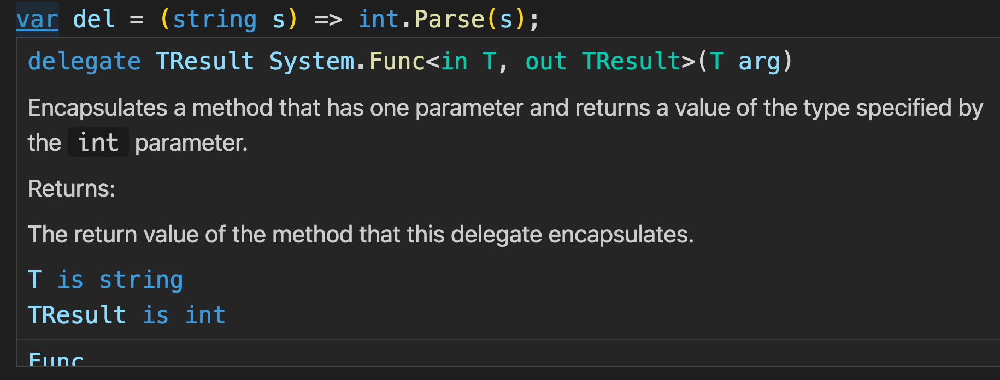
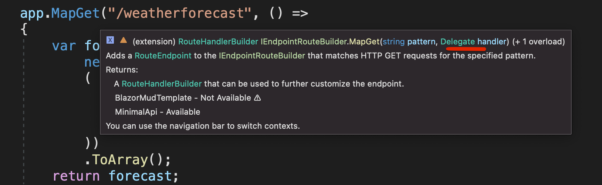
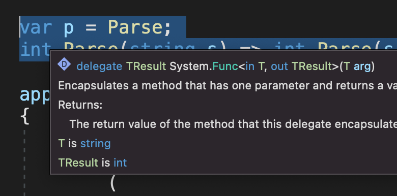
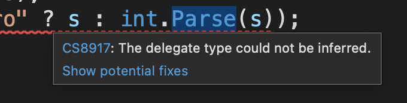

# 04 les `lambdas`


## Les `Delegate`

C'est un `Type` qui peut contenir (`hold`) une `référence` vers une `méthode`.

```cs
public delegate int ConversinDelegate(string input);
```

ici c'est une référence d'une `méthode` acceptant un `string` et renvoyant un `int`.

On instancie un `Delegate` avec `new` et la référence vers une méthode en argument :

```cs
var convertOne = new ConversionDelegate(Conversion);
var convertTwo = new ConversionDelegate(OtherConversion);

var resultOne = convertOne("5"); // 5
var resultTwo = convertTwo("5"); // 6

int Conversion(string input) =>  int.Parse(input);

int OtherConversion(string input) => int.Parse(input) + 1;
```


### Passer un `Delegate` en argument

L'intérêts est ici de pouvoir passer un `Delegate` comme argument d'une méthode :

```cs
var convert = new ConversionDelegate(OtherConversion);

var result = UseConversionDelegate(convert, "45"); // "number converted 46"

string UseConversionDelegate(ConversionDelegate del, string number)
{
    var numberInt = del(number);

    return $"number converted {numberInt}";
}
```


### Utilisation

Pour les `events` ou via `Linq`.

```cs
var list = new List<int> { 1, 2, 3, 4 };

var elt = list.Single(n => n == 3);
```

`Single` prend en argument une `Func<TSource, bool> predicate` est une `Func` est 

un `Delegate` :

```cs
public delegate TResult Func<in T, out TResult>(T arg);
```


### Inférence

Une `lambda` ou une `méthode` si elles correspondent à la signature, sont converties par inférence en `Delegate` :

```cs
var list = new List<int> { 1, 2, 3, 4 };
var elt = list.Single(equalThree);

bool equalThree(int number) => number == 3;
```


## `Type` naturel : `Delegate`

Une `lambda` est transformée en type `Delegate` automatiquement :

```cs
Func<string, int> converter = s => int.Parse(s);
```

Si on a une méthode prenant ce `Delegate` en argument on a :

```cs
void PassingOn(Func<string, int> converter)
{
    // ...
}
```

Si maintenant on veut en argument un `Delegate` prenant deux argument ?

On peut utiliser le type `Delegate` qui correspond à tous les `delegates`.

```cs
PassingOn((string s) => int.Parse(s));

void PassingOn(Delegate converter)
{
    // ...
}
```

On doit spécifier le type `string` car celui-ci ne peut pas être inféré.

On peut aussi inférer un `delegate` comme ceci :

```cs
var del = (string s) => int.Parse(s);
```

Le type `func<string, int>` est inféré :




### Utilisation

Dans `Minimal API` le type `Delegate` est utilisé pour construire les `Endpoints` :



Auparavant il fallait un cast de la lambda pour que cela fonctionne.


### `var`

le mot clé `var` parse vers `Delegate`

```cs
var p = Parse;
int Parse(string s) => int.Parse(s);
```




## Utilisation des `[Attribute]` dans les `lambda`

Cette fonctionnalité est utilisée par `minimal API` :

```cs
app.MapGet("/weatherforecast/{id}", ([FromQuery] int id) =>
{
    // ...
```


## Inférer le type de retour

Parfois il n'est pas possible d'inférer le type de retour de `lambda` :

```cs
PassingOn((string s) => s == "Zero" ? s : int.Parse(s));
```



On peut alors spécifier le type de retour avec cette syntaxe :

```cs
PassingOn(object (string s) => s == "Zero" ? s : int.Parse(s));
```

Il n'y a plus d'erreur. Il faut que le paramètre soit entre parenthèse pour que cela fonctionne.