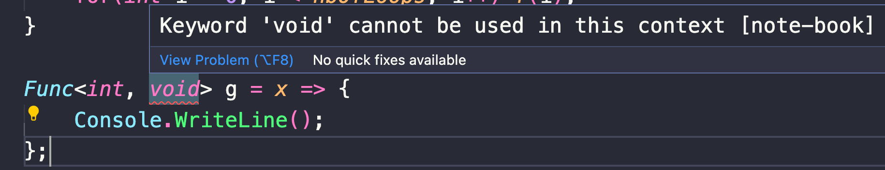
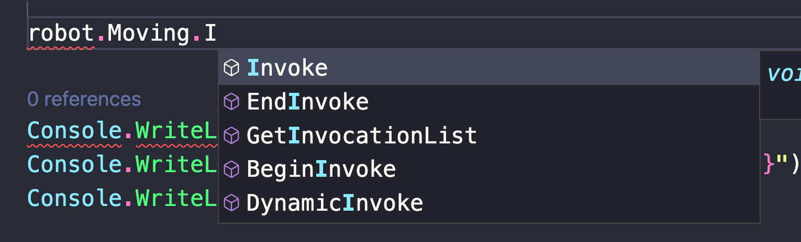
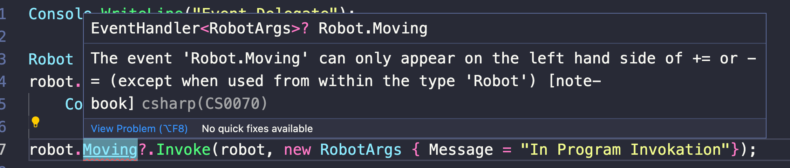

# 06 `Delegate` et `event`


## `Delegate`

> ## `Invoke`
>
> On peut invoquer un `delegate` de deux manières différentes :
>
> ```cs
> delegate void MyDelegate(int x);
> ```
>
> ```cs
> MyDelegate DisplayX = x => WriteLine($"X: {x}");
> 
> DisplayX.Invoke(8);
> // OU
> DisplayX(8);
> ```
>
> La deuxième écriture est un `helper` du compilateur (un raccourci), mais les deux syntaxes compile de la même manière (`SharpLab`)
>
> 
>
> ### Utilité avec `null`
>
> Si on utilise pas `Invoke`, on doit vérifier que le `delegate` passé n'est pas `null` avant de l'exécuter :
>
> ```cs
> DisplaySomething(null);
> 
> void DisplaySomething(MyDelegate? md)
> {
>     md(5);
> } // Unhandled exception. System.NullReferenceException: Object reference not set to an instance of an object.
> ```
>
> On écrit alors :
>
> ```cs
> void DisplaySomething(MyDelegate? md)
> {
>     if(md is not null) md(5);
> }
> ```
>
> Et on ne risque plus d'`exception`.
>
> On peut aussi simplifier un peu l'écriture avec `Invoke` :
>
> ```cs
> void DisplaySomething(MyDelegate? md)
> {
>     md?.Invoke(5);
> }
> ```
>
> De nouveau pas d'`exception`.


C'est un type permettant de définir la signature d'une fonction (d'une méthode) pouvant être attribuée à une variable :

```cs
public delegate void Something(int num);
```

On peut donc déclarer une varaible de ce type et assigner une fonction :

```cs
Something MyFunc;

void DisplayNumberMutiplyByTwo(int nb)
{
    Console.WriteLine($"Number {nb} multiply by two: {nb*2}");
}

MyFunc = DisplayNumberMutiplyByTwo;

MyFunc(5);
```

```
Number 5 multiply by two: 10
```

Si on veut tester la possibilité d'une valeur `null` on a une syntaxe avec `Invoke` :

```cs
MyFunc?.Invoke(5);
```


### Passer un `delegate` comme argument

On peut alors passer un lien vers une fonction en argument grâce à l'utilisation des `delegates` :

```cs
public delegate int MathFunc(int a, int b);
```

```cs
void PerformMathFunc(MathFunc f, int nbOfLoops)
{
    for(int i = 0; i < nbOfLoops; i++)
    {
        Console.WriteLine($"f({i}) = {f(i, i+1)}");
    }
}

int Plus(int a, int b) => a + b;
int Pow(int a, int b) => (int)Math.Pow(a, b);

PerformMathFunc(Plus, 3);
PerformMathFunc(Pow, 4);
```

```
f(0) = 1
f(1) = 3
f(2) = 5

f(0) = 0
f(1) = 1
f(2) = 8
f(3) = 81
```

Le type des paramètres étant inféré, on peut même encore simplifier :

```cs
PerformMathFunc((a, b) => a + 2 * b, 3);
PerformMathFunc((a, b) => (int)Math.Pow(a, b) - 2*a*b, 4);
```


### Passer directement une `Lambda function`

On peut simplifier le code en passant directement la logique en argument grâce à une `lambda function` :

```cs
PerformMathFunc((int a, int b) => a + 2 * b, 3);
PerformMathFunc((int a, int b) => (int)Math.Pow(a, b) - 2*a*b, 4);
```

```
f(0) = 2
f(1) = 5
f(2) = 8

f(0) = 0
f(1) = -3
f(2) = -4
f(3) = 57
```


### Plusieurs assignations

Le `delegate` est `multicast` : `multidiffusion`.

On peut assigner plusieurs fonctions au même `delegate` :

```cs
Something MyFunc;

void DisplayNumberMutiplyByTwo(int nb)
{
    Console.WriteLine($"Number {nb} multiply by two: {nb*2}");
}
void DisplayNumberMutiplyByThree(int nb)
{
    Console.WriteLine($"Number {nb} multiply by three: {nb*3}");
}

MyFunc = DisplayNumberMutiplyByTwo;
MyFunc += DisplayNumberMutiplyByThree;

MyFunc?.Invoke(5);
```

```
Number 5 multiply by two: 10
Number 5 multiply by three: 15
```

Dans le cas de `delegate` retournant une valeur, c'est la dernière fonction associé au `delegate` qui aura sa valeur retournée :

```cs
public delegate int MathSimple(int a);
```

```cs
void PerformMathFunc(MathSimple f, int nbOfLoops)
{
    for(int i = 0; i < nbOfLoops; i++)
    {
        Console.WriteLine($"f({i}) = {f(i)}");
    }
}

MathSimple f = x => x * 2;
f += x => x + 3;
f += x => x * x;

PerformMathFunc(f, 3);
```

```cs
f(0) = 0 // 0 * 0
f(1) = 1 // 1 * 1
f(2) = 4 // 2 * 2
```


## `Generic Delegate` 

###  `Func<TParam1, TParam2, ..., TOut>`

On peut utiliser les type `generic` de `delegate` plutôt que de définir les siens :

```cs
void PerformMathFunc(Func<int, int> f, int nbOfLoops)
{
    for(int i = 0; i < nbOfLoops; i++)
    {
        Console.WriteLine($"f({i}) = {f(i)}");
    }
    Console.WriteLine();
}

Func<int, int> f = x => x * 2;
f += x => x + 3;
f += x => x * x;

PerformMathFunc(f, 3);
```


### `Action<TParam1, TParam2, ...>`

`void` n'est pas réellement un type en `c#` et on ne peut pas écrire :



Si une fonction retourne `void` on a le type générique `Action<T>` qui convient parfaitement :

```cs
void PerformMathFunc(Action<int> f, int nbOfLoops)
{
    for(int i = 0; i < nbOfLoops; i++) f(i);
}

Action<int> f = x => Console.WriteLine($"f({x}) = {x * 2}");
f += x => Console.WriteLine($"f({x}) = {x + 3}");
f += x => Console.WriteLine($"f({x}) = {x * x}");

PerformMathFunc(f, 3);
```

```cs
f(0) = 0
f(0) = 3
f(0) = 0
    
f(1) = 2
f(1) = 4
f(1) = 1
    
f(2) = 4 // x * 2
f(2) = 5 // x + 3
f(2) = 4 // x * X
```


## Les `events`

Le `handler` est déclaré en `delegate`, par convention il renvoie `void` et a en argument un `object sender` et des arguments `SomethingArgs args` :

```cs
public class RobotArgs
{
    public string Message { get; set; } = string.Empty;
}

public delegate void RobotHandler(object sender, RobotArgs args);
```

Je l'utilise dans ma classe `Moving?.Invoke(this, args)`:

Pour exécuter un `delegate nullable` on utilise `MyDelegate?.Invoke( ... )`.

Le `handler` est déclaré comme `event` dans la classe.

```cs
public class Robot
{
    public int Speed { get; set; }
    public bool IsStopped { get; set; }

    public event RobotHandler? Moving;

    public int Move(int levelOfSpeed) 
    {
        IsStopped = false;
        
        Moving?.Invoke(this, new RobotArgs { Message = "You're moving" });

        Speed += levelOfSpeed*10;
        return Speed;
    }

    public void Stop() { ... }
}
```

Utilisation :

```cs
Robot robot = new();
robot.Moving += (s, e) => 
    Console.WriteLine($"Message From Robot : {e.Message}");

robot.Move(3);
```

```
Message From Robot : You're moving
```

> Pour le moment tout fonctionnerai pareil sans le mot clé `event`.


## Générique `event` : `EventHandler<MyArgs>`

On peut simplifier l'écriture avec le type générique `EventHandler`.

```cs
public class Robot
{
    // ...

    public event EventHandler<RobotArgs>? Moving;

    public int Move(int levelOfSpeed) 
    {
        IsStopped = false;
        Moving?.Invoke(this, new RobotArgs { Message = "No event : You're moving" });
		// ...
```

> De nouveau le mot clé `event` semble facultatif.


## Le mystère du mot clé `event`

Sans ce mot clé, on a un simple `delegate` et on peut l'invoquer de n'importe où, y compris depuis le programme exécutable.

```cs
public class Robot
{
    // ...

    public EventHandler<RobotArgs>? Moving;
```




```cs
Robot robot = new();
robot.Moving += (s, e) => 
    Console.WriteLine($"Message From Robot : {e.Message}");

robot.Moving?.Invoke(robot, new RobotArgs { Message = "In Program Invokation"});
```

```
Message From Robot : In Program Invokation
```


### Ajoutant le mot clé `event`

```cs
public class Robot
{
    // ...

    public event EventHandler<RobotArgs>? Moving;
```



On ne peut plus utiliser `Invoke` en dehors de la classe. On peut seulement ajouter `+=` ou enlever `-=` des fonctions.

`event` permet donc d'encapsuler l'invocation dans la classe : `private Invoke`.


### Configurer manuellement `event`

Comme pour les propriété, on peut avoir une auto-implémentation ou une implémentation manuelle :

```cs
private event EventHandler<RobotArgs>? _moving;

public event EventHandler<RobotArgs>? Moving
{
    add
    {
        Console.WriteLine("add manually logic");
        if(_moving?.GetInvocationList().Count() == 1)
        {
            Console.WriteLine("It's enough");
            return;
        }
        _moving += value;
    }

    remove
    {
        _moving -= value;
    }
}
```

On doit plus loin aussi utiliser `_moving` :

```cs
public int Move(int levelOfSpeed) 
{
    IsStopped = false;
    _moving?.Invoke(this, new RobotArgs { Message = "You're moving" });
    // ...
```

Puis dans `Program` :

```cs
Robot robot = new();
robot.Moving += (s, e) => 
    Console.WriteLine($"First Message From Robot : {e.Message}");
robot.Moving += (s, e) => 
    Console.WriteLine($"Second Message From Robot : {e.Message}");

robot.Move(3);
```

```
add manually logic
add manually logic
It's enough
First Message From Robot: You're moving
```

On a ici limité le nombre de `delegate` à `1`.

`add` correspond à `+=` et `remove` à `-=`.


## `event` et `interface`

Un `event` dans une `interface` ne promet que d'avoir `add` et `remove` implémenté.

Que ce soit auto-implémenté ou manuellement implémenté.