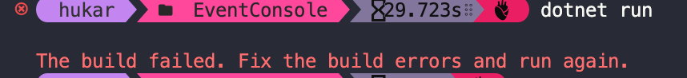
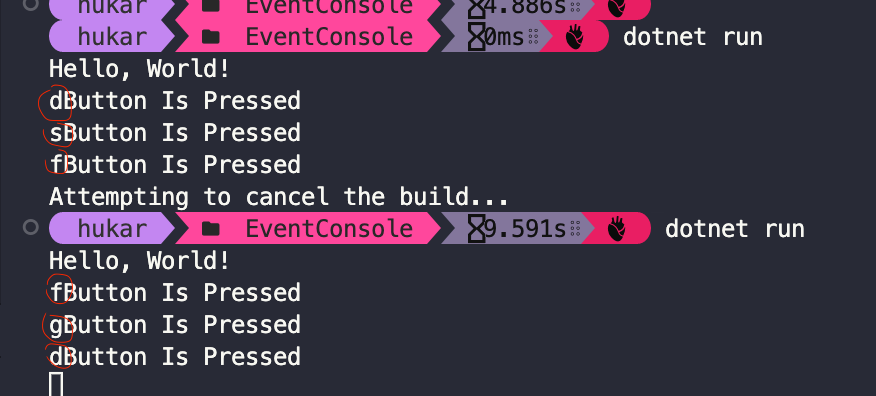

# 06.5 `event` et `mediator`

Nick Chapsas

https://www.youtube.com/watch?v=NmmpXcMxCjY&ab_channel=NickChapsas


## Exemple avec `event`

Un `event` notifie que quelque chose s'est produit.

Les `class` le désirant peuvent s'abonner à cet `event` (`pub` `sub`).

### Création d'une classe `ButtonMaster`

```cs
public class ButtonMaster
{
    public event EventHandler? ButtonPressed;
    
    public void OnButtonPressed(char keyCode)
    {
        ButtonPressed?.Invoke(this, EventArgs.Empty);
    }
}
```

L'événement est ici `ButtonPressed`.

`this` est l'`object` `sender`.

`OnButtonPressed` permet de déclencher l'événement (`raise an event`).


### Dans `Program`

```cs
var buttonMaster = new ButtonMaster();

buttonMaster.ButtonPressed += (sender, eventArgs) => {
    Console.WriteLine($"Button was pressed");
}

Start:

var keyCode = Console.ReadKey(true).KayChar;
buttonMaster.OnButtonPressed(keyCode);

goto Start;
```

`+=` : `subscribe operator` opérateur d'abonnement.

On s'abonne à l'événement `ButtonPressed` en lui passant une fonction (ici une `lambda`) qui sera exécutée lorsque l'événement sera déclenché (`raise`).

> ### Problème avec `.net 7 rc1`
>
> J'ai une erreur avec le `goto` :
>
> 
>
> J'utilise une boucle `while` à la place :
>
> ```cs
> while(true)
> {
>     var key = Console.ReadKey(true).KeyChar;
>     buttonMaster.OnButtonPressed(key);
> }
> ```

### Remarque pour `ReadKey`

Si j'écris `ReadKey()` ou bien `ReadKey(false)`, la lettre tapée s'affiche alors dans la console :



C'est pour cela qu'on a `ReadKey(true)` dans le code.


### Créer son argument

`ButtonPressedEventArgs`

```cs
public class ButtonPressedEventArgs
{
    public ButtonPressedEventArgs(char keyCode)
    {
        KeyCode = keyCode;
    }
    
    public char KeyCode { get; }
}
```

On l'utilise dans `ButtonMaster`

```cs
public event EventHandler<ButtonPressedEventArgs>? ButtonPressed;

public void OnButtonPressd(char keyCode)
{
    ButtonPressed?.Invoke(this, new ButtonPressedEventArgs(keyCode));
}
```

```
Button Is Pressed j
Button Is Pressed k
Button Is Pressed l
Button Is Pressed o
Button Is Pressed h
Button Is Pressed f
```


### Plusieurs `subscribers` : abonnés

On peut s'abonner plusieurs fois en fournissant un. nouvel `handler` :

```cs
var buttonMaster = new ButtonMaster();
buttonMaster.ButtonPressed += (sender, args) =>
{
    Console.WriteLine($"Button Is Pressed {args.KeyCode}");
};
buttonMaster.ButtonPressed += (sender, args) =>
{
    Console.WriteLine($"Button {args.KeyCode} is pressed from a different handler");
};
```

```
Button Is Pressed h
Button h is pressed from a different handler
```


## Problème de `event`

On utilise un modèle de `minimal API`.

`Program.cs`

```cs
var builder = WebApplication.CreateBuilder(args);

builder.Services.AddTransient<TransientService>();
builder.Services.AddHostedService<TickerBackgroundService>();

var app = builder.Build();

app.Run();
```

Un `HostedService` est en fait un `BackgroundService`.

```cs
internal class TickerBackgroundService : BackgroundService
{
    protected override async Task ExecuteAsync(CancellationToken stoppingToken)
    {
        while(stoppingToken.IsCancellationRequested == false)
        {
            Console.WriteLine($"Pong");
            await Task.Delay(1000, stoppingToken);
        }
    }
}
```

On va créer un système d'événement (à chaque `Tick` : instant) et l'enregistrer dans `Program.cs` comme `singleton` :

```cs
builder.Services.AddSingleton<TickerService>();
```

```cs
internal class TickerService
{
    public event EventHandler<TickerEventArgs> Ticked;
    
    public TickerService()
    {
        Ticked += OnEverySecond;
        Ticked += OnEveryFiveSeconds;
    }

    public void OnEverySecond(object? sender, TickerEventArgs args)
    {
        Console.WriteLine($"Tick: {args.Time.ToLongTimeString()}");
    }
    public void OnEveryFiveSeconds(object? sender, TickerEventArgs args)
    {
        if(args.Time.Second % 5 == 0)
            Console.WriteLine($"Tick: {args.Time.ToLongTimeString()}");
    }
    
    public void OnTick(TimeOnly time)
    {
        Ticked?.Invoke(this, new TickerEventArgs(time));
    }
}

internal class TickerEventArgs
{
    public TickerEventArgs(TimeOnly time)
    {
        Time = time;
    }
    
    public TimeOnly Time { get; }
}
```

On ajoute un `handler` directement dans le constructeur par facilité mais ils pourraient être n'importe où ailleurs.

La signature d'un `handler` est `void handler(object? sender, TypedEventArgs args)`

On va maintenant injecter le `TickerService` dans le `BackgroundService` :

```cs
internal class TickerBackgroundService : BackgroundService
{
    private readonly TickerService _ticker;

    public TickerBackgroundService(TickerService ticker)
    {
            _ticker = ticker;
        
    }
    protected override async Task ExecuteAsync(CancellationToken stoppingToken)
    {
        while (stoppingToken.IsCancellationRequested == false)
        {
            _ticker.OnTick(TimeOnly.FromDateTime(DateTime.Now));
            await Task.Delay(1000, stoppingToken);
        }
    }
}
```

```
Tick: 17:28:31
Tick: 17:28:32
Tick: 17:28:33
Tick: 17:28:34
Tick: 17:28:35
Tick: 17:28:35
Tick: 17:28:36
Tick: 17:28:37
```

Toutes les `5s` le `tick` est doublé.

On va maintenant implémenter notre `TransientService` :

```cs
internal class TransientService
{
    public Guid Id { get; } = Guid.NewGuid();
}
```

Notre service se contente de générer un `guid`. Comme il est `transient`, un nouvel objet est instancié à chaque nouvel appelle du service.

On s'attend donc à avoir un `guid` différent à chaque fois.

On va injecter ce service dans `TickerService` :

```cs
internal class TickerService
{
    public event EventHandler<TickerEventArgs>? Ticked;
    private readonly TransientService _transient;

    public TickerService(TransientService transient)
    {
        _transient = transient;
        Ticked += OnEverySecond;
        Ticked += OnEveryFiveSeconds;
    }
```

et afficher l'`id` obtenu par le `TransientService` :

```cs
public void OnEverySecond(object? sender, TickerEventArgs args)
{
    Console.WriteLine(_transient.Id);
}
```

```
3ba833d2-acca-4e42-aeac-01475165caf4
Tick: 17:35:25
3ba833d2-acca-4e42-aeac-01475165caf4
3ba833d2-acca-4e42-aeac-01475165caf4
3ba833d2-acca-4e42-aeac-01475165caf4
3ba833d2-acca-4e42-aeac-01475165caf4
3ba833d2-acca-4e42-aeac-01475165caf4
Tick: 17:35:30
3ba833d2-acca-4
```

L'`Id` n'est pas modifiée, c'est toujours la même. Et cela même si on passe `TickerService` à `transient` :

```cs
builder.Services.AddTransient<TickerService>();
```

```
Tick: 17:46:30
cf7907cf-d5a3-4825-8c86-35dcc06856f1
cf7907cf-d5a3-4825-8c86-35dcc06856f1
cf7907cf-d5a3-4825-8c86-35dcc06856f1
cf7907cf-d5a3-4825-8c86-35dcc06856f1
cf7907cf-d5a3-4825-8c86-35dcc06856f1
Tick: 17:46:35
```

C'est parceque la fonction `handler` capture la valeur de l'`Id` une fois pour toute.

Pour ce genre de raison, il est préférable d'utiliser une façon plus fiable et plus moderne avec `MediatR`.


## Gérer les `event` avec `MediatR`

`Mediatr` permet de faire la même chose mais avec une bien meilleur gestion de l'injection de dépendance.

`Program.cs`

```cs
using MediatR;

var builder = WebApplication.CreateBuilder(args);

builder.Services.AddMediatR(typeof(Program));

builder.Services.AddTransient<TransientService>();
builder.Services.AddHostedService<TickerBackgroundService>();

var app = builder.Build();

app.Run();
```


### `mediator.publish()`

Modification de `TickerBackgroundService`

```cs
internal class TickerBackgroundService : BackgroundService
{
   private readonly IMediator _mediator;
   
    public TickerBackgroundService(IMediator mediator)
    {
            _mediator = mediator;  
    }
    
    protected override async Task ExecuteAsync(CancellationToken stoppingToken)
    {
        while (stoppingToken.IsCancellationRequested == false)
        {
            var timeNow = TimeOnly.FromDateTime(DateTime.Now);
            
            await _mediator.Publish(new TimeNotification(timeNow), stoppingToken);
            await Task.Delay(1000, stoppingToken);
        }
    }
}
```

`mediator` peut déclencher un `event` avec `Publish`.

`Publish` prend deux argument :

- Une `Notification` implémentant `INotification`
- Un `Cancellation Token`

On publie en fait des `Notification` implémentant `INotification`

```cs
public class TimeNotification : INotification
{
    public TimeNotification(TimeOnly time) 
    {
        Time = time;
    }
    public TimeOnly Time { get; }
}
```


### `INotificationHandler<INotification>`

On créé une classe capable d'écouter les `notifications` de `Publish`.

`EverySecondHandler`

```cs
public class EverySecondHandler : INotificationHandler<TimeNotification>
{
    public Task Handle(TimeNotification notification, CancellationToken cancellationToken)
    {
		Console.WriteLine(notification.Time.ToLongTimeString());
        return Task.CompletedTask;
    }
}
```

Puis la même chose pour `5s` :

```cs
public class EveryFiveSecondsHandler : INotificationHandler<TimeNotification>
{
    public Task Handle(TimeNotification notification, CancellationToken cancellationToken)
    {
        if(notification.Time.Second % 5 == 0)
        {
            Console.WriteLine(notification.Time.ToLongTimeString());
        }
        return Task.CompletedTask;
    }
}
```

Et c'est tout :

```
09:46:25
09:46:25
09:46:26
09:46:27
09:46:28
09:46:29
09:46:30
09:46:30
09:46:31
```


### Problème de l'`Id`

On inject maintenant le même `TransientService` que précédement :

```cs
public class EverySecondHandler : INotificationHandler<TimeNotification>
{
    private readonly TransientService _transient;

    public EverySecondHandler(TransientService transient)
    {
        _transient = transient;
    }
    public Task Handle(TimeNotification notification, CancellationToken cancellationToken)
    {
        Console.WriteLine(_transient.Id);
        return Task.CompletedTask;
    }
}
```

```
f1a34bc0-ed19-4fa4-9669-8d7010951a82
d5591f82-d5c9-428d-9156-5702d10cfc65
47a2ef2b-7f5b-4148-bae1-899ee834732b
09:49:55
f251efc0-f2c9-47ff-9672-e41bbf406607
511fdcdf-f20a-430c-903c-c27875d57873
cc929922-929f-4d2e-b0e8-fb8b93cd5eaf
```

Cette fois tout fonctionne correctement.