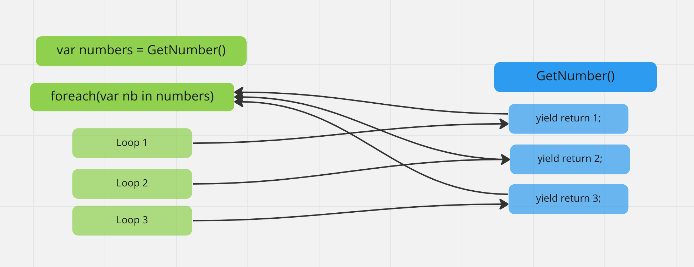
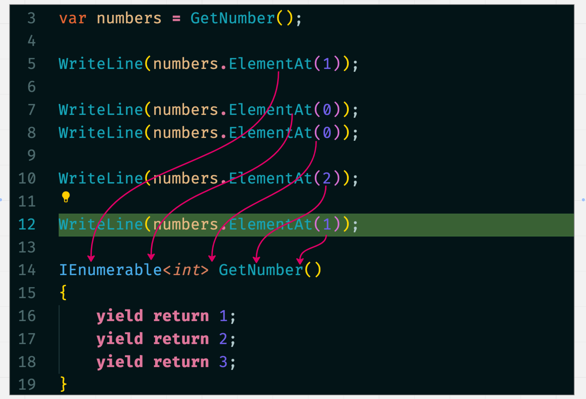
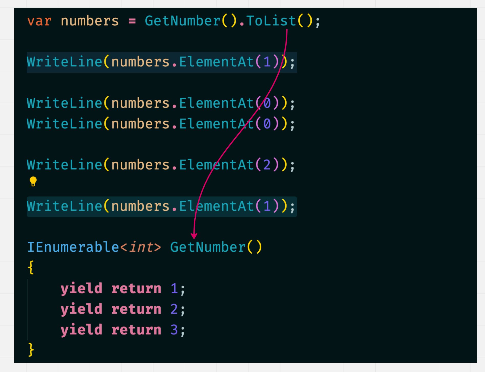

# 07 `Iterator Pattern`

D'après Shiv Kumar

https://www.youtube.com/watch?v=kqCSshDeDUQ&ab_channel=ShivKumar


## `yield return`

`yield` : générer

```cs
WriteLine($"Scratch Pad {DateTime.Now.ToLongDateString()}");

var numbers = GetNumber();

foreach(int nb in numbers)
{
    WriteLine(nb);
}

IEnumerable<int> GetNumber()
{
    yield return 1;
    yield return 2;
    yield return 3;
}
```

`yield` va permettre de créer un `IEnumerable` de `int`, chaque fois que la méthode est appelée par le `foreach`, elle passe au `yield return` suivant.

À la ligne `var numbers = GetNumber()`, `numbers` ne contient rien. Au compilateur, la fonction `GetNumber` n'est même pas appelée, c'est quand `foreach` appelle `numbers` avec l'opérateur `in` que la fonction est lu.

`GetNumber` est donc lu `3` fois dans la boucle `foreach` et a renvoyé à chaque fois la valeur suivante.



À chaque fois que le `foreach` va lire une valeur de `numbers`, il y a un aller/retour vers `GetNumber`.

Les données sont stockées dans l'`IEnumerable` au fur et à mesure de leurs utilisation.


## Attention la méthode `GetNumber` est ré-exécutée à chaque fois

```cs
var numbers = GetNumber();

WriteLine(numbers.ElementAt(1));

WriteLine(numbers.ElementAt(0));
WriteLine(numbers.ElementAt(0));

WriteLine(numbers.ElementAt(2));

WriteLine(numbers.ElementAt(1));

IEnumerable<int> GetNumber()
{
    yield return 1;
    yield return 2;
    yield return 3;
}
```

On pourrait penser la deuxième fois qu'un index est lu, la méthode `GetNumber` n'est plus rappelée, mais ce n'est pas le cas.

Voici un schéma des appels :



Ce procédé peut être couteux, surtout si la méthode `iterator` communique avec une `DB` par exemple.


## Résolution : `ToList()`

`LinQ` apporte une solution à ce problème avec la méthode `Tolist()` :

```cs
var numbers = GetNumber().ToList();
```



Cette fois ci la méthode `GetNumber` n'est appellée qu'une fois pour remplir la `list`.

`ToList` matérialise en quelque sorte notre `iterator pattern method`.