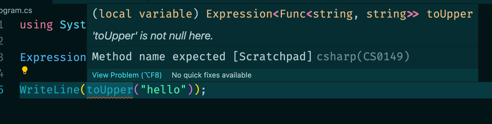
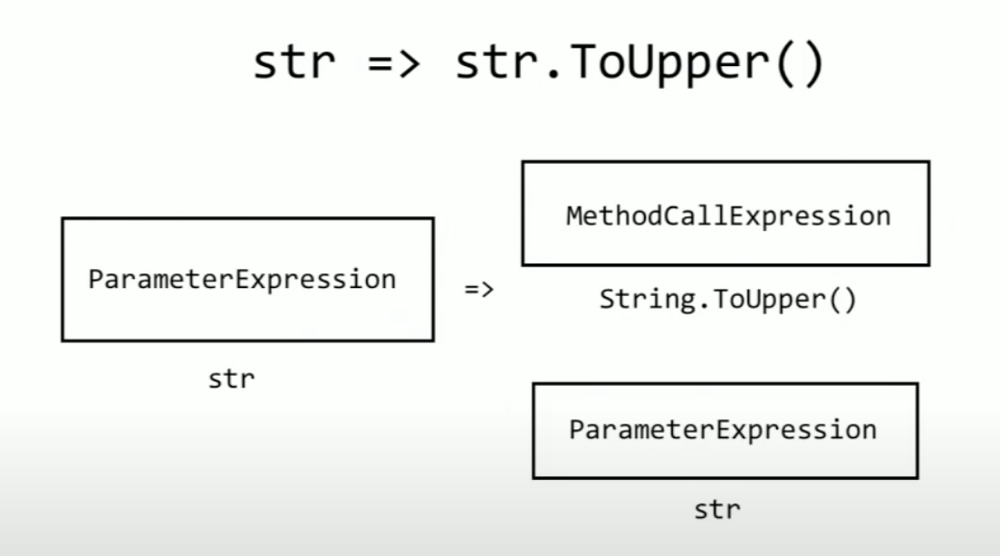
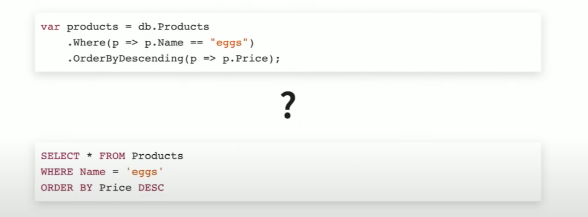
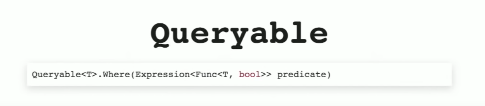
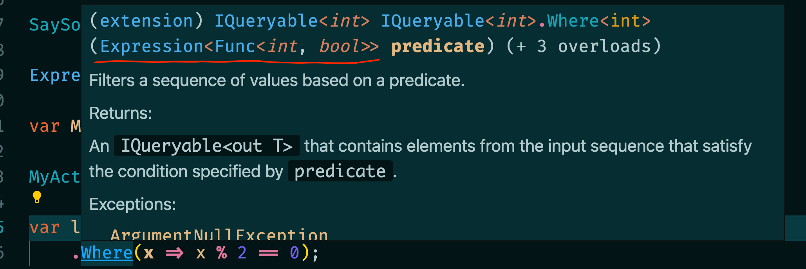
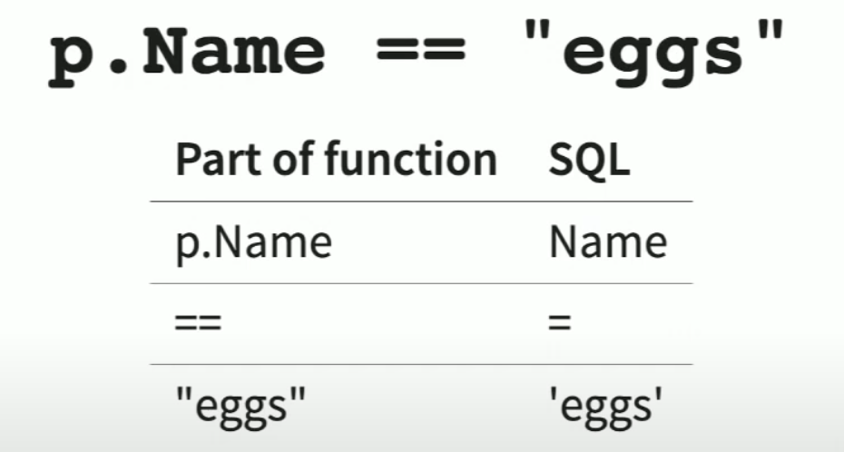
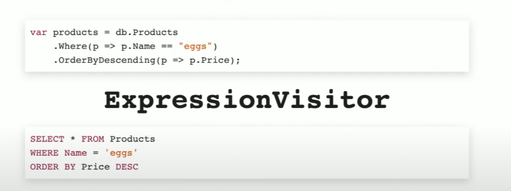

# 08 `Expression Trees`

Video `Youtube`

https://www.youtube.com/watch?v=Ptnxc6tVIPE&ab_channel=NDCConferences


## `Lambda Expression`

```cs
Func<string,string> toUpper = s => s.ToUpper();

WriteLine(toUpper("hello")); // HELLO
```


### Utilisation d'une `Expression`

```cs
using System.Linq.Expressions;

Expression<Func<string,string>> toUpper = s => s.ToUpper();

WriteLine(toUpper("hello"));
```

On obtient une erreur :



Les `Lambdas` font quelque chose.

Les `Expressions` décrivent la `Lambda` qui fait quelque chose.

### Les `Expression` ne sont pas des `Function`.


## `Homoiconicity`

La façon de déclarer une `Lambda` et une `Expression` est quasi identique. L'écriture semble naturele et simple.


## `Lambda Expression`

### On peut la lire


On récupère ici les différentes parties.

### La créer
```cs
Expression<Func<string,string>> toUpper = s => s.ToUpper();
```

On peut aussi les créer au `Runtime` très facilement avec `Expression API`.
On a des méthodes `static` de la classe `Expression` :

`ParameterExpression`

```cs
Expression.Parameter(typeof(string));
Expression.Parameter(typeof(string), "myStr"); // avec un nom
```

  

`ConstantExpression`

représente une constante (12, "Ceci", ...)

```cs
Expression.Constant("Sucre");
```


`MethodCallExpression`

Représente l'appelle à une méthode.

```cs
var prm = Expression.Parameter(typeof(string));
var toUpper = typeof(string).GetMethod("ToUpper", Type.EmptyTypes);

Expression.Call(prm, toUpper);
```

On va contruire cette `Expression` :


```cs
var prm = Expression.Parameter(typeof(string), "str");
var toUpper = typeof(string).GetMethod("ToUpper", Type.EmptyTypes);
var body = Expression.Call(prm, toUpper);

var lambda = Expression.Lambda(body, prm);
```

`Type.EmptyTypes` car `ToUpper` ne prend pas de paramètres, représente un tableau vide de type `Type[]`.

`toUpper` est de type : `MethodInfo`.


### L'utiliser `DynamicInvoke`, `Invoke`

#### Pas fortement typé : `DynamicInvoke`

```cs
var lambda = Expression.Lambda(body, prm);
var result = lambda.Compile().DynamicInvoke("hello hukar");
```

#### Typé fortement : `Invoke`

Si on connait le type au `runtime` on peut écrire comme ceci :

```cs
var lambda = Expression.Lambda<Func<string, string>>(body, prm);
var result = lambda.Compile().Invoke("hello hukar");
```

Plus simplement avec une `Expression` déclarée de manière littérale :

```cs
Expression<Action<int>> myExp = x => WriteLine($"x : {x}");

var myExpCompiled = myExp.Compile();

myExpCompiled(5);
```

```
x : 5
```


## Exemple avec `Entity Framework`

Les `lambdas` passées aux méthodes `LinQ` sont transformées en `SQL` :



Quelle est la magie derrière tout ça ?

#### `IQueryable`


## `Enumerable` vs `Queryable`

Un `Enumerable` va recevoir une `Lambda` dans ses méthodes `LinQ` :


Tandis qu'un `Queryable` va lui recevoir une `Expression` :



La différence est que celle-ci peut-être interprété au `Runtime`.

Si j'écris :

```cs
var list = new List<int>()
    .Where(x => x % 2 == 0);
```

Ici le predicat est une `Func<int, bool>` :


car `list` est un `IEnumerable`.

Maintenant si je transforme ma `list` en `IQueryable` :

```cs
var list = new List<int>().AsQueryable()
    .Where(x => x % 2 == 0);
```



On a un prédicat qui est une `Expression`.

## `BinaryExpression`

```cs
p => p.Name == "eggs"
```

| Propriété | Qu'est-ce que c'est ? |
| --------- | --------------------- |
| Gauche    | Expression            |
| Droite    | Expression            |
| NodeType  | Equal, NotEqual, ...  |

Transformation `c#` vers `sql`




## `ExpressionVisitor`

La magie entre les deux langages est un `ExpressionVisitor` :


