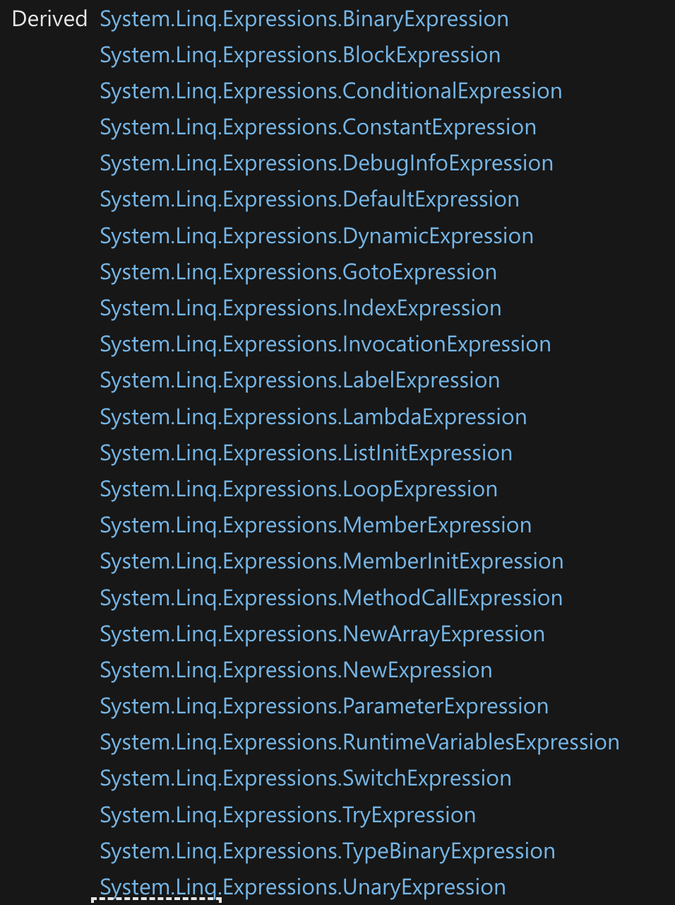

# 08.5 Les `Expression`

D'après cette vidéo :

https://www.youtube.com/watch?v=Glfz0FDPfXk&ab_channel=CodeItUpbyAMBITIONED


## Définition `Expression`

Une `Expression` est une structure de données qui représente le code de la fonction, (du `delegate`), qu'on lui passe.

On peut donc analyser ce code.

N'importe quel code peut-être représenté par un `arbre`, c'est ce que fait l'`Expression Tree`.


## `Expression Tree` Type



On a ici les type d'`expression` possible pour décrire le code.

## Comparaison `Func` et `Expression`

Connaître le nom d'une `Func` :

```cs
Func<int,int> AddingSomething = x => x + 5; 

WriteLine(AddingSomething.Method.Name);
```

```
<<Main>$>b__0_1
```

C'est le nom donné par le compilateur (!?).