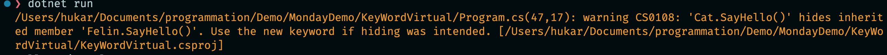
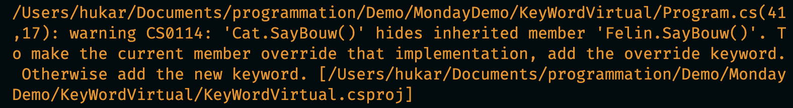

# 10 le mot clé `Virtual`


## Le mot clé `new`

```cs
class Felin
{
    public void SayHello() => WriteLine("Felin Hello!!");
}
```

```cs
class Cat : Felin
{
    public void SayHello() => WriteLine("Cat Hello !");
}
```

```cs
Cat b = new Cat();
b.SayHello();
```

```
Cat Hello !
```

La méthode de la classe de base `Felin` est dite masqué (`Hide`) par la méthode de la classe descendante `Cat`. Sans le mot clé `new`, le compilateur affiche un `warning`:



```cs
class Cat : Felin
{
    public new void SayHello() => WriteLine("Cat Hello !");
}
```

Il n'y a plus de `warning`.

```cs
Felin a = new Cat();
a.SayHello();
```

```
Felin Hello!!
```

Ici c'est la méthode de la classe de `base` qui est utilisé. Pour pouvoir utilisé la méthode de la classe `dérivée`, il faut ajouter un `cast`:

```ruby
((Cat)a).SayHello();
```

```
Cat Hello !
```


## `virtual` et `override`

```cs
class Felin
{
    virtual public void SayBouw() => WriteLine("FELIN BOUW");
}
```

```cs
class Cat : Felin
{
    public void SayBouw() => WriteLine("CAT BOUW");
}
```

```cs
Felin a = new Cat();
a.SayBouw(); // FELIN BOUW

Cat b = new Cat();
b.SayBouw(); // CAT BOUW
```

Ici le comportement est celui d'un masquage, le compilateur affiche un `warning`:




### Utilisation d'`override`

```cs
class Cat : Felin
{
    override public void SayBouw() => WriteLine("CAT BOUW");
}
```

```cs
Felin a = new Cat();
a.SayBouw(); // CAT BOUW

Cat b = new Cat();
b.SayBouw(); // CAT BOUW
```

Le mot clé `virtual` indique au compilateur qu'il faut chercher une méthode `override` dans les classes `dérivées`, si celle-ci existe, elle est utilisé à la place de la méthode de la classe de `base`.


### Accès à `base`

On a accès à la méthode de la classe de `base` avec la notation `base.MyMethod()` dans la `method` `override`:

```cs
class Cat : Felin
{
    override public void SayBouw()
    {
        base.SayBouw();
        WriteLine("CAT BOUW");
    }
```

```cs
Felin a = new Cat();
a.SayBouw();
// FELIN BOUW
// CAT BOUW

Cat b = new Cat();
b.SayBouw(); 
// FELIN BOUW
// CAT BOUW
```


