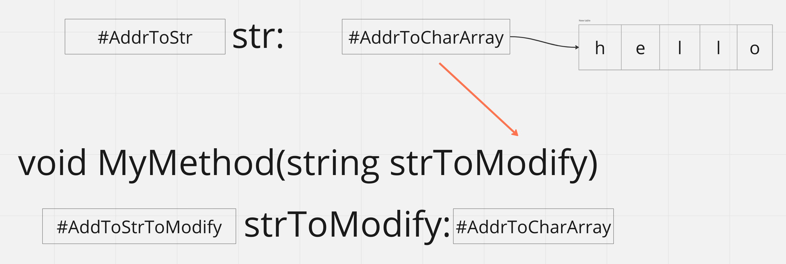
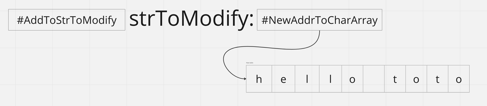
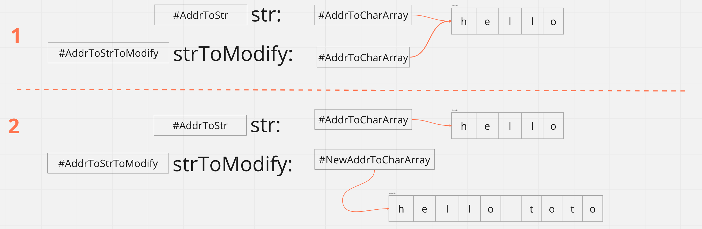
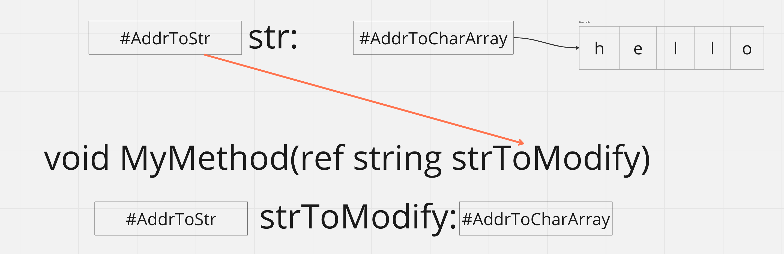
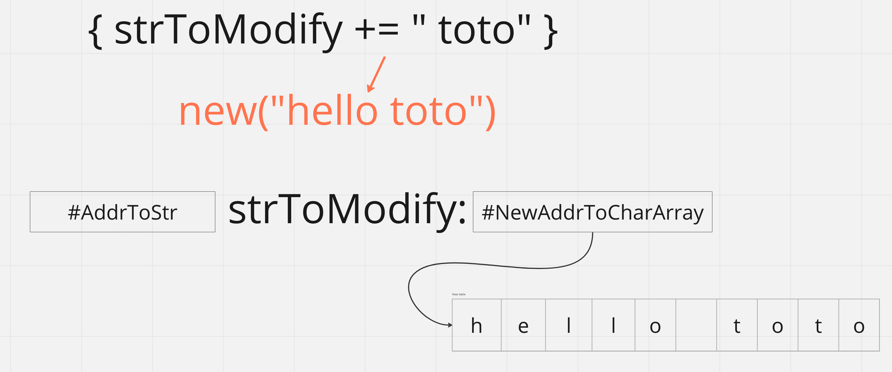
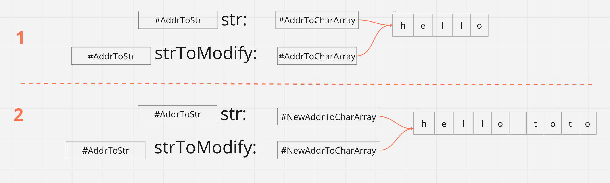

# 11 `string`

## Passage par valeur ou par référence

### Passage par valeur

De base un `string` est passé par valeur. Comme c'est une classe c'est la valeur de la référence à un `char[]` qui est passée.

```cs
void ModifyString(string strToModify)
{
    strToModify += " toto";
    Console.WriteLine(strToModify);
}
```

```cs
var str = "hello";
ModifyString(str);

System.Console.WriteLine(str);
```

```
hello toto
hello
```

`strToModify` prend la valeur de la variable `str`, c'est à dire l'adresse vers la chaîne `"hello"`:



La classe `string` est immutable et à chaque assignation, un nouvel objet `string` est créé sous le capot:


On a donc un nouveau `char[]` avec une nouvelle adresse:



En résumé:




### Passage par `référence`

On utilise pour cela le mot clé `ref`.

```cs
void ModifyString(ref string strToModify)
{
    strToModify += " toto";
    Console.WriteLine(strToModify);
}
```

```cs
var str = "hello";
ModifyString(ref str);

System.Console.WriteLine(str);
```

```
hello toto
hello toto
```

Ici c'est l'adresse de la variable `str` elle même que l'on passe:



On a ici deux noms de variable avec la même adresse, ce sont des alias de la **même** adresse mémoire.



`str` et `strToModify` ayant la même adresse, on exactement la même valeur, ici un nouveau `char[]`, ils affichent donc ewactement la même chose. C'est en fait deux noms pour la même entité contrairement au passage par valeur qui créé automatiquement une nouvelle variable en mémoire avec sa propre adresse. 

En résumé:



