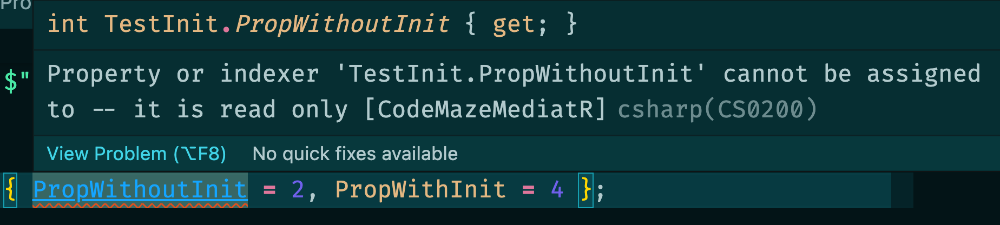
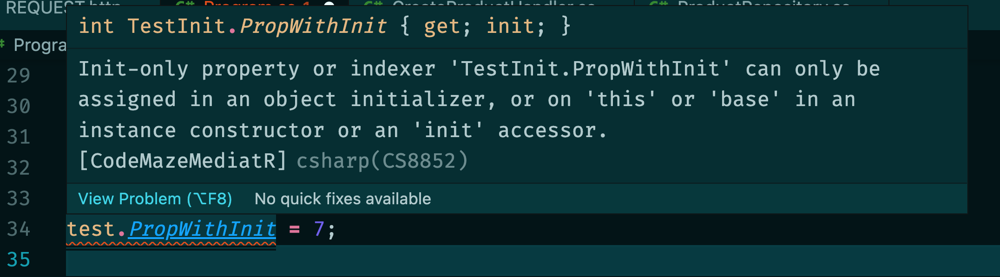

# 09 `init`

## `init` ou pas `init`

Cette syntaxe permet de rendre une propriété initialisable sans forcement définir un constructeur:

```cs
public class TestInit
{
    public int PropWithoutInit { get; }
    public int PropWithInit { get; init; }
}
```

 ```cs
 TestInit test = new TestInit() { PropWithoutInit = 2, PropWithInit = 4 };
 ```



La propriété n'ayant ni `set` ni `init` ne peut pas être assignée lors de la création d'un objet.

`init` fonctionne différemment, et on peut réassigner la propriété lors de la création d'un objet:

```cs
public class TestInit
{
    public int PropWithoutInit { get; } = 9;
    public int PropWithInit { get; init; } = 8;
}
```

```cs
TestInit test = new TestInit() { PropWithInit = 4 };

Console.WriteLine (test.PropWithInit);
```

```
4
```

Il n'est bien sûr plus possible après de réassigner cet objet:




## `record` et `init`

Un record compile ses propriété avec `{ get; init; }`

```cs
public record Product(string Name);
```

```cs
public string Name
{
    [CompilerGenerated]
    get
    {
        return <Name>k__BackingField;
    }
    [CompilerGenerated]
    init
    {
        <Name>k__BackingField = value;
    }
}
```

