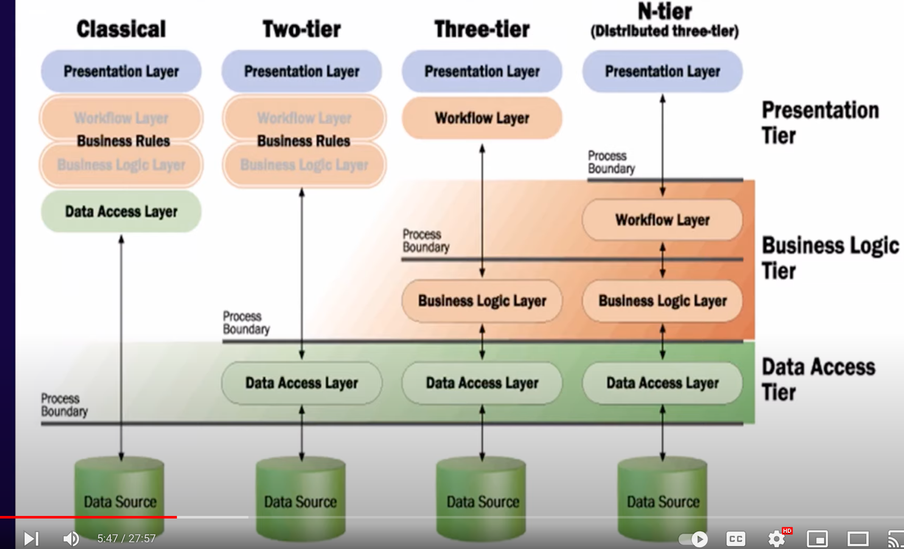
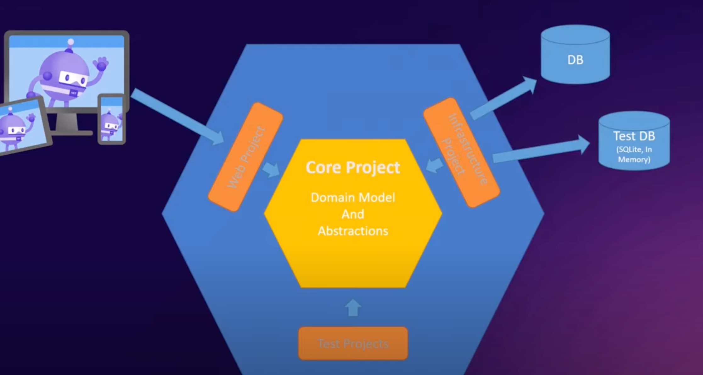
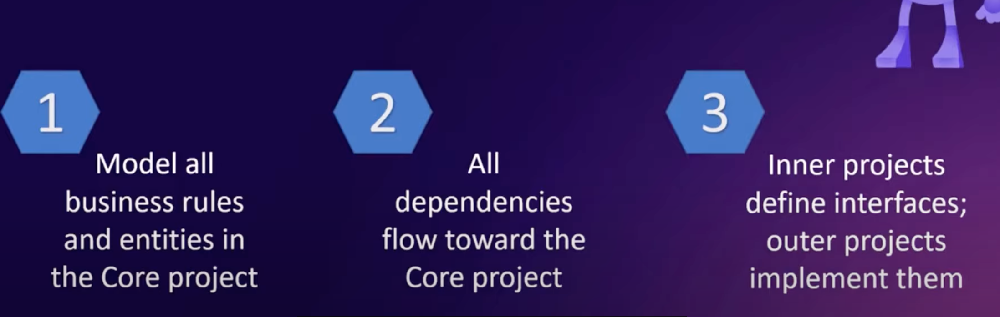
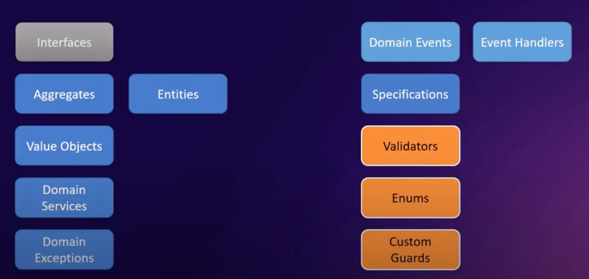
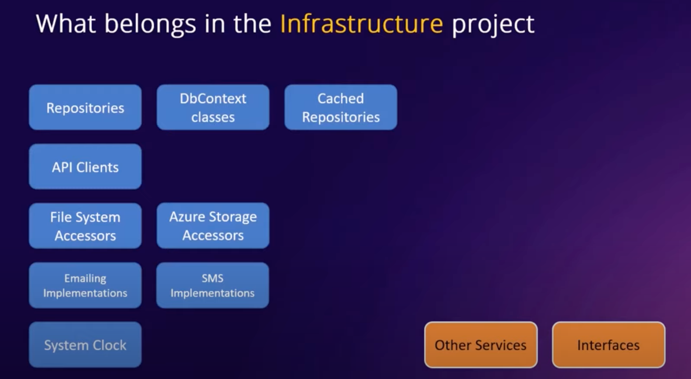
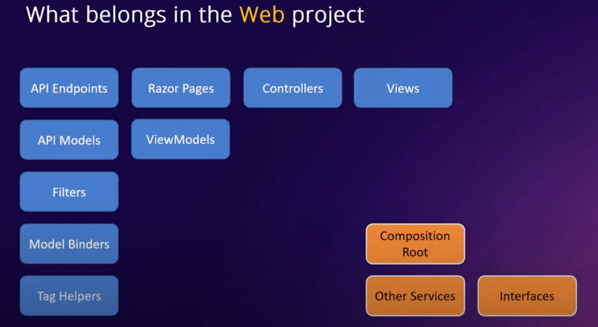
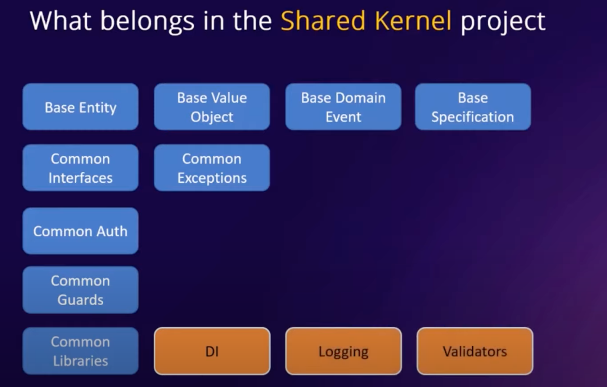

# 01 `Clean`  Architecture

## Différence avec une architecture `n-Tier`

L'architecture `n-Tier/n-Layer` est centrée sur la `BDD` (technologie) alors que l'architecture `Clean` est centrée sur le `Domain` (le métier).

## Architecture `N-Tier`

Cette architecture définie déjà une séparation du code :

## `Hexagonal`/`Ports and Adapters` Architecture

## `Clean` Architecture

La couche `Infrastructure ` sert à communiquer avec tous le reste :

- Base de données
- Services extérieur
- Système de mail
- ...

## Règles de la `Clean` Architecture

- Toutes les `règles métiers` et toutes les entités sont dans le `Core Project` (`Domain`)
- Toutes les dépendances pointes vers le `Core Project`
- Les projets intérieurs définissent les `interfaces`, les projets extérieurs les `implémentent`

## Composition du `Core` project

Je retiens :

- Les `Entities`
- Les `Services` (`CQRS`)
- Les `Interfaces`
- Les `Customs Exception`
- Les `Validators`

## Composition du `Infrastructure` Project

On va trouver ici toutes les implémentations des `interface` du `Core` Project.

Toutes les dépendences avec les librairies externe doivent être dans `Infrastructure` Project.

- `Repository`
- Gestion du `Cache`
- `API Client`
- `Email`, `sms`
- `File System`
- `System Clock`

## Le `Web` Project

Il peut être de différent type :

Les `Dtos` ou `ViewModels` sont définie ici.

## Principe du `Shared Kernel` Project

Ce sont les classes partagées par plusieurs applications.

Il n'y a pas de dépendence avec `Infrastructure`.

