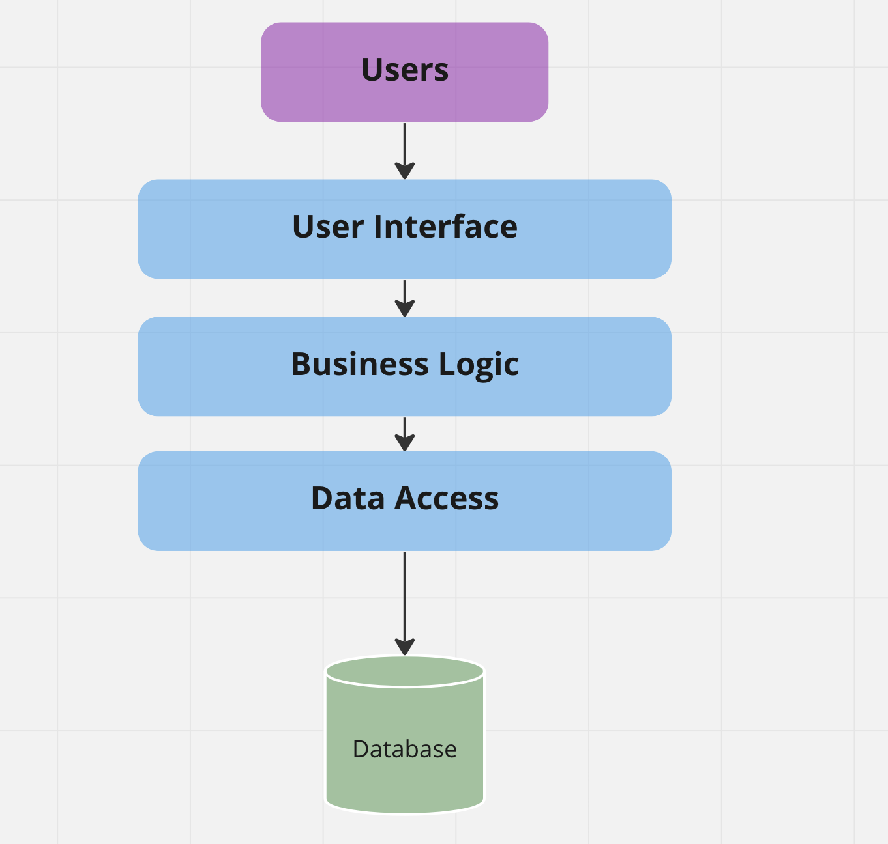
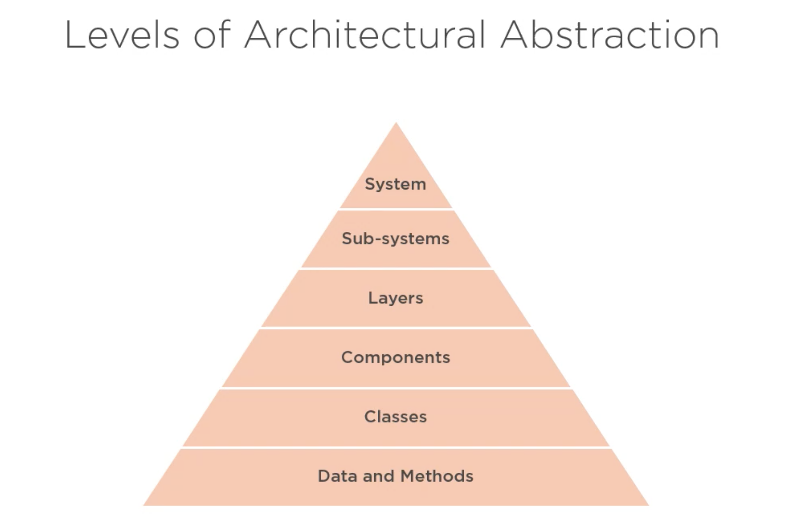

# 01 Introduction

## Qualités d'une `Architecture`

- Compréhensible
- Modifiable/Adaptable
- Testable
- Maintenable

## Qu'est ce que l'`Architecture Logicielle`

- C'est une vison `High-Level`
- C'est la réflection sur la structure
- Ce sont les couches (`Layers`)
- Ce sont les composants (`Components`)
- Et ce sont les liens entre les dufférents éléments (`Relationship`)

`Modèle en Couches`

`Niveaux d'abstraction de l'architecture logicielle`

## `Bad` vs `Clean` architecture

### `Bad` architecture

- Complexe par accident plutôt que par nécéssité
- Incohérente, les parties ne semblent pas aller ensemble
- Rigide, l'application est difficile à faire évoluer
- Fragile, toucher du code à un endroit peut casser du code à un autre
- Non testable
- Non maintenable sur le temps de vie du projet

### `Good` architecture

- Simple, pas de complexité arbitraire
- Compréhensible, c'est facile de raisonner sur le logicielle entier
- Flexible, il est facile d'implémenter les changement d'exigence (de fonctionnalité)
- Emergente, l'architecture évolue pendant la vie du projet
- Testable
- Maintenable

## `Clean` architecture

C'est une architecture qui est pensée (designée) pour les habitants de l'architecture, pas pour l'architecte ni pour la machine.

Les habitants de l'architecture sont:

- Les utilisateurs du logicielle
- Les développeur chargés de coder le système
- Les développeur chargés de maintenir le système (le logicielle)

On doit éviter les optimisations prématurées sur le logicielle.

On ne construit que ce qui est nécessaire, pas de fonctionnalités superflue.

La maintenabilité du système est primordiale, on passe plus de temps à maintenir un système qu'à le coder.

## Application d'exemple

Il contient 7 projet:

- `Application` Contient des abstractions à propos des `Use Cases` de l'application
- `Common` contient les préoccupations transverse de l'application 
- `Domain` c'est le domaine métier
- `Infrastructure` fournit une interface avec `Système d'exploitation` et les `third-party`
- `Persistance` fournit une abstraction avec la `DB`
- `Presentation` c'est le `User Interface` de l'application
- `Specification` contient les tests d'acceptance