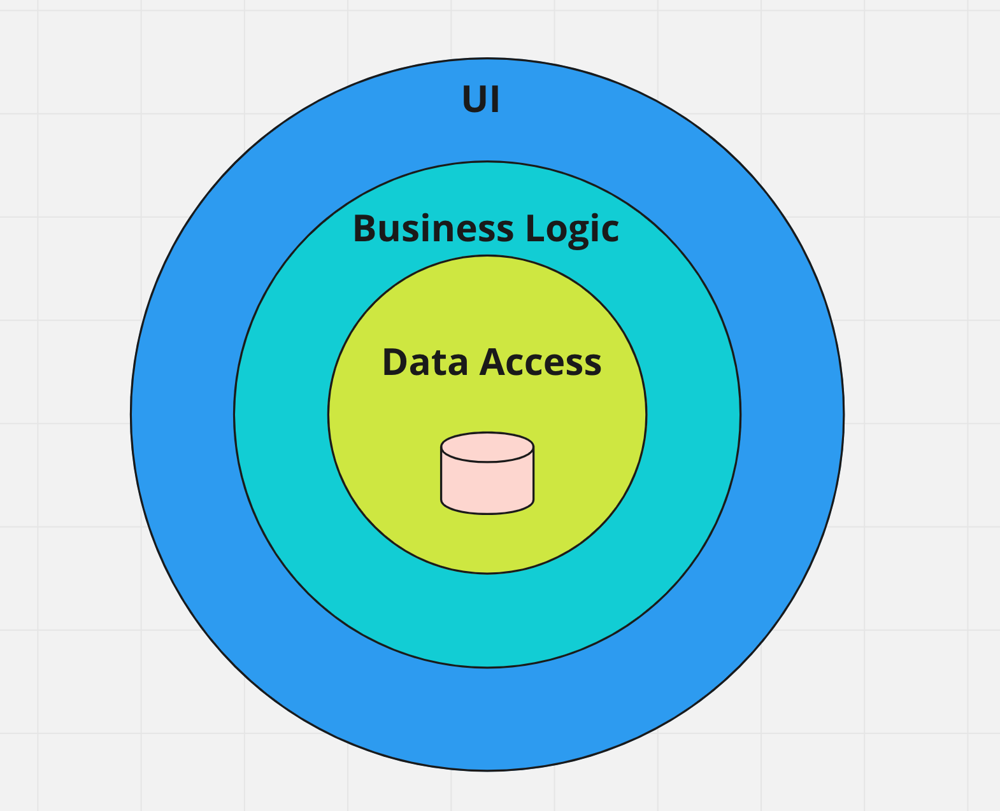
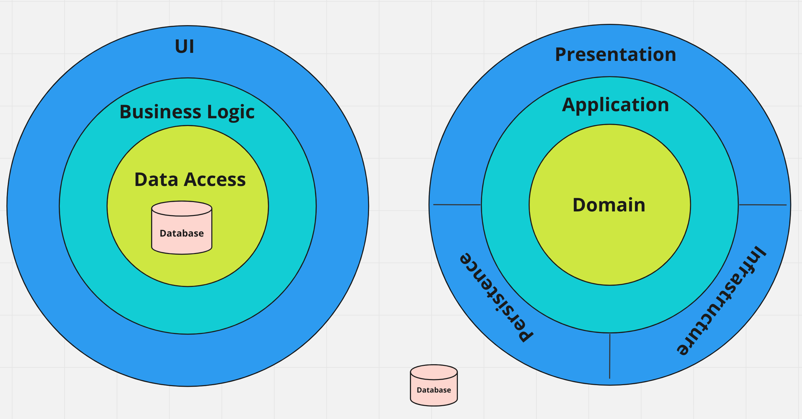
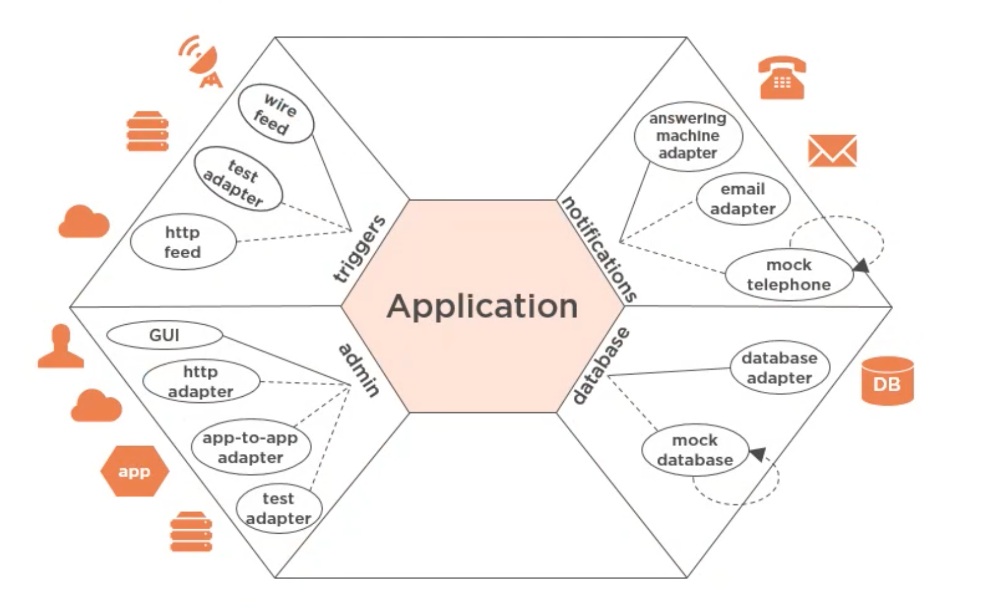
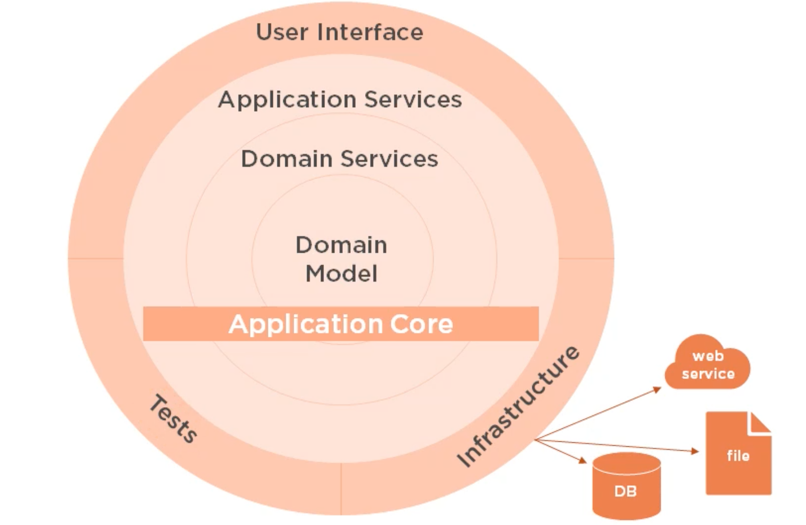
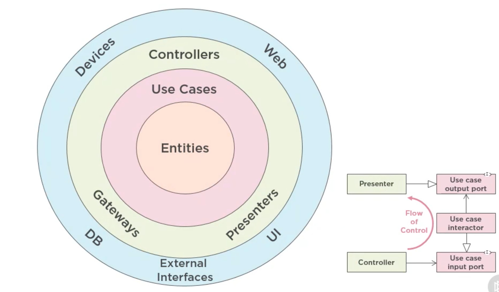
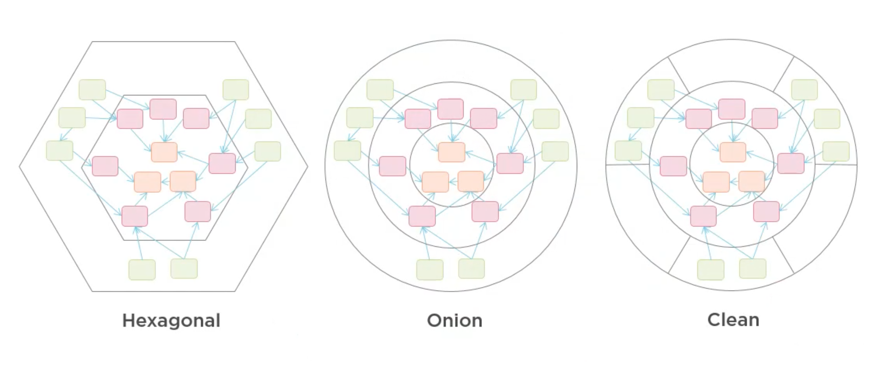
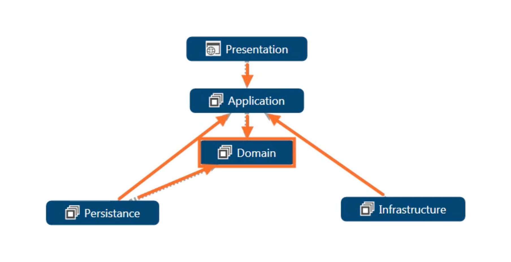
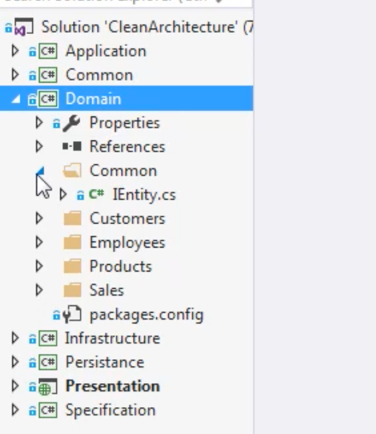

# 02 `Domain-Centric` architecture


## Classic architecture `3 couches` : architecture `Base De données centrées` : `Database-Centric`




## `Database-Centric` vs `Domain-Centric` architecture

Certaine personne on plutôt mit le `Dommain` au centre et reléguer la `DB` à un détail technique extérieur.



> La première préoccupation de l'architecture est d'être sûr que la maison est utilisable, pas de garantir que la maison est construite en brique.
>
> Uncle Bob


## `Hexagonal` architecture

Alistair Cockburn's



C'est une architecture `Port/adapters`.


## `Onion` architecture

Jeffrey Palermo



La couche `Persistance` est incluse dans `Infrastructure`.

Toutes les dépendances pointent vers le `Domain`.


## The `Clean` architecture

Uncle Bob



Ici les `Entities` sont le `Domain` et les `Use Cases` la couche `Application`.


## Ce sont toutes des `Domain-Centric` architecture



Elle sont toutes centrées sur le `Domain` (`Entities`), entouré par la couche `Application` (`Use Cases`) et enfin par les "détails" (`Persistance`, `Infrastructure`, `User Interface`).

Toutes les dépendances pointent vers le `Domain`.


## `Domain-Centric` architecture

### Pros

- Concentré sur le `Domain`
- Le `Domain` est découplé des "détails" d'implémentation de l'application : `DB`, `Operating System`, `UI`, ...
- Authorise le `DDD`: `Domain Driven Design` de Eric Evans

### Cons

- Le changement est difficile, et l'architecture en trois couche est plus répendue
- Demande plus de réflexion pour savoir où ranger les différentes classes
- Coût initial élevé comparé à une architecture en trois couche, cela vaut le coup si l'application est suffisament complex et que son cycle de vie est suffisament long.


## En pratique



Tous les projets pointent vers `Domain`.

Le projet `Persistance` dépend d'`Application` et de `Domain` aussi.



Le `Domain` contient les `Entities` et une interface commune `IEntity` pour les `entities` possédant un identifiant unique:

```cs
public interface IEntity
{
    int Id { get; set; }
}
```

Le nom des `Entities` doit être calqué sur le métier (`Business`).


