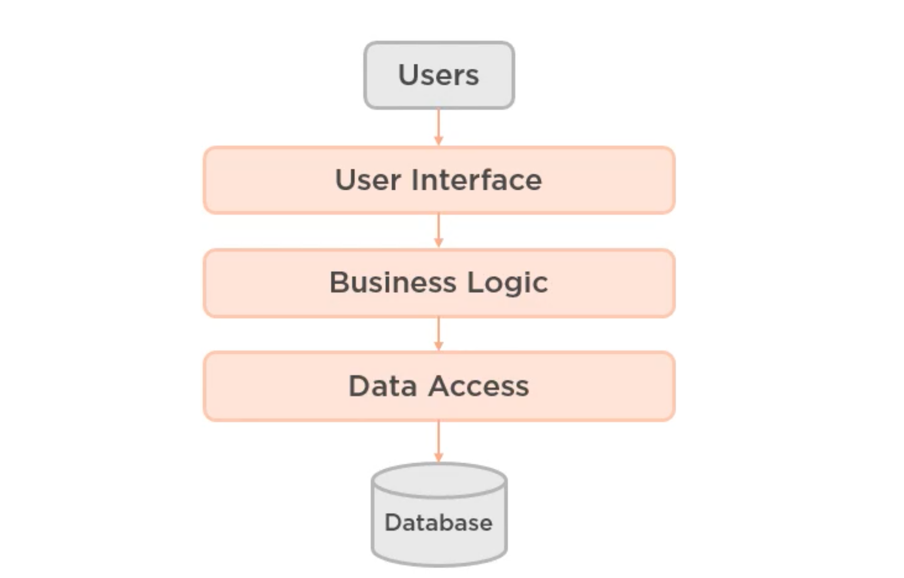
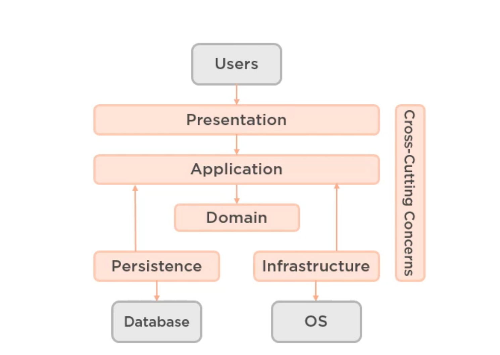
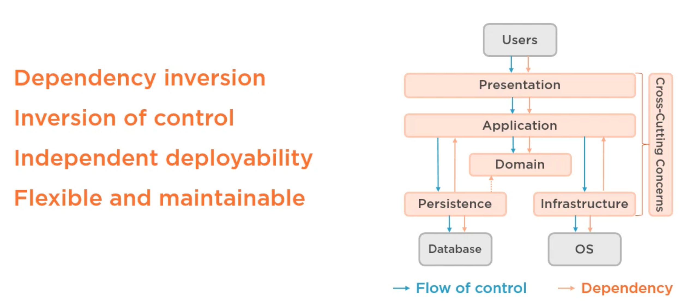
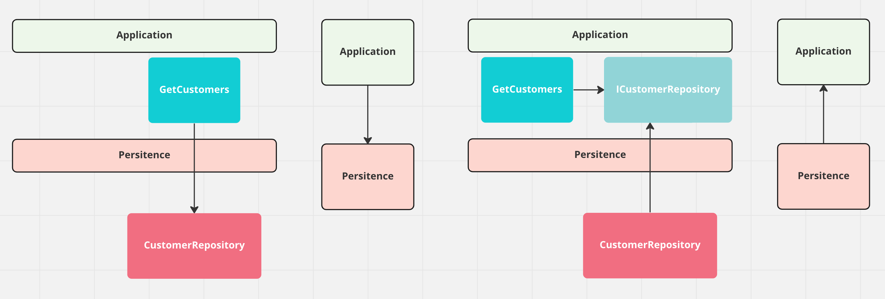
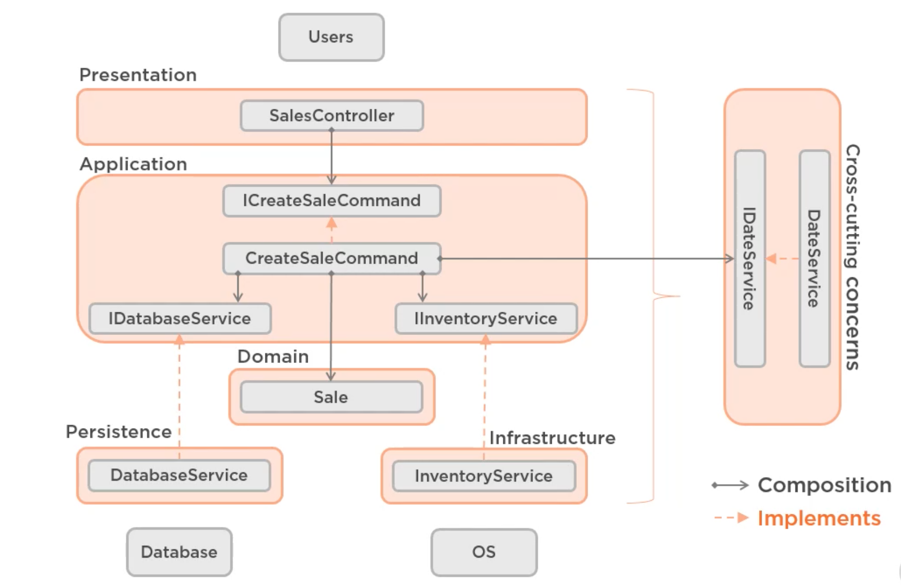
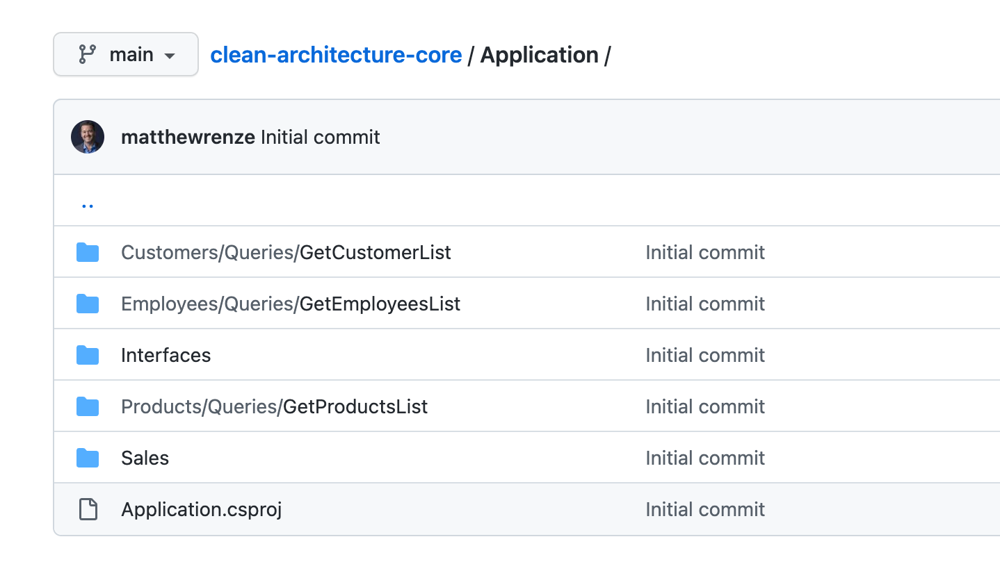
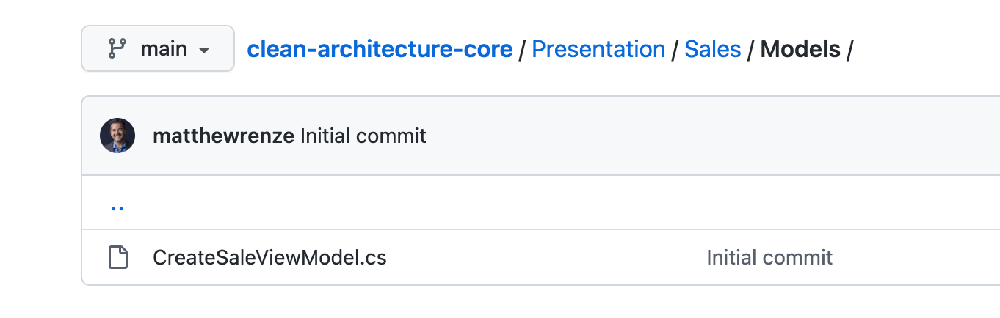

# 03 La couche `Application`

## Que sont les couches : `Layers`

Ce sont des frontières (`Boundaries`) au sein d'une application.

- Un niveau d'abstraction
- respecte le principe de `Single-Responsability` (voire `Solid`)
- Isole les rôles et les compétences
- Peuvent avoir des implémentations multiple
- Ont un taux différent de changement

Les couches sont le moyen d'organiser une application et de gérer sa complexité.

## Classique `Three-Layer` architecture

C'est une architecture bien adaptée pour un `CRUD`.

Cela fonctionne moins bien avec un `Domain` riche et complexe.

Il y a une ambigïté sur où le niveau d'abstraction `Application` et le niveau d'abstraction `Domain` doivent aller.

## Moderne `Four-Layer` architecture

## La couche `Application`

Elle contient les `Use Cases` : les cas d'utilisation.

La couche `Application` ne connait que la couche `Domain`, elle ne voit ni l'`Infrastructure`, ni la `Persistence`, ni la `Presentation`.

C'est une vue haut-niveau de la logique de l'application.

Elle contient des `interfaces` implémentée dans les couches `Infrastructure` et `Persistence`.

On utilise l'`Inversion Of Control` et la `Dependency Injection` pour relier les implémentations au `runtime`.

### Inversion de dépendance

En utilisant des `interfaces` devant être implémentés dans les couches `Persistence` et `Infrastructure`, la couche `Application` inverse le `flow of control` du sens de la dépendance.

C'est la couche `Persistence` qui doit avoir une référence vers `Application`, mais c'est la couche `Application` qui impose à la couche `Persistence` ce qu'elle doit implémenter.

Tout cela permet d'avoir une application `flexible` et `maintenable`.

Il existe aussi une dépendance de `Persistence` vers `Domain`, car la classe `Persistence` doit pouvoir mapper les enregistrement en `DB` vers les `Entity` du `Domain`.

Voici un exemple d'implémentation.

> Je ne suis pas sûr que `ICreateSaleCommand` est un intérêt.

Le projet `Cross-Cuting Concern` contient lui-même son interface `IDateService` pour être utilisable par n'importe quelle couche de l'application.

## `Pros` et `Cons`

### Pros

- Le focus est mis sur les cas d'utilisation
- Facile à comprendre
- Suit le principe d'injection de dépendances `DIP`

### `Cons`

- Cela créé un coût supplémentaire en ajoutant une couche
- Cela requière plus de réflexion pour savoir où placer la logique métier : `Domain` ou `Application`
- `Inversion Of Control` est un pattren contre-intuitif

## Contenu de la couche `Application`

Cette couche contient les `Queries` et les `Commands` nécessaire aux `entities` du `Domain`.

Elle contient aussi les `Intrefaces` implémentées dans `Infrastructure` et `Persistence`.

> ## Les fichiers `ViewModel` (`DTO`)
>
> Ces fichiers se trouvent dans la couche `Presentation` dans un dossier `Models`:
>
> 
>
> C'est certainement une bonne idée de mettre les `DTOs` dans la couche `API` et non pas dans la couche `Application`.
>
> Jason Taylor met lui ses `DTOs` dans la couche `Application` avec ses `Commands`.
>
> Steve Smith, lui met ses `ViewModels` dans la partie `Web` qui correspond à la couche `Presentation`. 

