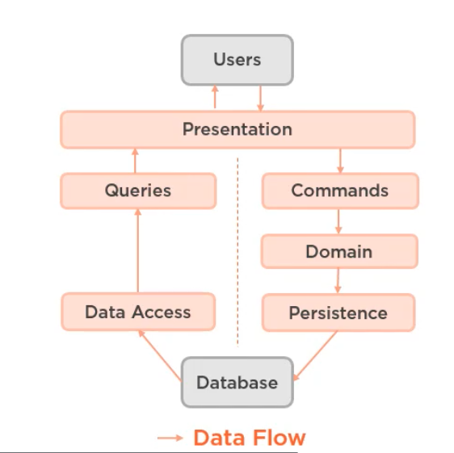
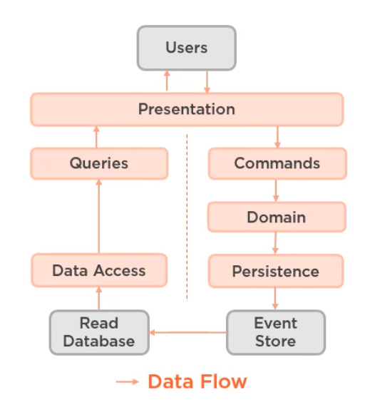

# 04 `Commands` et `Queries`

Bertrand Meyer (1988) sépare les actions possible dans un logicielle en deux concepts séparés :

### `Command`

- Font quelque chose
- peuvent modifier le `state`
- ne doivent pas retourner quelque chose

### `Query`

- Répondent à une question
- Ne modifie pas le `state`
- doivent retourner une valeur

Cette séparation permet d'éviter de pernicieux effets de bord.

## `Command-Query` séparation exception

Martin Fowler fait remarquer que cela n'est pas toujours possible.

### `stack` : `Pop`

- Supprime un élément => `Command`
- Retourne l'élément du dessus => `Query`

### Créer un nouvel enregistrement

- Créer un enregistrement => `Command`
- Retourner le nouvel `Id` => `Query`

## Les différents types de pattern `CQRS`

### `Single-Database CQRS`

Cette architecture peut utiliser deux stratégies différentes:

- Un `ORM` complexe pour les `Commands` tel que `EF Core`
- Une couche plus basse directement en `SQL` pour plus d'efficacité pour les `Queries`

### `Two-Database CQRS`

On a deux `DB` dont une est optimisé en lecture (1ère forme normale) et l'autre en écriture (3ème forme normale).

Les deux `DB` utilisent un pattern pour être synchronisées (`Eventual Consistency`).

Cette architecture permet de meilleur performance, un système étant plus souvent consulté (`Query`) que modifié (`Command`).

### `Event Sourcing CQRS`

À la place d'une `DB` en écriture, on a un `Event Store` qui enregistre l'historique de toutes les modifications qu'une `entity` a subi.

Si on a besoin de connaître l'état courant (`current state`) d'une `entity`, on rejoue tout l'historique de ses modifications.

Le `Current state` est ensuite poussé dans la `DB` en lecture qui sera elle, extrêmement rapide.

On conserve un historique complet des modifications.

On peut reconstruire le système à n'importe quel point dans le temps.

on peut rejouer des événements

On peut avoir plusieurs `DB` en lecture

On peut reconstruire la `DB` en production

Il est possible d'accélérer la partie `Event store` en programmant des `Snapshot` réguliers.

