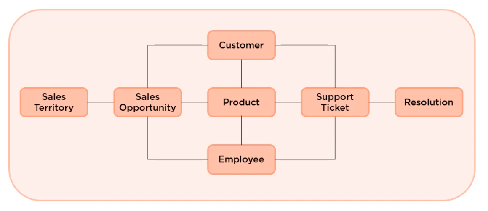
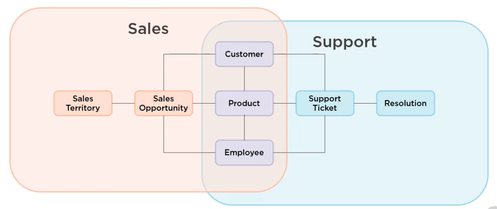
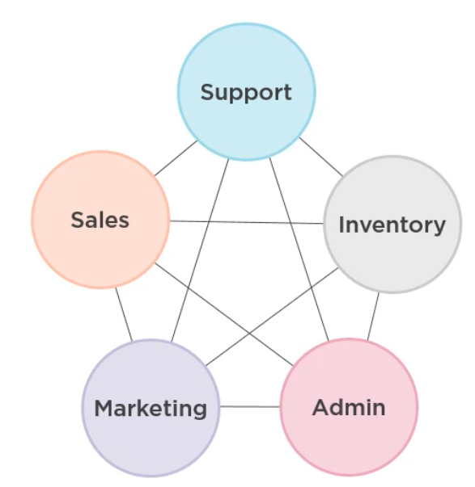
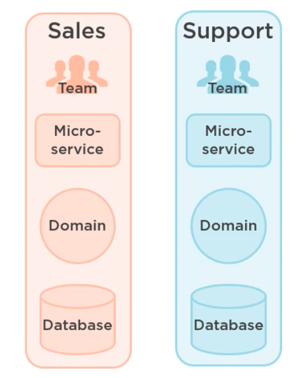

# 06 `Microservices` architecture

## Problème du `Domain`

On souhaite construire un `Domain` ayant ces deux `Use Cases` : `Sales` et `Support`.

## `Single Domain` modèle

On réuni les même noms et les même concept en une seule `entity`:

`Sale Person` et `Support person` => `Employee`

`Customer` et `Contact`=> `Contact`

on réuni `Product`

Au fur et à mesure que le `Domain` grandit, il devient de plus en plus difficile de garder un `Domain` unifié.

## Chevauchement (`overlapping`) de contexte

On peut faire coexister plusieurs contexte en les faisant se chevaucher:

## `Bounded Contexts`: contexte délimité

On peut diviser le `Domain` en plusieurs contexte délimités et spécifiques.

## `Microservices`

- Ils subdivisent les application monolithes
- Ils ont des interfaces clairement défini (`REST`)
- Ils peuvent être conçu par de petites Teams
- Ils sont indépendant (développement et déploiement)
- Similaire à `service Oriented Architect`

Les `microservices` s'alignent naturellement sur les délimitations des contextes.

Cette architecture pose beaucoup de questions:

- À quel point les services doivent être petits ?
- Où les couper ?

- On peut créer des `Microservices` par `Aggregate root`

> Les `Aggregate root` sont les seules objets renvoyés par un `Repository`.
>
> Le `Repository` encapsule les objets enfants qui eux ne seront jamais renvoyés par eux-même.
>
> Par exemple un `Client` est un `Aggregate root` contenant une `Adresse` et `Liste de Hobbys` par exemple. Ni l'`Adresse`, Ni la `Liste de Hobbys` ne vont être consultés par eux-même.
>
> https://stackoverflow.com/questions/1958621/whats-an-aggregate-root
>
> De Evans DDD :
>
> Un AGGREGAT est un groupe d'objets associés que nous traitons comme une unité aux fins des changements de données. Chaque AGGREGAT a une racine et une limite. La limite définit ce qui se trouve à l'intérieur de l'AGGREGAT. La racine est une ENTITÉ unique et spécifique contenue dans l'AGGREGAT.
>
> Et :
>
> La racine est le seul membre de l'AGGREGAT auquel les objets extérieurs sont autorisés à faire référence [...].
>

- Doit-on avoir une `DB` par `Bounded Context`

### Loi de Conway

L'architecture d'une application a tendance à refléter l'architecture de l'entreprise.

Une entreprise plutôt pyramidale aura tendance à favoriser des architecture `monolithique`, tandis qu'une entreprise plutôt agile favorisera une architecture en `microservicse`.
