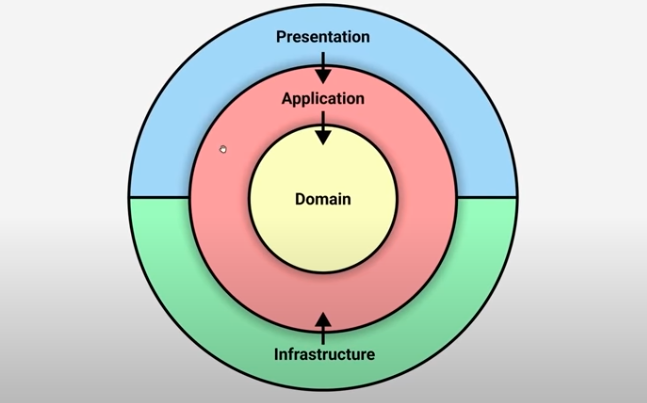
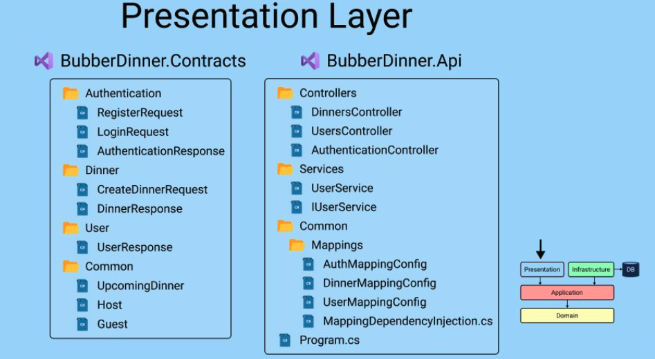
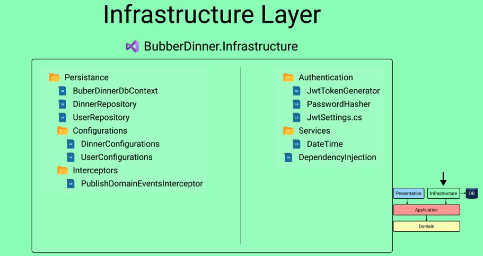
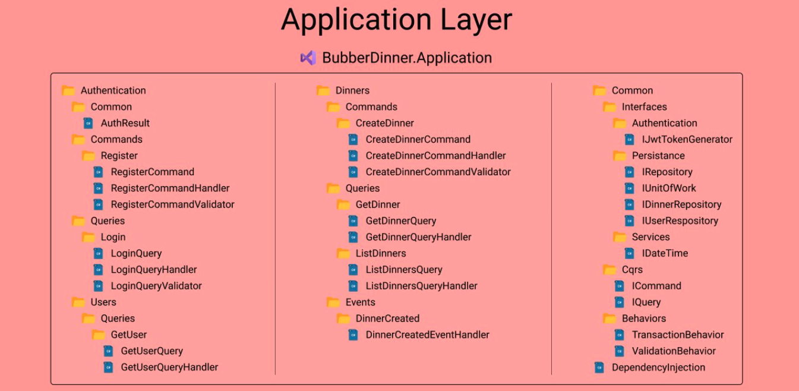

# 01 `Clean Architecture`

## La structure

Clean architecture, onion architecture, ports and adapter, hexagonal architecture.

On peut aussi le représenter comme ceci :

Une version plus détaillée :

### `Presentation`

### `Infrastructure`

### `Application`

### `Domain`

