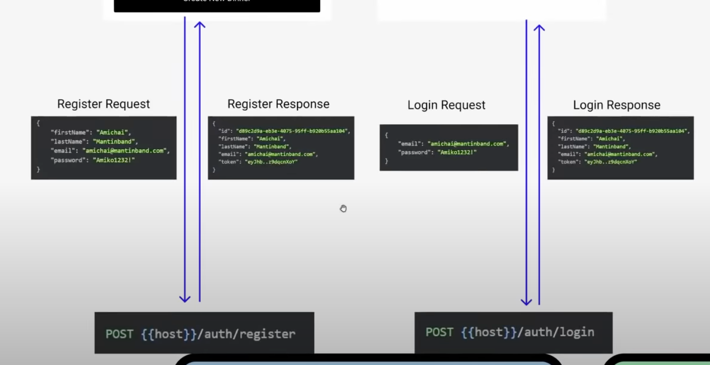
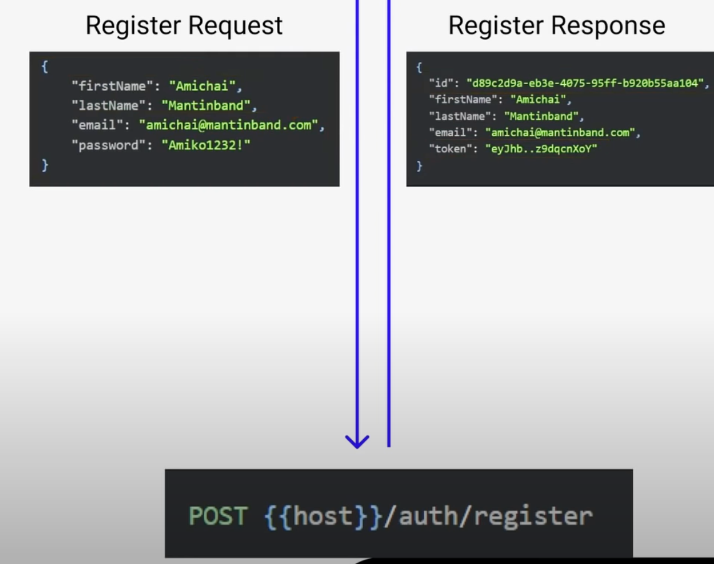
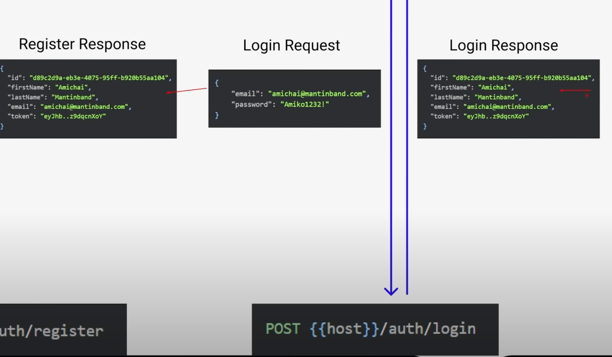
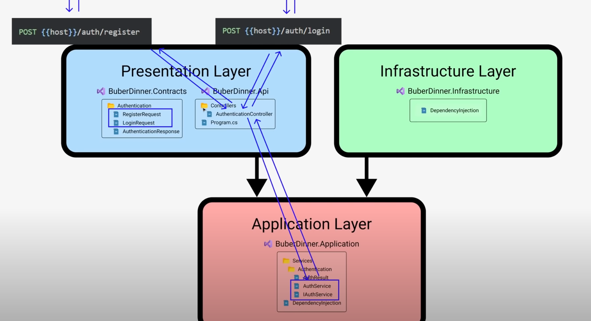

# 02 `Login` et `Enregistrement` : `Register`










## `BuberDinner.Contracts`

On crée le dossier `Authentication` et dedans les classes `RegisterRequest.cs`, `LoginRequest.cs` et `AuthenticationResponse.cs`

### `RegisterRequest.cs`

```cs
public record RegisterRequest(
	string FirstName,
    string LastName,
    string Email,
    string Password
);
```


### `LoginRequest.cs`

```cs
public record LoginRequest(
    string Email,
    string Password
);
```


### `AuthenticationResponse.cs`

```cs
public record AuthenticationResponse(
    Guid Id,
	string FirstName,
    string LastName,
    string Email,
    string Token
);
```


## Le `endpoint` pour `auth`

```cs
namespace BuberDinner.Api.Endpoints;

public static class AuthenticationEndpoint
{
    public static WebApplication MapAuthentication(this WebApplication app)
    {
        var authRoute = app.MapGroup("/auth");

        authRoute.MapPost("/register", (RegisterRequest request) => {
            
            return Ok(request);
        });
        authRoute.MapPost("/login", (LoginRequest request) => {

            return Ok(request);
        });

        return app;
    }
}
```

Pour l'instant on teste juste que tout fonctionne.

Utilisation des `extension method` pour organiser mes `endpoints`.

### enregistrement de l'`endpoint`:

`Program.cs`

```cs
var builder = WebApplication.CreateBuilder(args);

var app = builder.Build();

app.MapAuthentication();

app.Run();
```

> `REST Client`
>
> On peut définir des variables dans `REST Client` avec cette syntaxe `@myvar = ` :
>
> ```http
> @root = http://localhost:5260/auth
> 
> POST {{root}}/register HTTP/1.1
> Content-Type: application/json
> 
> {
>     "firstName": "Hukar",
>     "lastName": "Engine",
>     "email": "hukar@gmail.com",
>     "password": "h$$k@rrr99"
> }
> ```
>
> 


## Création de `AuthenticationService`

Dans le projet `BuberDinner.Application`, on créé un dossier `Services` et dedans un dossier `Authentication` :

Puis on y créé deux fichiers `IAuthenticationService.cs` et `AuthenticationService.cs`

```
BuberDinner.Application/Services/Authentication/AuthenticationService.cs
BuberDinner.Application/Services/Authentication/IAuthenticationService.cs
```

`IAuthentication.cs`

```cs
public interface IAuthenticationService
{
    AuthenticationResult Register(string firstName, string lastName, string email, string password);
    AuthenticationResult Login(string email, string password);
}
```

On a donc besoin d'un `record` :

`AuthenticationResult`

```cs
public record AuthenticationResult(
    Guid Id,
	string FirstName,
    string LastName,
    string Email,
    string Token
);
```

> On pourrait avoir ceci :
>
> ```cs
> public interface IAuthenticationService
> {
>     AuthenticationResponse Register(RegisterRequest request);
>     AuthenticationResponse Login(LoginRequest request);
> }
> ```
>
> Mais on garde nos frontière de responsabilité bien solide et `Application` n'a pas accès à `Contracts` donc on ne peut pas utiliser les `record` `RegisterRequest`, `LoginRequest` et `AuthenticationResponse`.
>
> On ne veut pas que la couche `Application` dépende des technologies utilisés par la couche `Api`/ `UI`.
