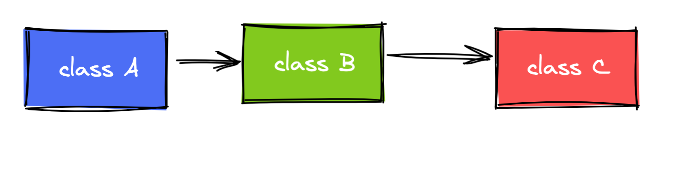
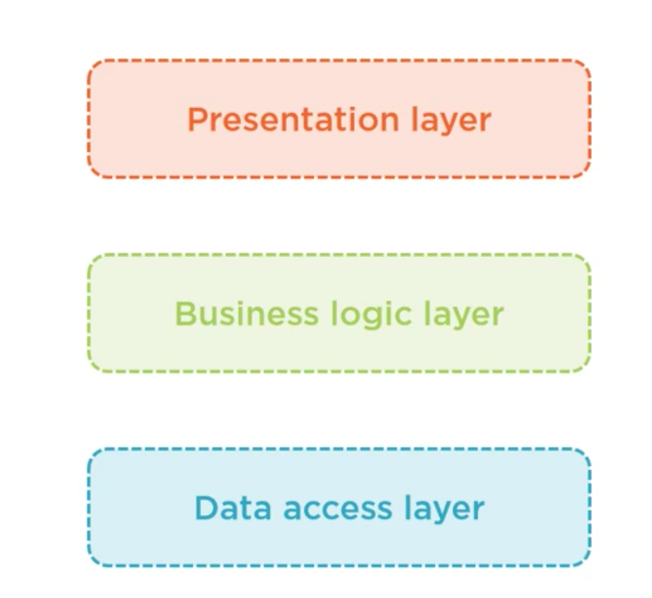
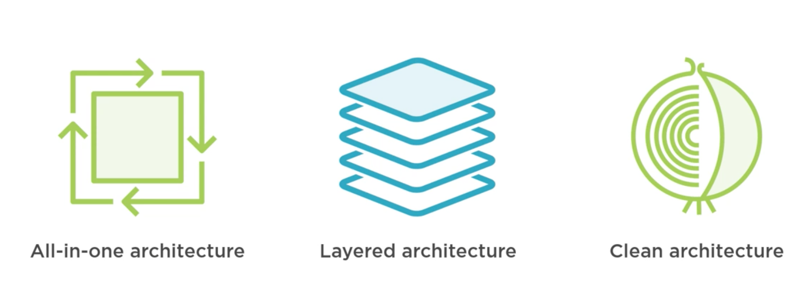
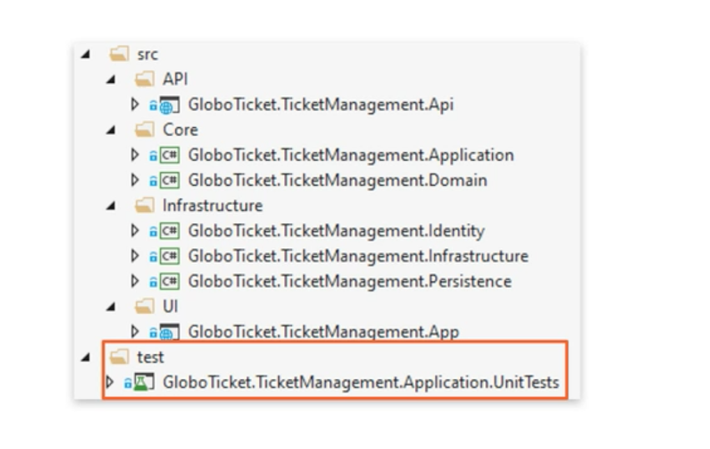

# 01 Introduction : Principes fondamentaux

Ce cours est basé sur la `Clean Architecture` aussi appelée `Onion Architecture`.

## Dependency inversion : inversion de dépendances

C'est le `D` de `SOLID`.

Cela permet de découpler les modules.

Les dépendances pointent vers des abstractions (`interface`) pas vers des implémentations.

Dans un cas classique chaque classe a une dépendance vers une autre classe :

ici le couplage entre les classes est fort, `A` dépend de l'implémentation de `B` et `B` celle de `C`.

Avec l'inversion de dépendance chaque classe ne dépend plus que d'une abstraction : `interface` et c'est les implémentation qui doivent respecter le contrat de l'`interface`. Il y a inversion de dépendances.

## Separation of concerns : Séparation des responsabilités

Séparer en block de fonctionnalité => chaque block a sa propre responsabilité, son propre champs de fonctionnalité.

Créer un code modulaire => encapsuler chaque fonctionnalité dans un `module`.

## Single Responsibility

Le `S` de `SOLID`.

Chaque block doit avoir une et une seule responsabilité encapsulée.

Séparer le code en plusieurs `classes` de petite taille et créer des couches applicatives (`data access`, `ui`, `business logic`).

## DRY Don't Repeat Yourself

Moins de répétition dans le code rend les changements plus simple à implémenter.

On a moins de chance d'avoir des erreurs si le code est centralisé (un seul endroit où chercher le bug).

## Persistence Ignorance

Le code du `Domain` n'utlise que de simple classe `C#` : `POCO`

> A Plain Old CLR Objects (POCO) is a class, which doesn't depend on any framework-specific base class

Ce code ne dépend d'aucunes technologies de persistance, il n'est pas impacté par le changement de technologie.

# Style d'architecture

## All-In-One architecture

Toutes l'application est contenu dans un seul projet.

Les couches sont organisées en dossiers (`folders`).

Peut devenir difficile à maintenir au fur et à mesure que l'application grossit.

La séparation des responsabilité n'est pas garantie par l'architecture, rien n'empêche de mettre un `Model` dans le dossier des `Controller`.

## Layered architecture

Le code est séparé en différents projets.

Promeut la ré-utilisation du code : `DRY` principle.

Plus simple à maintenir, il est facile de s'y retrouver dans l'application.

C'est une bonne architecture.

### Désavantages

- Encore couplé entre les couches
- Fonctionne de manière monolithique (single application)

## Clean Architecture

- basé sur des principes de design
- Séparation des préoccupations (responsabilités) (`concerns`)
- créer un code maintenable et testable

La logique `business` est encapsulée au cœur de l'application de façon indépendante des influences externe (`database`, `ui`).

C'est une variation des archtitectures en oignons ou hexagonales.

Elle apparaît en 2012 et est une application du principe `Separations Of Concerns`.

Elle permet d'être moins couplé que la `Layered architecture`.

La `Clean Architecture` essaye de donner le meilleur en termes de :

- testabilité
- maintenance
- scalabilité (mise à l'échelle)

## Circular Design

Au centre se trouve le `Core` :

- Abstractions
- Interfaces & Entities
- Business Logic (uses-cases)
- ne connait pas les autres cercles
- N'a pas de dépendances à l'extérieur

Les autres cercles sont l'`Infrastructure`  :

- L'`Infrastructure` dépend du `Core`
- Elle implémente les interfaces du `Core`

Les dépendances sont inversées, elles pointent vers le centre.

De même l'`UI` est à l'extérieur et le `Core` ne connaît rien de comment les données sont représentées.

## Deux principes importants

## Qui va Où

### `Core`

- Entities
- Interfaces
  - Core
  - Infrasctructure
- Sevices
- Custom Exceptions

### `Infrastructure`

- Data Access `EF Core`
- Logging
- Identity
- API clients
- File Access

### `UI`

- API / mvc / Razor
- Des objets spécifique à `.net core`
  - Middleware
  - Filtres
- Intérageir avec les services grâce à MediatR
  - Moins de couplage
  - Des contrôleur léger et simple

## struture de fichiers

