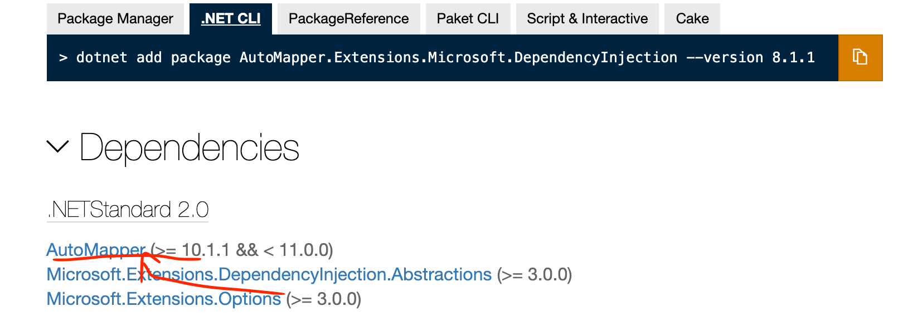

# 03. `mediator pattern` et  `AutoMapper`

## `Mediator`

La communication entre plusieurs objets peut ressembler à cela :


Et vite devenir compliqué.

On introduit alors un `Mediator` :


C'est un objet qui encapsule comment les autres objets doivent communiquer.

Évite une référence explicite d'un objet à un autre.

Cela permet d'encapsuler la logique business dans un objet et de communiquer avec des messages.

On va utiliser un `package` : `MediatR` une implémentation du pattern `mediator`.


## `MediatR`

### Installation

```bash
dotnet add package MediatR --version 9.0.0
```


### Usage

Deux éléments :

- `IRequest` pour implémenter les messages
- `IRequestHandler` pour implémenter la logique de gestion des messages


### Créer une `Request`

```cs
public class GetEventsListQuery : IRequest<List<EventListVm>>
{
    
}
```


### Définir le gestionnaire de requête : `Request Handler`

```cs
public class GetEventsListQueryHandler : 
	IRequestHandler<GetEventListQuery, List<EventListVm>>
{
    public async Task<List<EventListVm>> Handle
        (GetEventsListQuery request, CancellationToken cancellationToken)
    {
        
    }
}
```

`MediatR` a des fonctionnalités de `pipeline` pour gérer les `Logging`,  `Validation` et `Caching`.

Pas vue dans le cours car ces fonctionnalités vont être ajoutées manuellement.


## `AutoMapper`

On ne veut pas forcement que ce soit nos entité entière qui soit vue par l'utilisateur final.


Pour éviter d'écrire à la main le `mapping` vers les différentes `view`, on va utiliser unoutil : `AutoMapper`.

### Installation

```bash
dotnet add package AutoMapper --version 10.1.1
```


### Utilisation

On enregistre dans le fichier `Startup` en injection de dépendance.

On établie le `profile`.

```cs
var result = _mapper.Map<List<EventListVm>>(allEvents);
```


## Mise en pratique

On crée un dossier `Features` et dedans un dossier `Events`.

On ajoute les packages nécessaire au projet `Application`.

```bash
# dotnet add package AutoMapper --version 10.1.1
# Je pense que la deuxième installe la première à tester
dotnet add package AutoMapper.Extensions.Microsoft.DependencyInjection --version 8.1.1

dotnet add package MediatR.Extensions.Microsoft.DependencyInjection --version 9.0.0
```



`GloboTicket.TicketManagement.Application.csproj`

```cs
<Project Sdk="Microsoft.NET.Sdk">

  <ItemGroup>
    <ProjectReference Include="..\GloboTicket.TicketManagement.Domain\GloboTicket.TicketManagement.Domain.csproj" />
  </ItemGroup>

  <ItemGroup>
    <PackageReference Include="AutoMapper.Extensions.Microsoft.DependencyInjection" Version="8.1.1" />
    <PackageReference Include="MediatR.Extensions.Microsoft.DependencyInjection" Version="9.0.0" />
  </ItemGroup>

  <PropertyGroup>
    <TargetFramework>net5.0</TargetFramework>
  </PropertyGroup>

</Project>
```

On va ajouter une classe `GetEventListQuery` dans `Features/Events` :

```cs
using System.Collections.Generic;
using MediatR;

namespace src.Core.GloboTicket.TicketManagement.Application.Features.Events
{
    public class GetEventsListQuery : IRequest<List<EventListVm>>
    {
        
    }
}
```

C'est une requête qui renvoie une `List<EventListVm>` : `Vm` pour `View model`.

Je pense que `View model` est la même chose que `DTO` `Data Transfert Object`.

> Après quelques recherche sur `Stackoverflow` :
>
> `DTO` pas de comportement (pas de méthode)
>
> `ViewModel` peut avoir des comportements (méthodes).

Pour ce cours, ce qui est envoyé, c'est une `View Model : VM` et ses sous-représentations sont des `Data Transfert Object : DTO`

On va créer une classe `EventListVm` :

```cs
using System;

namespace src.Core.GloboTicket.TicketManagement.Application.Features.Events
{
    public class EventListVm
    {
        public Guid EventId { get; set; }
        public string Name { get; set; }
        public DateTime Date { get; set; }
        public string ImageUrl { get; set; }
    }
}
```

On crée maintenant la classe `GetEventsListQueryHandler`.

```cs
using System.Collections.Generic;
using System.Threading;
using System.Threading.Tasks;
using MediatR;

namespace src.Core.GloboTicket.TicketManagement.Application.Features.Events
{
    public class GetEventsListQueryHandler : IRequestHandler<GetEventsListQuery, List<EventListVm>>
    {
        public Task<List<EventListVm>> Handle(GetEventsListQuery request, CancellationToken cancellationToken)
        {
            throw new System.NotImplementedException();
        }
    }
}
```

La methode `Handle` est appelée automatiquement dès qu'un `GetEventsListQuery` est renvoyé.

```cs
public class GetEventsListQueryHandler : IRequestHandler<GetEventsListQuery, List<EventListVm>>
{
    private readonly IMapper _mapper;
    private readonly IAsyncRepository<Event> _eventRepository;
    public GetEventsListQueryHandler(IMapper mapper, IAsyncRepository<Event> eventRepository)
    {
        _eventRepository = eventRepository;
        _mapper = mapper;

    }

    public async Task<List<EventListVm>> Handle(GetEventsListQuery request, CancellationToken cancellationToken)
    {
        var allEvents = (await _eventRepository.ListAllAsync()).OrderBy(x => x.Date);

        return _mapper.Map<List<EventListVm>>(allEvents);
    }
}
```

> **Question** :
>
> Pourquoi utiliser un `IAsyncRepository` plutôt qu'un `IEventRepository` puisqu'on en a créé un ?
>
> **Réponse :**
>
> Si les méthodes utilisés dans `Handle` sont toutes génériques, pas besoin d'utiliser `IEventRepository`.
>
> On essaye de rester le plus générique possible sauf si on a besoin d'une méthode spécifique.


Si les propriétés de `Event` et `EventListVm` sont les mêmes, `autoMapper` va *mapper* automatiquement, sinon on doit utiliser les `profiles`.

On crée un dossier `Profiles` dans `Features` et on y ajoute la classe `MappingProfile` :

```cs
using AutoMapper;

namespace src.Core.GloboTicket.TicketManagement.Application.Features.Profiles
{
    public class MappingProfile : Profile
    {
        public MappingProfile()
        {
            CreateMap<Event, EventListVm>().ReverseMap();
        }
    }
}
```

`ReverseMap` pour que le *mapping* puisse se faire dans les deux sens.


## `GetEventDetailQuery`

On va maintenant créer `GetEventDetailQuery` et `GetEventDetailQueryHandler`.

`GetEventDetailQuery`

```cs
using System;
using MediatR;

namespace src.Core.GloboTicket.TicketManagement.Application.Features.Events
{
    public class GetEventDetailQuery : IRequest<EventDetailVm>
    {
        public Guid Id { get; set; }
    }
}
```

Ici on a besoin de connaître l'`Id` de l'`Event` qu'on recherche.

On peut utiliser les `record` pour simplifier la syntaxe des `Request` :

```cs
public record GetEventDetailQuery(int Id) : iRequest<EventDetailVm>;
```


`EventDetailVm`

```cs
using System;

namespace src.Core.GloboTicket.TicketManagement.Application.Features.Events
{
    public class EventDetailVm
    {
        public Guid EventId { get; set; }
        public string Name { get; set; }
        public int Price { get; set; }
        public string Artist { get; set; }
        public DateTime date { get; set; }
        public string description { get; set; }
        public string ImageUrl { get; set; }
        public Guid CategoryId { get; set; }
        public CategoryDto Category { get; set; }
    }
}
```

Utilisation des `VM` et des `DTO` :

> explication de **Gill Cleren**
>
> Les `VM` sont les principaux objets qui circulent sur le réseau. S'ils contiennent des enfants, je les appelle des `DTO`.

On va créer la classe `CategoryDto` :

```cs
using System;

namespace src.Core.GloboTicket.TicketManagement.Application.Features.Events
{
    public class CategoryDto
    {
        public Guid Id { get; set; }
        public string Name { get; set; }
    }
}
```

Implémentation de la classe `GetEventDetailQueryHandler`

```cs
public async Task<EventDetailVm> Handle(GetEventDetailQuery request, CancellationToken cancellationToken)
{
	var @event = await _eventRepository.GetByIdAsync(request.Id);
    var eventDetailDto = _mapper.Map<EventDetailVm>(@event);
    
    var category = await _categoryRepository.GetByIdAsync(@event.categoryId);
    
    eventDetailDto.Category = _mapper.Map<CategoryDto>(category);
    
    return eventDetailDto;
}
```

On doit compléter notre `MappingProfile` :

```cs
public MappingProfile()
{
    CreateMap<Event, EventListVm>().ReverseMap();
    CreateMap<Category, CategoryDto>().ReverseMap();
    CreateMap<Event, EventDetailVm>().ReverseMap();
}
```


## `ApplicationServiceRegistration`

`MediatR` et `AutoMapper` doivent être enregistrer dans la collection de `service` de l'application.

On doit créer une méthode d'extension via la classe `ApplicationServiceRegistration`.

```cs
namespace src.Core.GloboTicket.TicketManagement.Application
{
    public static class ApplicationServiceRegistration
    {
        // On ajoute une méthode d'extension
        public static IServiceCollection AddApplicationServices(this IServiceCollection services)
        {
            services.AddAutoMapper(Assembly.GetExecutingAssembly());
            services.AddMediatR(Assembly.GetExecutingAssembly());
            
            return services;
        }
    }
}
```

`Assembly.GetExecutingAssembly` retourne l'`assembly` qui contient le code en train d'être exécuté.

> ### méthode d'extension
>
> ```cs
> using System;
> 					
> var mino = new Cat { Name = "Mino" };
> mino.Miaow();
> 
> public static class AddingMiaow
> {
> 	public static void Miaow(this Cat c)
> 	{
> 		Console.WriteLine($"miaow I'm {c.Name}");
> 	}
> }
> 
> public class Cat
> {
> 	public string Name { get; set; }
> }
> ```
>
> Il faut créer une classe pour créer une méthode d'extension.
>
> `this Cat c` défini la type de la classe pouvant utiliser cette méthode.

 


