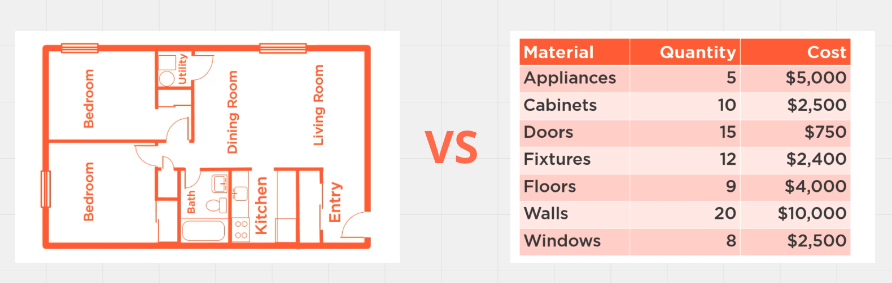
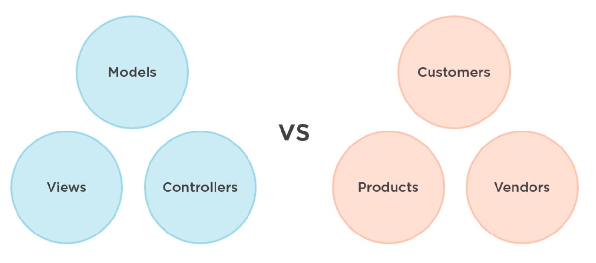

# Organisation  `fonctionnel`

## `Screaming` architecture 

> L'architecture devrait crier l'intention du système
>
> Uncle Bob 

L'application est organisée en suivant les `Use Cases` du système.

Les `Use cases` étant les interactions possible d'un utilisateur sur le système:

- Récupérer la liste des clients
- Acheter un produit
- Payer un vendeur

## (`functionnal` vs `Categorical` organisation)

On peut représenter une architecture par ses fonctions ou par ses constituants.

La vision par fonction (`Bedroom`, `Kitchen`, `Entry`, ...) est plus parlante sur l'utilisation de l'architecture que la liste des constituants.

On peut retrouver cette analogie dans l'organisation des dossiers d'une application.

### `Pros`

- Les éléments travaillant ensemble doivent être rassemblés ensemble.

- Il est plus facile de naviguer dans une structure basée sur les `Use Case` que sur les types d'éléments.
- Evite les limitations de tel ou tel framework

### `Cons`

- On perd les conventions du framework
- On perd la structure automatique de base
- `Categorical` est plus facile en premier lieu

## Mise en pratique

Chaque couche peut être organisée en `Functionnal` plutôt qu'en `Categorical`.

### La couche `Presentation`

On retrouve la découpe `Customers`, `Employees`, `Products`, `Sales`.

### La couche `Application`

On retrouve nos `Use Cases` séparés en `Queries` et `Commands`.

De même pour les autres couches. Le système est ainsi facile à comprendre et `scream` ses intentions fonctionnelles.

