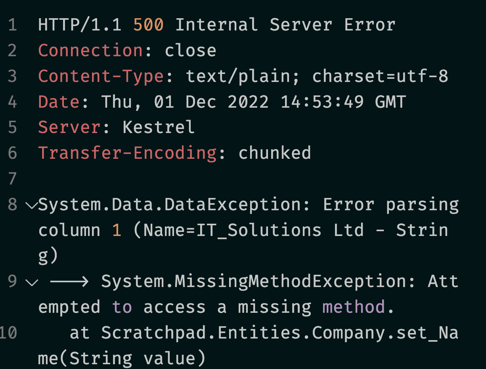

# 03 Un `crud` avec `Dapper`


## Premier `Endpoint` : `GetCompanies`

Méthode du `CompanyRepository` :

```cs
public async Task<IEnumerable<Company>> GetCompanies()
{
    var sql = "SELECT * FROM Companies";

    using var connection = _context.CreateConnection();
    var companies = await connection.QueryAsync<Compagny>();

    return companies.ToList();
}
```

Utilisation des méthodes d'extension pour organiser les `Endpoints` :

```cs
public static class CompanyEndpointExtension
{
    public static WebApplication MapCompagny(this WebApplication app)
    {
        var companyRoute = app.MapGroup("/companies");

        companyRoute.MapGet("/", async (ICompanyRepository db) => await db.GetCompanies());

        return app;
    }
}
```

La partie importante :

```cs
async (ICompanyRepository db) => await db.GetCompanies()
```

#### ! c'est bien `ICompanyRepository` et non pas `CompanyRepository` pour que l'injection de dépendance fonctionne.


## Nom de Colonne et nom de propriété différents

On modifie le nom de la propriété de l'entité `Company` :

```cs
public class Company
{
    public int Id { get; set; }
    // public string? Name { get; set; }
    public string? CompanyName { get; set; }
```



Boum, ça crash.

On peut arranger cela en modifiant le `sql` du `repository` :

```cs
var sql = @"SELECT Id, Name as CompanyName, Address, Country 
			FROM Companies";
```

`Name as CompanyName`.


## `GetCompanyById` : utilisation des `query parameters`

## Avec objet anonyme `new { ... }`

```cs
// Dans le CompanyRepository

public async Task<Company> GetCompanyById(int id)
{
    var sql = "SELECT * FROM Companies WHERE Id = @Id";
    using var connection = _context.CreateConnection();
    
    var company = await connection.QuerySingleOrDefaultAsync<Company>(sql, new { id });
    
    return company;
}
```

On ajoute le `endpoint` :

```cs
companyRoute.MapGet("/{id:int}", async (ICompanyRepository db, int id) => await db.GetCompanyById(id) is Company company ? Ok(company) : NotFound());
```


## `Create` Company : utilisation des `DynamicParameters`

On crée un dossier `Dtos` et dedans `CreateCompanyDto.cs`

```cs
public record CreateCompanyDto(string? Name, string? Address, string? Country);

// ou

public class CreateCompanyDto
{
    public string? Name { get; set; }
    public string? Address { get; set; }
    public string? Country { get; set; }
}

```

On ajoute la signature dans `ICompanyRepository` :

```cs
public Task CreateCompany(CreateCompanyDto companyToCreate);
```

> On remarque l'utilisation d'un `Dto` dans le contrat de `repository`. Ce n'est peut-être pas le mieux (?).

Et on l'implémente dans `CompanyRepository` :

```cs
public async Task CreateCompany(CreateCompanyDto companyToCreate)
{
    var sql = @"INSERT INTO Companies (Name, Address, Country)
                VALUES (@name, @address, @country)";
    
    var parameters = new DynamicParameters();
    parameters.Add("name", company.Name, DbType.String)
    parameters.Add("address", companyToCreate.Address, DbType.String);
    parameters.Add("country", companyToCreate.Country, DbType.String);

    using var connection = _dapperContext.CreateConnection();
    await connection.ExecuteAsync(sql, parameters);
}
```

### `parameters.Add(ParamName, ParamValue, ParamType)`

Cette implémentation ne permet pas de retourner la `Company` fraîchement créée.

On modifie le contrat en retournant une `Company` cette fois :

```cs
public Task<Company> CreateCompany(CreateCompanyDto companyToCreate);
```

Et on implémente de nouveau :

```cs
public async Task<Company> CreateCompany(CreateCompanyDto companyToCreate)
{
    var sql = @"INSERT INTO Companies (Name, Address, Country)
                VALUES (@name, @address, @country);
                SELECT CAST(SCOPE_IDENTITY() AS int)";
    
    var parameters = new DynamicParameters();
    parameters.Add("name", company.Name, DbType.String)
    parameters.Add("address", companyToCreate.Address, DbType.String);
    parameters.Add("country", companyToCreate.Country, DbType.String);

    using var connection = _dapperContext.CreateConnection();
    var await connection.QuerySingleAsync(sql, parameters);
 	
    var createdCompany = new Company { 
    	Id = is,
        Name = companyToCreate.Name,
        Address = companyToCreate.Address,
        Country = companyToCreate.Country,
    }
    
    return companyCreated
}
```

On peut aussi utiliser `OUTPUT Inserted.Id` entre le `INSERT INTO` et le `VALUES` :

```sql
INSERT INTO Companies (Name, Address, Country)
OUTPUT Inserted.Id
VALUES (@name, @address, @country)
```

Et utiliser un *mapper* (`AutoMapper`) :

```cs
    var connection = _dapperContext.CreateConnection();
    var id = await connection.QuerySingleAsync<int>(sql, companyToCreate);

    var companyCreated = _mapper.Map<Company>(companyToCreate);

    companyCreated.Id = id;

    return companyCreated;   
}
```


## `UPDATE` Company

### Avec un objet anonyme

```cs
public async Task<int> UpdateCompany(int id, UpdateCompanyDto companyToUpdate)
{
    var sql = @"UPDATE Companies
                SET 
                    Name = @name,
                    Address = @address,
                    Country = @country
                WHERE Id = @id";

    using var connection = _dapperContext.CreateConnection();
    var rowsAffected = await connection.ExecuteAsync(sql, new { 
        id, 
        name = companyToUpdate.Name,
        address = companyToUpdate.Address,
        country = companyToUpdate.Country
    });
    
    return rowsAffected;
}
```


### Avec les `DynamicParameters`

```cs
public async Task<int> UpdateCompany(int id, UpdateCompanyDto companyToUpdate)
{
    var sql = @"UPDATE Companies
                SET 
                    Name = @name,
                    Address = @address,
                    Country = @country
                WHERE Id = @id";

    var parameters = new DynamicParameters();
    parameters.Add("id", id, DbType.Int32);
    parameters.Add("name", companyToUpdate.Name, DbType.String);
    parameters.Add("address", companyToUpdate.Address, DbType.String);
    parameters.Add("country", companyToUpdate.Country, DbType.String);

    using var connection = _dapperContext.CreateConnection();

    var rowsAffected = await connection.ExecuteAsync(sql,parameters);
    
    return rowsAffected;
}
```


### Le `endpoint`

```cs
companyRoute.MapPut("/{id:int}", async (int id, ICompanyRepository db, UpdateCompanyDto companyToUpdate) => {
    var rowsAffected = await db.UpdateCompany(id, companyToUpdate);

    if(rowsAffected > 0) return NoContent();

    return NotFound();
});
```


## `DELETE` Company

`Repository`

```cs
public async Task<int> DeleteCompany(int id)
{
    var sql = @"DELETE FROM Companies WHERE Id = @id";

    using var connection = _dapperContext.CreateConnection();
    return await connection.ExecuteAsync(sql, new { id }); // return rowsAffected
}
```

`Endpoint`

```cs
companyRoute.MapDelete("/{id:int}", async (int id, ICompanyRepository db) => {
    var rowsAffected = await db.DeleteCompany(id);

    if(rowsAffected > 0) return NoContent();

    return NotFound();
});
```


## L'interface finale

`ICompanyRepository`

```cs
public interface ICompanyRepository
{
    public Task<IEnumerable<Company>> GetCompanies();
    public Task<Company?> GetCompanyById(int id);
    public Task<Company> CreateCompany(CreateCompanyDto companyToCreate);
    public Task<int> UpdateCompany(int id, UpdateCompanyDto companyToUpdate);
    public Task<int> DeleteCompany(int id);
}
```


