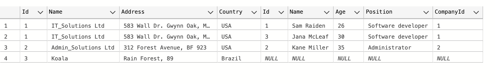

# 05 `Multiple Query` et `Mapping`

## `QueryMultipleAsync` et deux `SELECT`

On ajoute cette méthode à l'interface :

```cs
public interface ICompanyRepository
{
    // ...
    public Task<Company?> GetMultipleResults(int id);
```

Puis on l'implémente :

```cs
public async Task<Company?> GetMultipleResults(int id)
{
    var sql = @"SELECT * FROM Companies WHERE Id = @id;
                    SELECT * FROM Employees WHERE CompanyId = @id";

    using var connection = _context.CreateConnection();
    using var multi = await connection.QueryMultipleAsync(sql, new { id });

    var company = await multi.ReadFirstOrDefaultAsync<Company>();

    if(company is not null)
    {
        company.Employees = (await multi.ReadAsync<Employee>()).ToList();
    }

    return company;
}
```


### Le `endpoint`

```cs
routeCompany.MapGet("/{id:int}/employees", 
   async (ICompanyRepository db, int id) 
       => await db.GetMultipleResults(id) is Company company ?
          Ok(company) : 
          NotFound()
);
```

```http
GET {{root}}/companies/1/employees HTTP/1.1
```

```json
{
  "id": 1,
  "name": "IT_Solutions Ltd",
  "address": "583 Wall Dr. Gwynn Oak, MD 21207",
  "country": "USA",
  "employees": [
    {
      "id": 1,
      "name": "Sam Raiden",
      "age": 26,
      "position": "Software developer",
      "companyId": 1
    },
    {
      "id": 3,
      "name": "Jana McLeaf",
      "age": 30,
      "position": "Software developer",
      "companyId": 1
    }
  ]
}
```


## Avec un `JOIN` et `QueryAsync`

```cs
public interface ICompanyRepository
{
    // ...
    public Task<List<Company>> MultipleMapping();
```

```cs
public async Task<List<Company>> MultipleMapping()
{
	var sql = @"SELECT * FROM Companies c 
				JOIN Employees e
				ON c.Id = e.CompanyId";
    
    using var connection = _context.CreateConnection();
    var companyDict = new Dictionary<int, Company>();
    
    var companies = await connection.QueryAsync<Company, Employee, Company>( sql, (company, employee) => {
        if (!companyDict.TryGetValue(company.Id, out var currentCompany))
        {
            currentCompany = company;
            companyDict.Add(currentCompany.Id, currentCompany);
        }
        
        currentCompany.Employees.Add(employee);
        
        return currentCompany;
    });
    
    return companies.Distinct().ToList();
}
```

Le `Distinct` car on renvoie `companies` et pas `companyDict`.

On peut aussi renvoyer ceci :

```cs
return companyDict.Values.ToList();
```

```json
[
  {
    "id": 1,
    "name": "IT_Solutions Ltd",
    "address": "583 Wall Dr. Gwynn Oak, MD 21207",
    "country": "USA",
    "employees": [
      {
        "id": 1,
        "name": "Sam Raiden",
        "age": 26,
        "position": "Software developer",
        "companyId": 1
      },
      {
        "id": 3,
        "name": "Jana McLeaf",
        "age": 30,
        "position": "Software developer",
        "companyId": 1
      }
    ]
  },
  {
    "id": 2,
    "name": "Admin_Solutions Ltd",
    "address": "312 Forest Avenue, BF 923",
    "country": "USA",
    "employees": [
      {
        "id": 2,
        "name": "Kane Miller",
        "age": 35,
        "position": "Administrator",
        "companyId": 2
      }
    ]
  }
]
```


## Version sans `Dictionary`

Cette version gère les valeur `null` et fonctionne avec un `LEFT JOIN`

```cs
var sql = @"SELECT * FROM Companies c
                    LEFT JOIN Employees e 
                    ON e.CompanyId = c.Id";

using var connection = _dapperContext.CreateConnection();
```
Utilisation du `LEFT JOIN` pour avoir aussi les `companies` sans `employees`.
```cs
var companies = await connection.QueryAsync<Company, Employee, Company>(sql, (company, employee) => {

    if(employee is not null) company.Employees.Add(employee);

    return company;
});
```



Companies contient une collection d'objet `company` où chaque `company` contient un ou zéro `employee`.

```cs
var companiesGroup = companies.GroupBy(company => company.Id).ToList();
```
Pour fusionner les `company` identique (même `Id`), on utilise un `GroupBY`.
Le `GroupBy`créé une collection de tableau qu'on va projeter avec `SELECT`.

```cs
var companiesOutput = companiesGroup.Select((group, index) => {
    var company = group.FirstOrDefault();

    company!.Employees = group.Where(company => company.Employees.Count > 0).Select(company => company.Employees.First()).ToList();

    return company;
});
```
La projection renvoie la première `company` (on la veut en un seul exemplaire) et lui assigne la liste des `employees` si (`Where`) il y a au moins un `employee`.
```cs
return companiesOutput;
```

### Résultat

```json

[
  {
    "id": 1,
    "name": "IT_Solutions Ltd",
    "address": "583 Wall Dr. Gwynn Oak, MD 21207",
    "country": "USA",
    "employees": [
      {
        "id": 1,
        "name": "Sam Raiden",
        "age": 26,
        "position": "Software developer",
        "companyId": 1
      },
      {
        "id": 3,
        "name": "Jana McLeaf",
        "age": 30,
        "position": "Software developer",
        "companyId": 1
      }
    ]
  },
  {
    "id": 2,
    "name": "Admin_Solutions Ltd",
    "address": "312 Forest Avenue, BF 923",
    "country": "USA",
    "employees": [
      {
        "id": 2,
        "name": "Kane Miller",
        "age": 35,
        "position": "Administrator",
        "companyId": 2
      }
    ]
  },
  {
    "id": 3,
    "name": "Koala",
    "address": "Rain Forest, 89",
    "country": "Brazil",
    "employees": []
  }
]
```

Il n'y a pas de doublons et la dernière `company` a bien une liste vide d'`employee`.
