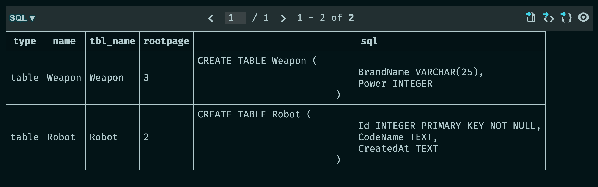
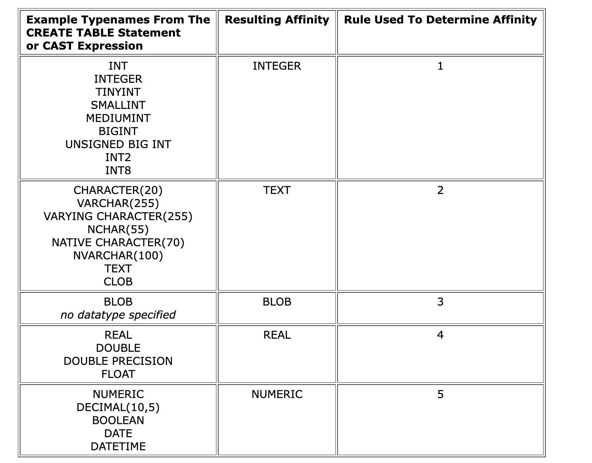
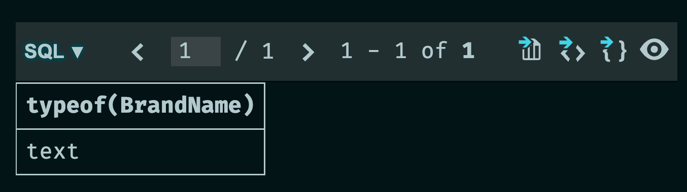
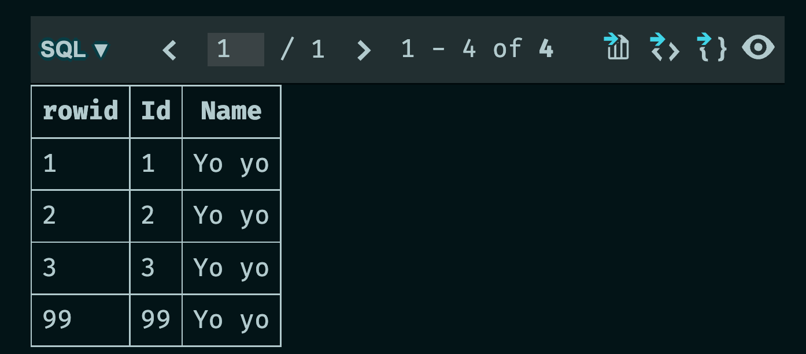

# 02 Créer une `DB`


## la classe `DatabaseBootstrap`

```cs
public class DatabaseBootstrap
{
    private readonly DapperContext _context = new DapperContext();
```


## Utilitaire `Is Table Exists`

```cs
private async Task<bool> IsTableExists(string tableName)
{
    var sql = @"SELECT name
                FROM sqlite_master
                WHERE type='table' AND name=@Name";

    using var connection = _context.CreateConnection();

    var tableNameInDB = await connection.QueryFirstOrDefaultAsync(sql, new { Name = tableName });

    return tableNameInDB is not null;
}
```

La table `sqlite_master` contient les informations nécessaire sur l'existence d'une table.

```sql
SELECT * FROM sqlite_master
```




##  Créer une table : `Create Table`

> ## Les types dans `Sqlite`
>
> Il n'existe que `5` types :
>
> - `TEXT`
> - `NUMERIC`
> - `INTEGER`
> - `REAL`
> - `BLOB`
>
> `Sqlite` fait une correspondance s'il se trouve un type dans `CREATE TABLE` qui ne fait pas partie de la liste plus haut :
>
>  
>
> Par exemple `VARCHAR(25)` est transformé en `TEXT`, le nombre `25` n'étant tout simplement pas pris en compte.
>
> ```sql
> SELECT typeof(BrandName) FROM Weapon GROUP BY typeof(BrandName)
> ```
>
> 
>
> `Microsoft.Data.Sqlite` ne prend en compte que `4` types :
>
> - `INTEGER`
> - `REAL`
> - `TEXT`
> - `BLOB`

```cs
public async Task CreateTableRobot()
{
    if (await IsTableExists("Robot") == false)
    {
        var sql = @"CREATE TABLE Robot (
                        Id INTEGER PRIMARY KEY NOT NULL,
                        CodeName TEXT,
                        CreatedAt TEXT
                    )";

        using var connection = _context.CreateConnection();
        await connection.ExecuteAsync(sql);

        Console.WriteLine("Table Robot was Created");
        return;
    }

    Console.WriteLine("Table Robot already exists");
}
```

`NOT NULL` est implicite pour une `PRIMARY KEY` et on n'est pas obligé de l'écrire.

Il n'y a pas de type `Date` avec `Sqlite`, on utilise un type `TEXT` à la place.


```cs
public async Task CreateTableWeapon()
{
    if(await IsTableExists("Weapon") == false)
    {
        var sql = @"CREATE TABLE Weapon (
                        BrandName VARCHAR(25),
                        Power INTEGER
                    )";

        using var connection = _context.CreateConnection();
        await connection.ExecuteAsync(sql);            

        Console.WriteLine("Table Weapon was created");
        return;
    }

    Console.WriteLine("table Weapon already exists");
}
```

Ici `BrandName VARCHAR(25),` est transformé en `BrandName TEXT,`.

Ici une colonne `Id` créer par le système et nommée `rowid` est automatiquement ajoutée à la table.


## Remplir une table : `Fill Table`

```cs
public async Task FillTableRobot(params Robot[] robots)
{
    var sql = @"INSERT INTO Robot
                VALUES (null, @CodeName, @CreatedAt)";

    using var connection = _context.CreateConnection();

    var rowsAffected = 0;

    foreach (var robot in robots)
    {
        rowsAffected += await connection.ExecuteAsync(sql, robot);
    }

    Console.WriteLine($"{rowsAffected} robot(s) was inserted successfuly");
}
```

Si on affecte une valeur `null` à l'`Id`, il va automatiquement s'incrémenter.

On peut aussi tout simplement ne rien mettre:

```sql
INSERT INTO Robot (CodeName, CreateAt)
VALUES (@CodeName, @CreatedAt)
```

On peut aussi forcer la valeur de l'`Id`:

```sql
INSERT INTO Robot
VALUES (99, @CodeName, @CreatedAt)
```

Si on définit une colonne `INTEGER` comme `PRIMARY KEY` elle devient un alias de la colonne automatiquement générer `rowid` :

```sql
select rowid as rowid, * from TestId
```



On peut aussi utiliser le fait que `Dapper` ntérate pour vous sur une liste :

```cs
await connection.ExecuteAsync(sql, listOfDatas);
```

Dans 

`params Robot[] robots` permet de remplir la table avec autant de `robot` que l'on souhaite :

```cs
await dbBootstrap.FillTableRobot(
    new Robot(99, "RR-T67", DateTime.Now.ToLongDateString()), 
    new Robot(99, "DS-U-78", DateTime.Now.ToLongDateString()),
    new Robot(99, "ZP-3O", DateTime.Now.ToLongDateString()),
    new Robot(99, "REBLO-55", DateTime.Now.ToLongDateString())
);
```


## Supprimer une table : `Drop Table`

```cs
public async Task DropTableRobot()
    {
        var sql = @"DROP TABLE IF EXISTS Robot";

        var connection = _context.CreateConnection();

        await connection.ExecuteAsync(sql);
        Console.WriteLine("Table Robot was dropped");
    }
```

