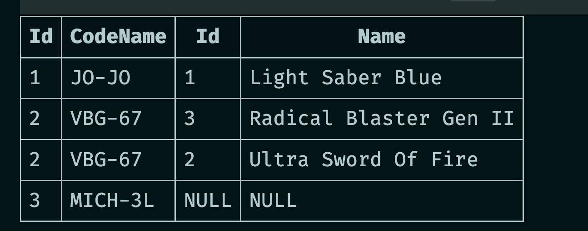

# 04 `CRUD` avec des requête `multi` tables

On peut gérer un graphe d'objet avec `QueryAsync<T1, T2, ..., TReturn>`.


## Récupérer les `Robots` avec leurs `Weapons` : `GetAllRobotsWithWeapons`

```cs
public async Task<IEnumerable<Robot>> GetAllRobotsWithWeapons()
{
    var sql = @"SELECT * 
                FROM Robot as r
                LEFT JOIN Weapon as w
                ON w.RobotId = r.Id";
```




```cs
    using var connection = _context.CreateConnection();

    var result = await connection.QueryAsync<Robot, Weapon, Robot>(sql, (robot, weapon) => {
        if(weapon is not null) robot.Weapons.Add(weapon);
        return robot;
    });

    var robots = result.GroupBy(robot => robot.Id).Select(grp => {
        var robot = grp.First();
        var weapons = grp
                        .Where(r => r.Weapons.Count > 0)
                        .Select(r =>  r.Weapons.First()).ToList();
        robot.Weapons = weapons;

        return robot;
    });

    return robots;
}
```

Ici le valeurs `null` pour `Weapon` sont gérer et s'il n'y a pas de `Weapon`, on obtient bien un tableau vide.

```json
[
  {
    "id": 1,
    "codeName": "JO-JO",
    "weapons": [ { "id": 1, "name": "Light Saber Blue" } ]
  },
  {
    "id": 2,
    "codeName": "VBG-67",
    "weapons": [ 
        			{ "id": 3, "name": "Radical Blaster Gen II" },
                 	{ "id": 2, "name": "Ultra Sword Of Fire" }
    			]
  },
  {
    "id": 3,
    "codeName": "MICH-3L",
    "weapons": []
  }
]
```


## Récupérer un `Robot` avec ses `Weapons` : `GetRobotWithWeaponsById`

```cs
public async Task<Robot?> GetRobotWithWeaponsById(int id)
{
    var sql = @"SELECT * FROM Robot WHERE Id = @id;
                SELECT * FROM Weapon WHERE RobotId = @id;";

    using var connection = _context.CreateConnection();

    var gridReader = await connection.QueryMultipleAsync(sql, new { id });

    var robot = await gridReader.ReadSingleOrDefaultAsync<Robot>();
    var weapons = await gridReader.ReadAsync<Weapon>();

    if(robot is not null) robot.Weapons = weapons.ToList();

    return robot;
}
```

Ici on utilisera deux `SELECT` et `QueryMultipleAsync`.

On reçoit un `GridReader` à travers duquel on accède simplement aux données avec `Read...` : ici `ReadSingleOrDefaultAsync`  pour un objet censé être `null` ou unique et `ReadAsync` pour une liste.

On remarque la précaution `if(robot is not null)` pour éviter un `NullReferenceException`.
