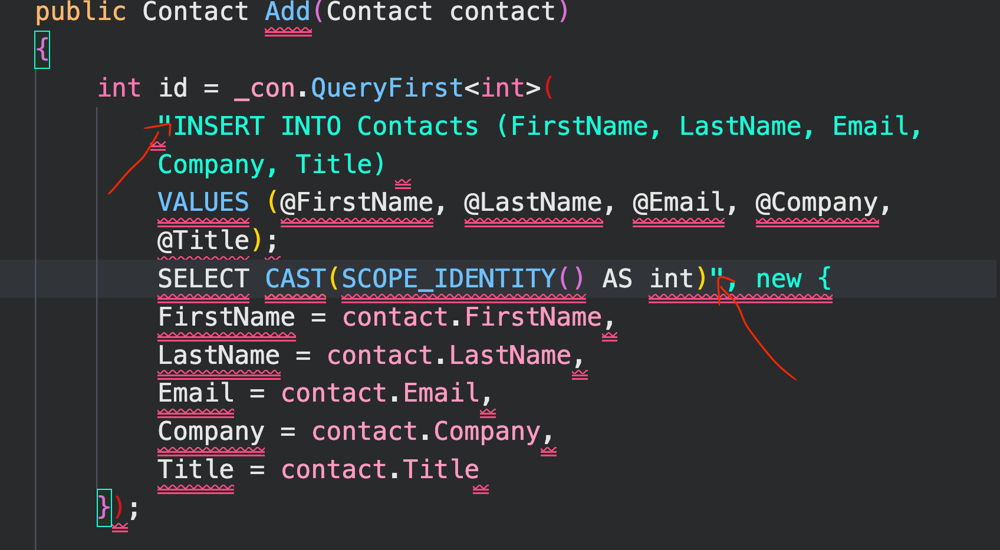
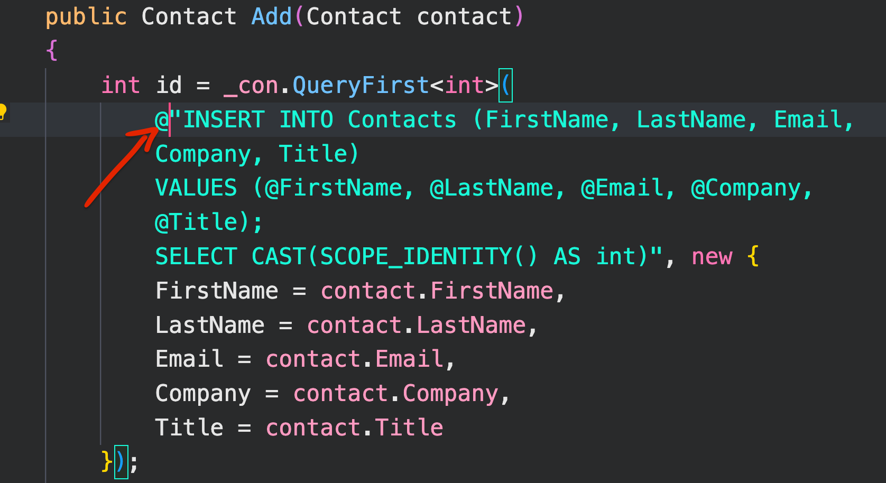

# 02.1 Implémentation du `Repository`


## création de l'interface du `Repository`

`IContactRepository`

```cs
public interface IContactRepository
{
    Contact GetById(int id); // Contact Find(int id);
    List<Contact> GetAll();
    Contact Add(Contact contact);
    Contact Update(Contact contact);
    void Delete(int id);
}
```


## Injection du `repository`

```cs
// Program.cs
// PATTERN Personnel inspiré par Damian Edwards, j'espère que c'est une bonne pratique

var connectionString = builder.Configuration.GetConnectionString("HukarConnection");

builder.Services.AddScoped(_ => new SqlConnection(connectionString));
builder.Services.AddScoped<IContactRepository, ContactRepository>();
```


## `ContactRepository`

```cs
public class ContactRepository : IContactRepository
{ 
    private IDbConnection _db;
    
    public ContactRepository(SqlConnection connection)
    {
        _db = connection;
    }
```


### `GET BY ID`

```cs
public Contact GetById(int id)
{
    var sql = @"SELECT * 
                    FROM Contacts 
                    WHERE Id = @Id";

    return _db.Query<Contact>(sql, new { id }).SingleOrDefault();
    // SingleOrDefault a du sens pour un id plus que FirstOrDefault
    // Lance une exception : InvalidOperationException 
    // si la requête renvoie plus d'un élément
}
```

```cs
// Version courte
public Contact GetById(int id) => _con.QuerySingleOrDefault<Contact>(
    "SELECT Id AS ContactId, * FROM Contacts WHERE Id = @Id", 
    new { Id = id }
);

```

`Id As ContactId` c'est pour faire concorder une colonne qui n'a pas exactement le même que la propriété associée de l'objet. Le `AS` est optionnel, on peut écrire `SELECT Id ContactId,* FROM ...`.

Onpeut simplifier `new { Id = id }` en `new { id }` car c'est le même nom (et apparemment pas case sensitive !?).


### `GET ALL`

```cs
public List<Contact> GetAll()
{
    var sql = "SELECT * FROM Contacts";

    return _db.Query<Contact>(sql).ToList();
}
```

```cs
// Version courte
public List<Contact> GetAll() 
    => _con.Query<Contact>("SELECT Id ContactId, * FROM Contacts").ToList();
```


### `ADD`

```cs
public Contact Add(Contact contact)
{
    var sql = @"INSERT INTO Contacts
                (FirstName, LastName, Email, Company, Title) 
                VALUES 
                (@FirstName, @LastName, @Email, @Company, @Title);
                SELECT CAST(SCOPE_IDENTITY() as int)";

    var id = _db.QuerySingle<int>(sql, contact);
    contact.Id = id;

    return contact;
}
```

On utilise `QuerySingle` pour s'assurer que l'`Id` unique est bien créé (lance une exception pour 0 et plus de 1).

`@` verbatim identifier : textuellement, mot pour mot

`@" ... "` cela permet d'écrire du `SQL` plus proprement dans la même chaîne de caractère.






### `UPDATE`

```cs
public Contact Update(Contact contact)
{
    var sql = @"UPDATE Contacts
                SET FirstName = @FirstName, 
                    LastName = @LastName,
                    Email = @Email,
                    Company = @Company,
                    Title = @Title
                WHERE Id = @Id";
    var rowsAffected = _db.Execute(sql, contact);
    return new UpdateContactDto(contact, rowsAffected);
}
```

Une deuxième version qui crée le `contact` s'il ne trouve pas déjà un enregistrement (autre stratégie)

```cs
public Contact Update(Contact contact)
{
    Contact contactToUpdate = GetById(contact.ContactId);
    if(contactToUpdate is null)
    {
        // s'il n'existe pas crée le
        Add(contact);
        return contact;
    }

    _con.Execute(
        @"UPDATE Contacts 
          SET FirstName = @FirstName, 
              LastName = @LastName,
              Email = @Email,
              Company = @Company,
              Title = @Title
          WHERE Id = @Id", contact);

    return contact;
}
```


### `DELETE`

```cs
public void Delete(int id)
{
    var sql = @"DELETE FROM Contacts WHERE Id = @Id";
    return _db.Execute(sql, new{ id });
}    
```


## Utilisation dans un `Endpoint`

```cs
app.MapGet("/contact/{id:int}", GetContactById);
app.MapGet("/contact", GetAllContact);
app.MapPost("/contact", AddContact);
app.MapPut("/contact", UpdateContact);
app.MapDelete("/contact/{id:int}", DeleteContact);
```

### `GET CONTACT BY ID`
```cs
IResult GetContactById(int id, IContactRepository repo) 
    => repo.GetById(id) is Contact contact ? Ok(contact) : NotFound();
```
#### ! Il faut bien déclarer `IContactRepository` et pas `ContactRepository` (ou une erreur est levée) pour l'argument `repo`.


### `GET ALL CONTACT`

```cs
IResult GetAllContact(IContactRepository repo) => Ok(repo.GetAll());
```

### `ADD CONTACT`
```cs
IResult AddContact(Contact contact, IContactRepository repo)
{
    repo.Add(contact);

    return Created($"/contact/{contact.Id}", contact);
}
```

### `UPDATE CONTACT`
```cs
IResult UpdateContact(Contact contact, IContactRepository repo)
{
    var response = repo.Update(contact);

    if (response.rowsAffected == 0)
    {
        return NotFound();
    }

    return NoContent();
}
```

### `DELETE CONTACT`
```cs
IResult DeleteContact(int id, IContactRepository repo)
{
    var rowsAffected = repo.Delete(id);

    if(rowsAffected == 0)
    {
        return NotFound();
    }

    return NoContent();
}
```

