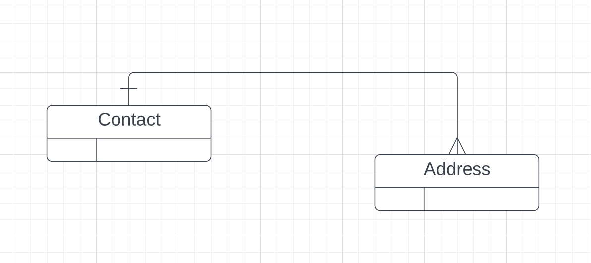

# 05   `MultipleResults`


## Relation parent-enfants




## Création de la méthode `GetFullContact` dans le `Repository` : `QueryMultiple` et `Read<T>`

`ContactRepository.cs`

```cs
public Contact GetFullContact(int id)
{
    var sql = @"SELECT * FROM Contacts WHERE Id = @Id;
    			 SELECT * FROM Addresses WHERE ContactId = @Id";
    
    using GridReader multipleResults = _db.QueryMultiple(sql, new { id });
    
    var contact = multipleResults.Read<Contact>().SingleOrDefault();
    
    var addresses = multipleResults.Read<Address>().ToList();
    
    if(contact is not null && adresses is not null)
    {
        contact.Adresses.AddRange(addresses);
    }
    
    return contact;
}
```

Dans le `Endpoint` :

```cs
app.MapGet("/contactfull/{id:int}", GetContactFullById);

IResult GetContactFullById(int id, IContactRepository repo) 
    => repo.GetFullContact(id) is Contact contact ? Ok(contact) : NotFound();
```

On utilise `using` car `GridReader` implémente `Idisposable` :

```cs
public class GridReader : IDisposable
```

