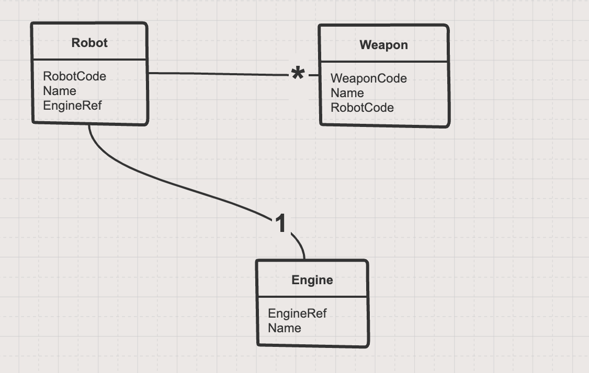
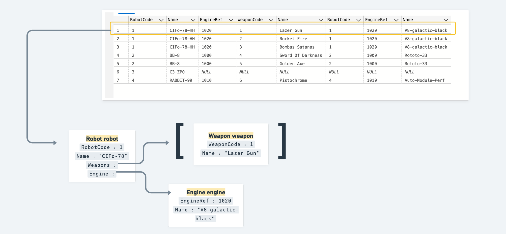
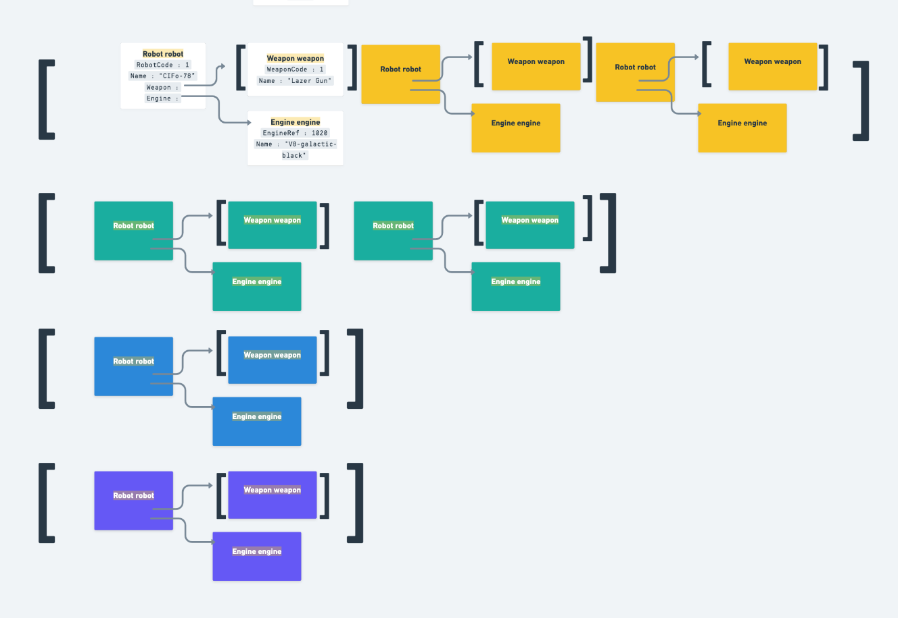
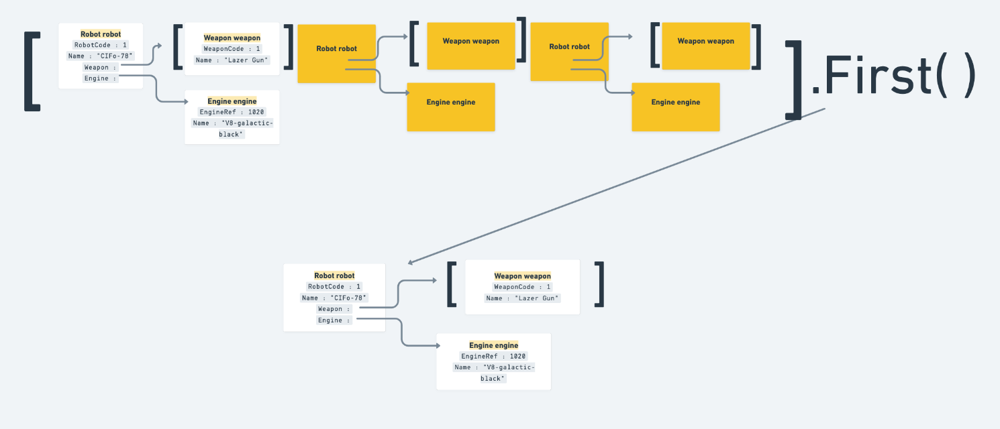
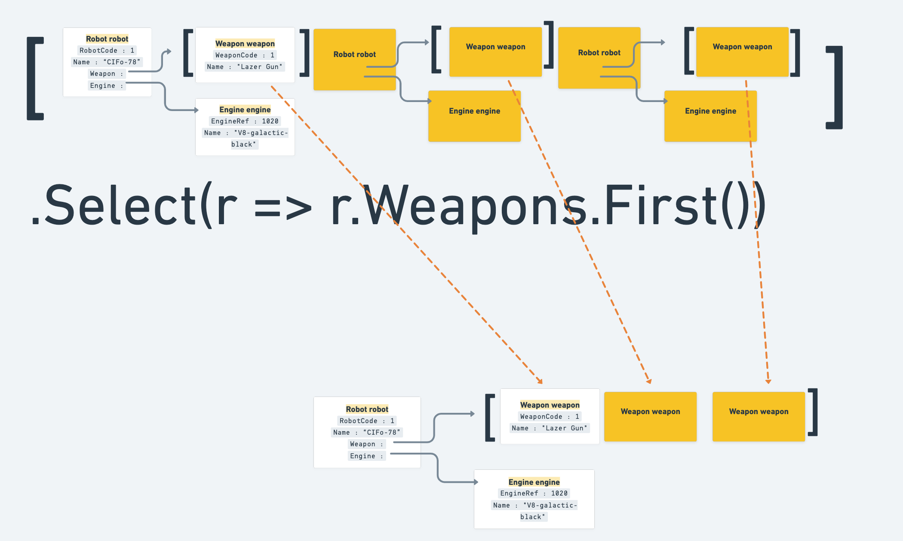
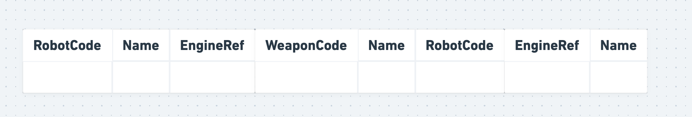
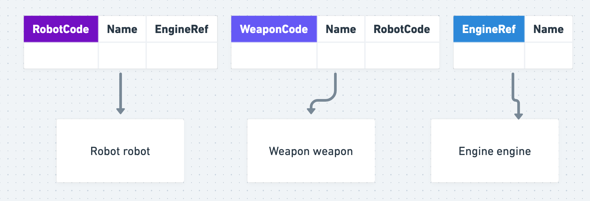

# 06 Gérer un graphe de relation

## `Query<T1, T2, T3, TReturn>`

On a un schéma assez simple :



```cs
app.MapGet("robot/full", (SqlConnection con) => {
    var sql = @"SELECT * FROM Robot
                LEFT JOIN Weapon
                ON Weapon.RobotCode = Robot.RobotCode
                LEFT JOIN Engine
                ON Robot.EngineRef = Engine.EngineRef";

    var result = con.Query<Robot, Weapon, Engine, Robot>(sql, (robot, weapon, engine) => {
        robot.Weapons.Add(weapon);
        robot.Engine = engine;
        return robot;
    }, splitOn: "RobotCode, WeaponCode, EngineRef")
    .GroupBy(r => r.RobotCode)
    .Select(robotGrouped => {
        var robot = robotGrouped.First();
        robot.Weapons = robotGrouped.Select(r => r.Weapons.First()).ToList();
        return robot;
    })
    .ToList();

    return result;
});
```


### `con.Query<Robot, Weapon, Engine, Robot>()`

À ce niveau chaque ligne est mappé avec les objets correspondant :



Le résultat en `json` , on a un tableau de `robot` qui a lui même un tableau de `weapon` et un objet `engine` :

```json
[
    {
        "robotCode": 1,
        "name": "CIFo-78-HH",
        "weapons": [
            {
                "weaponCode": 1,
                "name": "Lazer Gun",
                "robotCode": 1
            }
        ],
        "engine": {
            "engineRef": 1020,
            "name": "V8-galactic-black"
        }
    },
    {
        "robotCode": 1,
        "name": "CIFo-78-HH",
        "weapons": [
          {
            "weaponCode": 2,
            "name": "Rocket Fire",
            "robotCode": 1
          }
        ],
        "engine": {
          "engineRef": 1020,
          "name": "V8-galactic-black"
        }
      },
```

On remarque que l'on a plusieurs lignes pour un seul `robot`.


### `GroupBy(r => r.RobotCode)`

On va regrouper les enregistrements appartenant au même `robot`.



On obtient un nombre de liste égale au nombre de `robot`.


### `Select(robotGrouped => { ... })`

On va faire une projection avec `Select` pour chaque `Collection`

On va d'abord récupérer le premier élément de la liste comme `robot` de base :

```cs
.Select(robotGrouped => {
        var robot = robotGrouped.First();
```




On va ensuite refaire une projection avec `Select` sur l'ensemble de la collection pour récupérer chaque `weapon` et en faire une liste avec `ToList`.

```cs
robot.Weapons = robotGrouped.Select(r => r.Weapons.First()).ToList();
```



On assigne cette `List<Weapon>` à `robot.Weapons`.


## `splitOn`

Par défaut les différents objets sont coupés au  niveau de la colonne `Id` qui est la `clé primaire`.

Si nos différentes `clés primaires` ont un nom différent on obtient une erreur :

```
System.ArgumentException: Multi-map error: splitOn column 'Id' was not found - please ensure your splitOn parameter is set and in the correct order (Parameter 'splitOn')
```

On reçoit l'ensemble des colonnes en un bloc :




Dans le cas de plusieurs `mapping` avec plusieurs objets de types différents, il faut préciser toutes les `clés primaires`pour découper la ligne unique en plusieurs objets :

### `splitOn: "RobotCode, WeaponCode, EngineRef"`




## Exemple avec le `repository` : `ContactRepository`

```cs
public List<Contact> GetAllFullContact()
{
    var sql = @"SELECT Contacts.Id ContactId, * 
                FROM Contacts
                LEFT JOIN Addresses
                ON Contacts.Id = Addresses.ContactId";

    var result = _con.Query<Contact, Address, Contact>(
        sql,
        (contact, address) => {
            contact.Addresses.Add(address);
            return contact;
        })
        .GroupBy(c => c.ContactId)
        .Select(groupedContact => {
        var contact = groupedContact.First();
        contact.Addresses = groupedContact.Select(c => c.Addresses.First()).ToList();
        return contact;
    }).ToList();

    return result;
}
```


