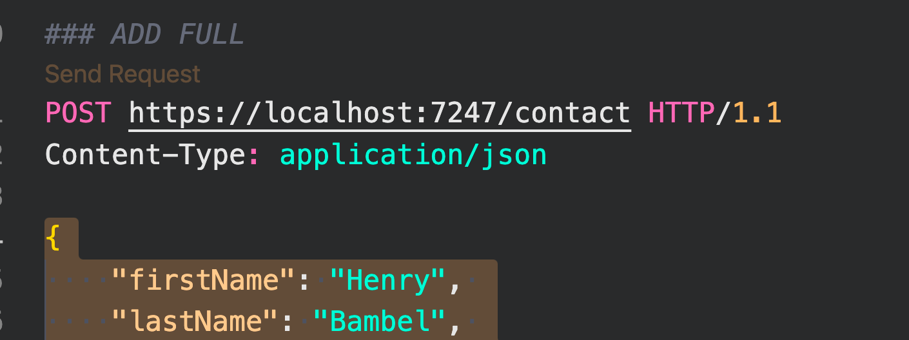

# 07 `CRUD` pour objet `Complexe`


## Méthode `Save`

On veut enregistrer des obejts composés (grâce à l'extension `REST client`):



```json
{
    "firstName": "Henry", 
    "lastName": "Bambel", 
    "email":"turlututu@bienbien.com", 
    "company": "Okapi and co.", 
    "title":"Long Legs"
    "addresses": [
        {
            "AddressType": "Home",
            "StreetAddress": "Chemin de l'escavée, 18",
            "City": "Nivelles",
            "StateId": 4,
            "PostalCode": "4000"
        },
        {
            "AddressType": "Work",
            "StreetAddress": "rue d'arlon, 35",
            "City": "Bruxelles",
            "StateId": 1,
            "PostalCode": "1000"
        },
    ]
}
```

Dans `ContactRepository`

On crée deux méthodes pour `Add` et `Update` une `Address`

### `Add(Address address)`

```cs
public Address Add(Address address)
{
    var sql = @"INSERT INTO Addresses (
                        AddressType, 
                        StreetAddress, 
                        City, 
                        StateId, 
                        PostalCode,
                        ContactId)
                    VALUES (
                        @AddressType, 
                        @StreetAddress, 
                        @City, 
                        @StateId, 
                        @PostalCode,
                        @ContactId);
                    SELECT CAST(SCOPE_IDENTITY() as int)";

    var id = _db.QueryFirst<int>(sql, address);
    address.Id = (int)id;

    return address;
}
```


### `Update(Address address)`

```cs
public Address Update(Address address)
{
    var sql = @"UPDATE Addresses
                    SET AddressType = @AddressType, 
                        StreetAddress = @StreetAddress, 
                        City = @City, 
                        StateId = @StateId, 
                        PostalCode = @PostalCode
                    WHERE Id = @Id";

    _db.Execute(sql, address);

    return address;
}
```


### `Save(Contact contact)`

```cs
public void Save(Contact contact)
{
    if(contact.IsNew)
    {
        Add(contact)
    }
    else
    {
        Update(contact)
    }
    
    foreach(var adress in contact.Addresses.Where(a => !a.IsDeleted))
    {
        address.ContactId = contact.Id;
        
        if(address.IsNew)
        {
            Add(address);
        }
        else
        {
            Update(address);
        }
    }
    
    foreach(var address in contact.Addresses.Where(a => a.IsDeleted))
    {
        _db.Execute("DELETE FROM Addresses WHERE Id = @Id", new { address.Id });
    }
}
```

On ne doit pas créer de méthode `Delete(Address address)` à part, car si on `DELETE` un `contact`, on a une `CONSTRAINT` : `ON DELETE CASCADE` qui fait ce travail.


### `IsNew`

```cs
public class Contact
{
    // ...

	[Computed]      
    public bool IsNew => this.Id == default(int);
```

Si `Id` est égal à `0` (`default(int)`), c'est que ce contact n'est pas en `DB` et on utilise `Add` sinon on utilise `Update`. De même pour `Address`.


### `IsDeleted`

```cs
public class Address
{
    // ...
    
    public bool IsDeleted { get; set; }
```

Permet d'effacer une `address` dans l'interface graphique (`UI`) et que cette `address` soit réellement effacer quand on appelle la méthode `Save`.


## Utiliser une `transaction`

Pour être sûr que toutes les opérations réussissent ou échouent ensemble, on **doit** utiliser une `trasaction`.

On va utiliser `TransactionScope` :

```cs
using System.Transactions;

public void Save(Contact contact)
{
    using var transactionScope = new TransactionScope();

    // ...

    transactionScope.Complete();
}
```

Si une des requête génère une erreur, toutes les requêtes sont annulées.

Ceci fonctionne avec `Microsoft.Data.SqlClient`.

Des anciennes versions de `System.Data.SqlClient` peuvent générer des bugs (lancer des exceptions).


