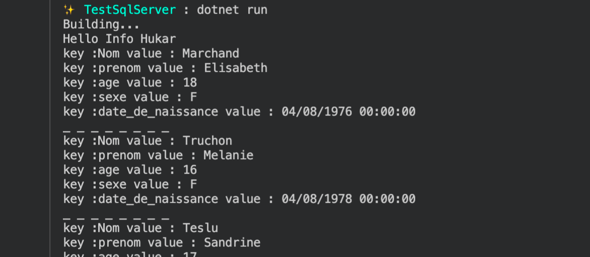
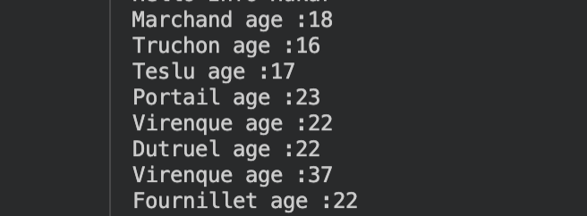

# DD Afficher des données inconnues

Si on ne connait pas le nom des colonnes de données reçues, on peut les afficher avec le code suivant :

```sql
using Dapper;
using Microsoft.Data.SqlClient;

var connectionString = "Server=localhost,1433;Database=EloaBdd;User=sa;Password=huk@r2Xmen99;MultipleActiveResultSets=true;Encrypt=false";

using var connection = new SqlConnection(connectionString);

var rows = connection.Query("SELECT * FROM Contact").Select(x => x as IDictionary<string, object>);
if (rows is not null) {
    foreach(var row in rows)
    {
        if(row is not null) {
            foreach(var column in row)
            {
                Console.WriteLine($"key :{column.Key} value : {column.Value?.ToString()}");
            }
        }
    }
}
```

On joue sur le fait de recevoire un `IEnumerable` de `IDictionary<string, object>`.




## Si on connait le nom des colonnes et qu'on ne souhaite pas créer une classe pour recevoire les données on aput procéder ainsi :

https://stackoverflow.com/questions/6147121/dapper-and-anonymous-types

### La méthode d'extension

```c#
using System.Data;
using Dapper;

namespace TestSqlServer;

public static class DapperExtension
{
    public static IEnumerable<T> Query<T>(this IDbConnection connection, Func<T> typeBuilder, string sql)
    {
        return connection.Query<T>(sql);
    }
}
```

La manière de récupérer le type avec `Func<T>` est très élégante.


### Utilisation

```c#
using Dapper;
using Microsoft.Data.SqlClient;
using TestSqlServer;

var contacts = connection.Query(() => new { nom = "", age = 0 }, "SELECT nom, age FROM Contact PRINT 'Hello Info Hukar'");

foreach(var contact in contacts)
{
    Console.WriteLine($"{contact.nom} age :{contact.age}");
}
```

#### ! de bien ajouter le `using TestSqlServer` sinon on a une erreur car `.net` ne voit que la version de `Dapper` de la méthode `Query`.

