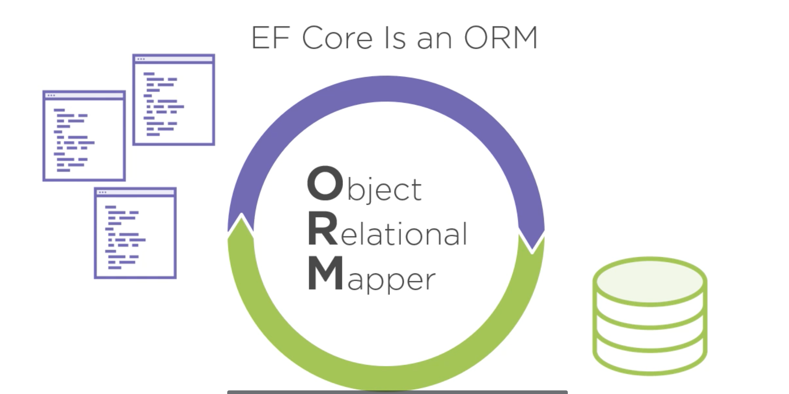
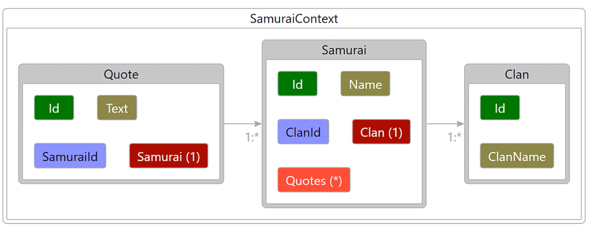

# 00. Présentation d'`Entity Framework Core`

# création de la solution

## ORM Object Relational Mapper



Un `ORM` réduit les frictions entre comment la db est structuré et les classes de l'application.

## Création du projet

On crée une solution

```bash
dotnet new sln
```

Dans le dossier `SamouraiApp`.

```csharp

Microsoft Visual Studio Solution File, Format Version 12.00
# Visual Studio 15
VisualStudioVersion = 15.0.26124.0
MinimumVisualStudioVersion = 15.0.26124.0
Global
	GlobalSection(SolutionConfigurationPlatforms) = preSolution
		Debug|Any CPU = Debug|Any CPU
		Debug|x64 = Debug|x64
		Debug|x86 = Debug|x86
		Release|Any CPU = Release|Any CPU
		Release|x64 = Release|x64
		Release|x86 = Release|x86
	EndGlobalSection
	GlobalSection(SolutionProperties) = preSolution
		HideSolutionNode = FALSE
	EndGlobalSection
EndGlobal

```

### ajout des projets `class library` `console app` et `unit test`

```bash
🦄 SamouraiApp dotnet new classlib -o SamouraiApp.Domain

🦄 SamouraiApp dotnet new classlib -o SamouraiApp.Data

🦄 SamouraiApp dotnet new console -o ConsoleApp

🦄 SamouraiApp dotnet new mstest -o Tests
```

### Ajout des projets à la solution

```bash
🦄 SamouraiApp dotnet sln SamouraiApp.sln add **/*.csproj

Project `ConsoleApp/ConsoleApp.csproj` added to the solution.
Project `SamouraiApp.Data/SamouraiApp.Data.csproj` added to the solution.
Project `SamouraiApp.Domain/SamouraiApp.Domain.csproj` added to the solution.
Project `Tests/Tests.csproj` added to the solution.
```

## Création de trois classes dans `SamouraiApp.Domain`

`Samourai.cs`

`Quote.cs`

`Clan.cs`

## Ajout d'`EF Core 3.1` dans `SamouraiApp.Data`

Il vaut mieux installer un package qui comprends `EF Core` pour un `SBDD` donné.

```bash
dotnet add package Microsoft.EntityFrameworkCore.Sqlite --version 3.1.9
```

`SamouraiApp.Data.csproj`

```csharp
<Project Sdk="Microsoft.NET.Sdk">

  <PropertyGroup>
    <TargetFramework>netstandard2.0</TargetFramework>
  </PropertyGroup>

  <ItemGroup>
    <PackageReference Include="Microsoft.EntityFrameworkCore.Sqlite" Version="3.1.9" />
  </ItemGroup>

</Project>
```

## Création du modèle

Dans `SamouraiApp.Data` :

```csharp
using Microsoft.EntityFrameworkCore;
using SamouraiApp.Domain;

namespace SamouraiApp.Data
{
    public class SamouraiContext : DbContext
    {
        public DbSet<Samourai> Samourais { get; set; }
        public DbSet<Quote> Quotes { get; set; }
        public DbSet<Clan> clans { get; set; }
    }
}
```

`EF core` déduite les tables et les relations d'après ce `DbContext`.

Ajouter la référence à `SamouraiApp.Domain` :

```bash
🦄 SamouraiApp.Data dotnet add reference ../SamouraiApp.Domain/SamouraiApp.Domain.csproj
```



Relations déduites par `EF core` (outil de visual studio).

## Spécifier le fournisseur de données (`data provider`) et la chaine de connexion (`connection string`)

Toujours dans `SamouraiContext.cs`

```csharp
// ...
    public class SamouraiContext : DbContext
    {
       // ...

        protected override void OnConfiguring(DbContextOptionsBuilder optionsBuilder)
        {
            optionsBuilder.UseSqlite("Data Source=./SamouraiAppData");
        }
    }
}
```

`optionsBuilder` va proposer un `UseSomeDataBase` en fonction du package installé.

Ici c'est `UseSqlite` et le `connexion string` est `"Data Source=./SamouraiAppData"`.

La `DB` peut être crée dans la phase de `design` ou au `runtime`.

## Écrire et lire des données : la manière rapide

D'abord on ajoute les références à `SamouraiApp.Domain` et `SamouraiApp.Data` à `ConsoleApp`:

```bash
🦄 ConsoleApp dotnet add reference ../SamouraiApp.Domain/SamouraiApp.Domain.csproj ../SamouraiApp.Data/SamouraiApp.Data.csproj

Reference `..\SamouraiApp.Domain\SamouraiApp.Domain.csproj` added to the project.
Reference `..\SamouraiApp.Data\SamouraiApp.Data.csproj` added to the project.
```
