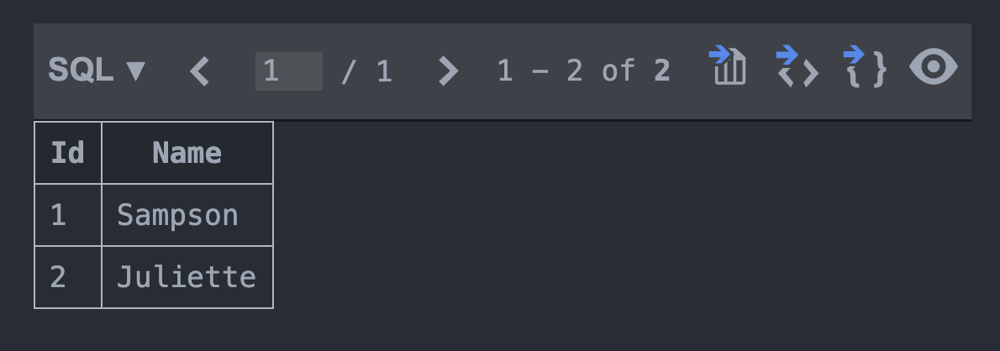
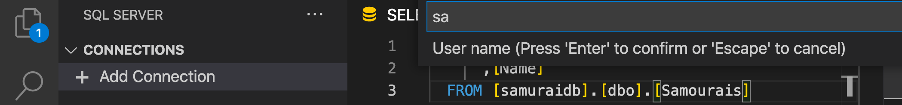

# 03 Créer le `context`

Dans notre projet `SamouraiApp.Data` on va créer une classe `SamouraiContext.cs`.

Cette classe hérite de `DbContext`.

Une classe `DbContext` représente une session avec une base de données et fournit une `api` pour communiquer avec elle :

- connection à la BDD
- Opérations sur les données (requête et persistence) CRUD
- écouter les changements sur les entités (objets)
- construire le modèle
- Mappé les données de la BDD avec les entités de l'application
- Mettre les objets en cache : 
  permet de renvoyer les objets en cache plutôt que de ré-exécuter la même requête
- Gérer les transactions : quand `SaveChanges` est appelée, une transaction est créée.

Dans un `context` on peut définir des `DbSet<Type>`.

Ce sont des `collections` pour une `entité donnée`, il sont une passerelle pour les opérations de BDD.

#### `DbContext` apporte toute la logique pour intéragir avec la `BDD`

```csharp
using Microsoft.EntityFrameworkCore;
using SamouraiApp.Domain;

namespace SamouraiApp.Data;

public class SamouraiContext : DbContext
{
    public DbSet<Samourai> samourais { get; set; } => Set<Samourai>();
    public DbSet<Quote> Quotes { get; set; } => Set<Quote>();
}
```

Grace aux conventions, `EF Core` peut inférer le modèle et les relations d'après les entités du `Domain`.


## Relation `one-to-many`

`EF Core` comprend automatiquement en voyant les propriétés `Samourai` et `SamouraiId` qu'il y a une relation antre `Quote` et `Samourai`.

## Fournir le `provider` à `EF Core`

Cela peut se faire directement dans le `context` : `SamouraiApp.Data/samouraiContext.cs`.

Plus tard une meilleur technique utilisant l'**injection de dépendance** sera utilisé.

```csharp
using Microsoft.EntityFrameworkCore;
using SamouraiApp.Domain;

namespace SamouraiApp.Data
{
    public class SamouraiContext : DbContext
    {
        public DbSet<Samourai> samourais { get; set; }
        public DbSet<Quote> Quotes { get; set; }

        protected override void OnConfiguring(DbContextOptionsBuilder optionsBuilder)
        {
            optionsBuilder.UseSqlite("Data source=localdb.db");
        }
    }
}
```

Le `connection string` est en dur dans le code, en production il pourrait être appelé seulement au `Runtime`.

Pour `Sqlite` il suffit d'écrire `Data source=leNomDeMaDb`.

Avec `EF Core` on peut créer la `BDD` automatiquement au `runtime` ou au `design time` avec la génération du `sql`.


## Provider pour `SQL Server`

```cs
protected override void OnConfiguring(DbContextOptionsBuilder optionsBuilder)
{
    optionsBuilder.UseSqlServer("Server=localhost,1433; Database=samuraidb; User=sa; Password=huk@r2Xmen99");
}
```


## Ajouter les références à `SamouraiApp.UI`

```bash
dotnet add SamouraiApp.UI reference SamouraiApp.Data SamouraiApp.Domain 
```

`SamouraiApp.UI.csproj`

```csharp
<Project Sdk="Microsoft.NET.Sdk">

  <ItemGroup>
    <ProjectReference Include="..\SamouraiApp.Data\SamouraiApp.Data.csproj" />
    <ProjectReference Include="..\SamouraiApp.Domain\SamouraiApp.Domain.csproj" />
  </ItemGroup>

  <PropertyGroup>
    <OutputType>Exe</OutputType>
    <TargetFramework>net5.0</TargetFramework>
  </PropertyGroup>

</Project>
```

### Ajouter les méthodes `AddSamourai` et `GetSamourais`

`samouraiApp.UI/Program.cs`

```csharp
using System;
using System.Linq;
using SamouraiApp.Data;
using SamouraiApp.Domain;

namespace SamouraiApp.UI
{
    class Program
    {
        private static SamouraiContext _context = new SamouraiContext();
        static void Main(string[] args)
        {
            _context.Database.EnsureCreated();
            GetSamourais("Before Add ...");
            AddSamourai();
            GetSamourais(".. After Add");
            Console.Write("... Press any key ...");
            Console.ReadKey();
        }

        private static void AddSamourai()
        {
            var samourai = new Samourai { Name = "Juliette" };

            _context.Samourais.Add(samourai);
            _context.SaveChanges();
        }

        private static void GetSamourais(string text)
        {
            var samourais = _context.Samourais.ToList();
            Console.WriteLine($"{text} : Samourai count is {samourais.Count}");
            foreach (var samourai in samourais)
            {
                Console.WriteLine(samourai.Name);
            }
        }
    }
}
```

`_context.Database.EnsureCreated()` crée la `BDD` si elle n'existe pas. Utiliser cette méthode pour tester pas pour la production.

`_context.Samourais.Add(samourai)` ajoute un `samourai` au `DbSet` (en mémoire).

`_context.SaveChanges()` persiste en `BDD` tous les changements en mémoire non persisté.

`_context.Samourais.ToList()` renvoie une liste, méthode de `System.Linq`.



Les `Id` ont été générées automatiquement par `EF Core`.


## Nouvelle syntaxe des applications `Console` dans `.net 5`

On a plus besoin d'encadrer notre code dans une classe `Program` et dans une méthode `Main`, on peut écrire du code à la suite comme `javascript` :

```cs
using System;
using System.Linq;
using SamouraiApp.Data;
using SamouraiApp.Domain;

SamouraiContext _context = new SamouraiContext();

_context.Database.EnsureCreated();
GetSamourais("Before Add ...");
AddSamourai();
GetSamourais(".. After Add");
Console.Write("... Press any key ...");
Console.ReadKey();

void AddSamourai()
{
    var samourai = new Samourai { Name = "garcia" };

    _context.Samourais.Add(samourai);
    _context.SaveChanges();
}

void GetSamourais(string text)
{
    var samourais = _context.Samourais.ToList();
    Console.WriteLine($"{text} : Samourai count is {samourais.Count}");
    foreach (var samourai in samourais)
    {
        Console.WriteLine(samourai.Name);
    }
}
```

#### Magnifique !!

## Extension `SQL Server` pour VSCode


Il faut juste répondre aux questions pour se connecter :


Pas besoin de renseigner le `port`.




Ce sont les mêmes crédentials de la `connection string`.


Maintenant on peut requête et afficher sa `BDD` directement dans `VSCode` :


