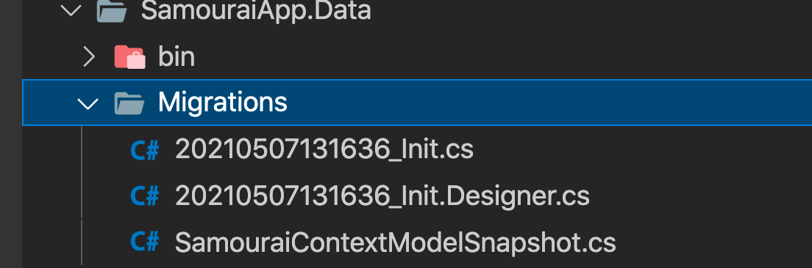

# 04 `Migration` et `Schema`

## Créer une `migration`

Tous les développeur ne peuvent avoir la possibilité de faire des `migrations`, c'est pour cela qu'il faut ajouter un package supplémentaire à `EF Core`.

En ligne de commande, c'est un package à installer pour la machine et non pour le projet :

```bash
dotnet tool install --global dotnet-ef
```


### `Microsoft.EntyFrameworkCore.Design`

Ce sont les templates utilisés pour les migrations :

```bash
dotnet add package Microsoft.EntityFrameworkCore.Design --version 5.0.5
```

```cs
<Project Sdk="Microsoft.NET.Sdk">

  <ItemGroup>
    <ProjectReference Include="..\SamouraiApp.Domain\SamouraiApp.Domain.csproj" />
  </ItemGroup>

  <ItemGroup>
    <PackageReference Include="Microsoft.EntityFrameworkCore.Design" Version="5.0.5">
      <IncludeAssets>runtime; build; native; contentfiles; analyzers; buildtransitive</IncludeAssets>
      <PrivateAssets>all</PrivateAssets>
    </PackageReference>
    <PackageReference Include="Microsoft.EntityFrameworkCore.SqlServer" Version="5.0.5" />
  </ItemGroup>

  <PropertyGroup>
    <TargetFramework>net5.0</TargetFramework>
  </PropertyGroup>

</Project>
```


## Deux commandes importantes

### `dotnet ef migrations add <MonNomDeMigration>`

### `dotnet ef database update`

```bash
dotnet ef

Commands:
  database    Commands to manage the database.
  dbcontext   Commands to manage DbContext types.
  migrations  Commands to manage migrations.
```

```bash
dotnet ef migrations

Commands:
  add     Adds a new migration.
  list    Lists available migrations.
  remove  Removes the last migration.
  script  Generates a SQL script from migrations.
```

```bash
dotnet ef database

Commands:
  drop    Drops the database.
  update  Updates the database to a specified migration.
```


## Changement des `classlib` avec `.net 5`

Avec `.net 5`, une `classlib` peut faire tourner une `migration`.

```bash
➜  SamouraiApp.Data dotnet ef migrations add Init
Build started...
Build succeeded.
Done. To undo this action, use 'ef migrations remove'
```



### `snapshot`

Le fichier `Snapshot` est utilisé par `EF Core` pour déterminer comme créer un migration entre un modèle et sa prochaine version.

### `Init`

Posséde toutes les infos pour créer la `BDD` :

```cs
migrationBuilder.CreateTable(
    name: "Samourais",
    columns: table => new
    {
        Id = table.Column<int>(type: "int", nullable: false)
            .Annotation("SqlServer:Identity", "1, 1"),
        Name = table.Column<string>(type: "nvarchar(max)", nullable: true)
    },
    constraints: table =>
    {
        table.PrimaryKey("PK_Samourais", x => x.Id);
    });
```

On voit que la clé primaire est définie sur l'`Id`.

```cs
// idem pour "Quotes"

constraints: table =>
{
    table.PrimaryKey("PK_Quotes", x => x.Id);
    table.ForeignKey(
        name: "FK_Quotes_Samourais_SamouraiId",
        column: x => x.SamouraiId,
        principalTable: "Samourais",
        principalColumn: "Id",
        onDelete: ReferentialAction.Cascade);
});
```

Les relations sont aussi déduites des classes du `Domain`, ici une `one-to-many`.

```cs
migrationBuilder.CreateIndex(
    name: "IX_Quotes_SamouraiId",
    table: "Quotes",
    column: "SamouraiId");
```

Un `index` est créé sur la clé étrangère.


## Utiliser les `migrations`

On peut au choix laisser `EF Core` généré la `BDD` ou seulement le `script SQL`.