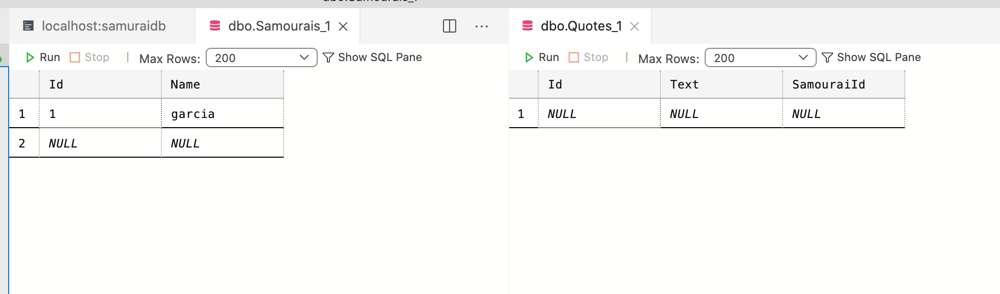
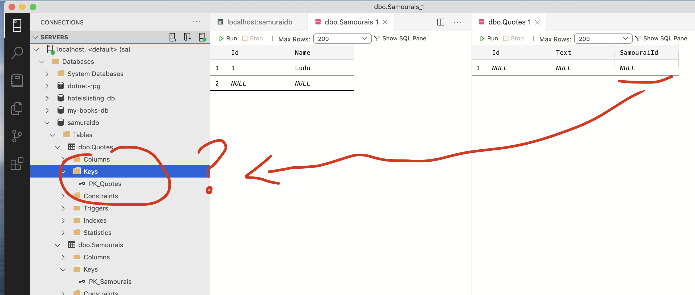
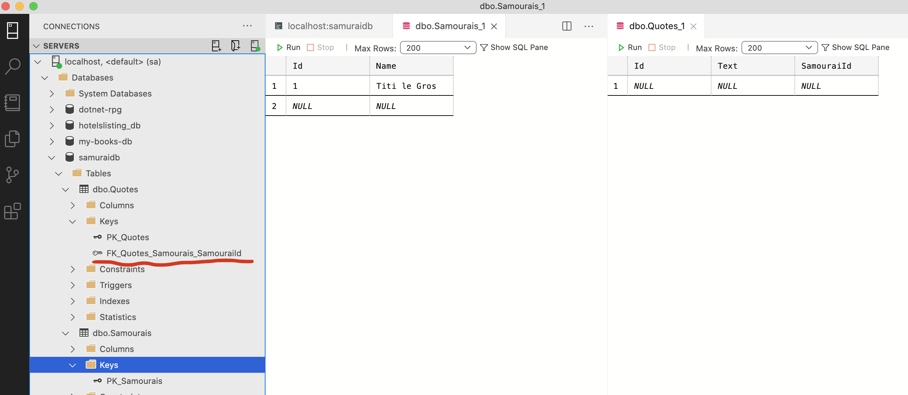
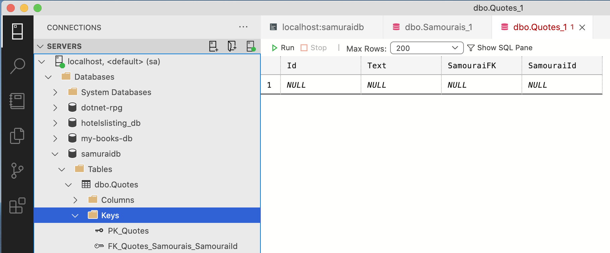

# 06 `One-To-Many`

C'est ce qu'on appelle une relation `Parent-Enfant`


## Relation  dans le `Parent`

Le `parent` contient une collection de l'`enfant` :

```cs
public class Samourai
{
    public int Id { get; set; }
    public string Name { get; set; }
    public List<Quote> Quotes { get; set; } = new List<Quote>();
}
```

`EF Core` reconnait :

- `List<T>`
- `Enumerable<T>`
- `Collection<T>`

L'`enfant` lui ne contient rien :

`Enfant`

```cs
public class Quote
{
    public int Id { get; set; }
    public string Text { get; set; }
}
```


C'est suffisant pour que `EF Core` crée la relation en `BDD` :




## Relation dans l'`Enfant`

### 1. Juste ajouter l'`Id` d'un `Samurai`

Maintenant c'est seulement l'`enfant` qui contient la relation :

`Parent`

```cs
public class Samourai
{
    public int Id { get; set; }
    public string Name { get; set; }
}
```

`Enfant`

```cs
public class Quote
{
    public int Id { get; set; }
    public string Text { get; set; }
    public int SamouraiId { get; set; }
}
```

Dans ce cas la relation n'est pas créée car `SamouraiId` n'est pas enregistrée comme un clé étrangère :




### 2. Juste ajouter un objet `Samurai`

`Parent`

```cs
public class Samourai
{
    public int Id { get; set; }
    public string Name { get; set; }
}
```

`Enfant`

```cs
public class Quote
{
    public int Id { get; set; }
    public string Text { get; set; }
    public Samourai Samourai { get; set; }
}
```



Cela fonctionne.


## Implication de l'implémentation des classes du `Domain`

Si `Quote` contient une référence vers `SamouraiId`, cette propriété n'est pas `nullable` en base de données.

`Parent`

```cs
public class Samourai
{
    public int Id { get; set; }
    public string Name { get; set; }
    public List<Quote> Quotes { get; set; } = new List<Quote>();
}
```

`Enfant` :

```cs
public class Quote
{
    public int Id { get; set; }
    public string Text { get; set; }
    public int SamouraiId { get; set; }
}
```


`migration` :

```cs
migrationBuilder.AlterColumn<int>(
    name: "SamouraiId",
    table: "Quotes",
    type: "int",
    nullable: false,  // <= pas nullable
    defaultValue: 0,
    oldClrType: typeof(int),
    oldType: "int",
    oldNullable: true);

migrationBuilder.AddForeignKey(
    name: "FK_Quotes_Samourais_SamouraiId",
    table: "Quotes",
    column: "SamouraiId",
    principalTable: "Samourais",
    principalColumn: "Id",
    onDelete: ReferentialAction.Cascade);
```

Si on retire juste la propriété `SamouraiId` de `Quote` on a bien une `Foreign Key` mais elle est nullable :

`migration`

```cs
migrationBuilder.AlterColumn<int>(
    name: "SamouraiId",
    table: "Quotes",
    type: "int",
    nullable: true,  // <= nullable cette fois
    oldClrType: typeof(int),
    oldType: "int");

migrationBuilder.AddForeignKey(
    name: "FK_Quotes_Samourais_SamouraiId",
    table: "Quotes",
    column: "SamouraiId",
    principalTable: "Samourais",
    principalColumn: "Id",
    onDelete: ReferentialAction.Restrict);
```

Cela signifie qu'on peut avoir des `Quote` qui ne sont pas reliée à un `Samurai`.

### Nullable Property

Un `int` n'est pas `nullable`, mais un `Samurai` l'est.

Si on a une implémentation comme ceci :

```cs
public class Samourai
{
    public int Id { get; set; }
    public string Name { get; set; }
    public List<Quote> Quotes { get; set; } = new List<Quote>();
}
```

```cs
public class Quote
{
    public int Id { get; set; }
    public string Text { get; set; }
    public Samourai Samourai { get; set; }
}
```

Une `Quote` peut très bien ne pas avoir de `Samurai` :

`migration` :

```cs
migrationBuilder.AlterColumn<int>(
    name: "SamouraiId",
    table: "Quotes",
    type: "int",
    nullable: true,
    oldClrType: typeof(int),
    oldType: "int");
```


## Override les noms des clés

`EF Core` fonctionne sur des conventions de noms, et une propriété nommée `SamuraiFK` ne sera pas considérée comme candidate pour une clé étrangère :



`EF Core` va créer par convention une `Foreign Key` nommée `SamuraiId` et garder une propriété `SamuraiFK` qui n'est pas considérée comme `Foreign Key`.

