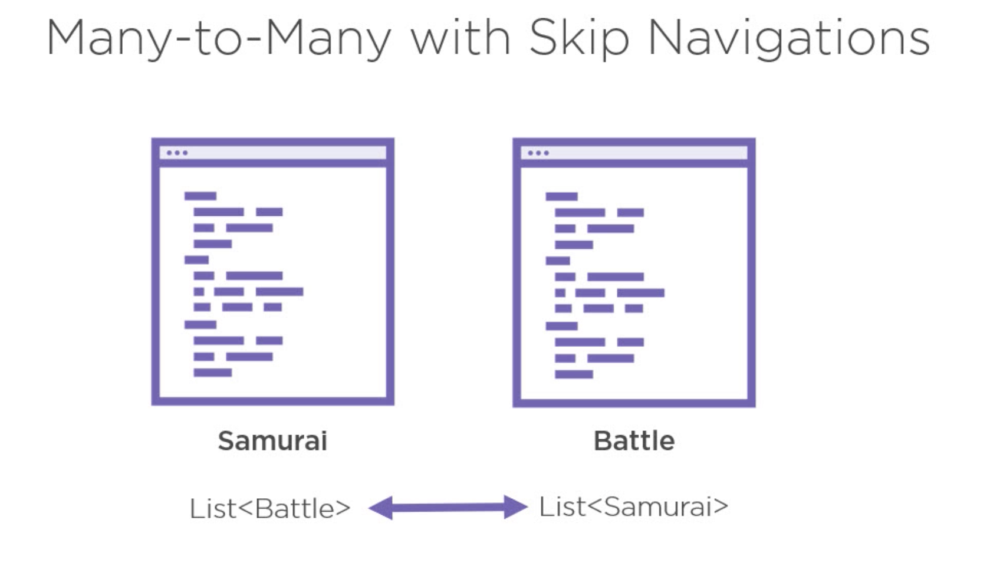
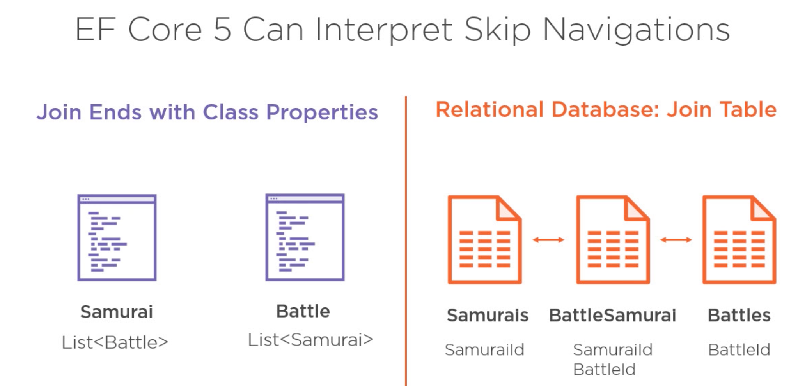
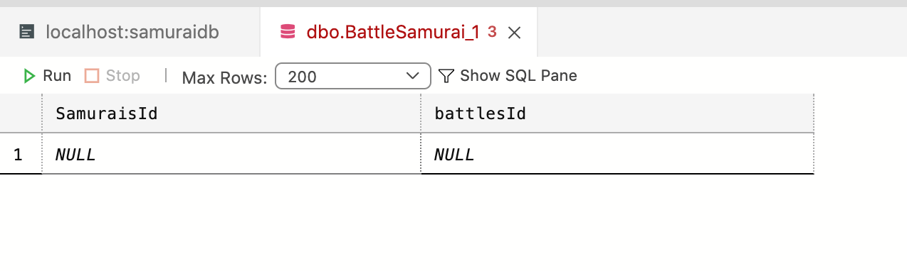

# 07 `Many-To-Many`

On ajoute une classe `Battle` au `Domain`.

Il y a plusieurs `Samurai` dans une `Battle` et un `Samurai` participe à plusieurs `Battle`.



Il suffit d'ajouter une `List` dans chaque `Class`.

## Classe `Battle`

```cs
using System.Collections.Generic;

namespace SamouraiApp.Domain
{
    public class Battle
    {
        public int BattleId { get; set; }
        public string Name { get; set; }
        public List<Samurai> Samurais { get; set; } = new();
    }
}
```


## Classe `Samurai` 

```cs
using System.Collections.Generic;

namespace SamuraiApp.Domain
{
    public class Samurai
    {
        public int Id { get; set; }
        public string Name { get; set; }
        public List<Quote> Quotes { get; set; } = new();
        public List<Battle> battles { get; set; } = new();
    }
}
```


## Table de jointure



`EF Core` est capable de déduire (d'inférer) une table de `jointure` en interprétant les propriétés `List` de chaque classe du `Domain`.


## `DbContext`

Il suffit d'ajouter un nouveau `DbSet` à `SamouraiContext` :

```cs
public class SamuraiContext : DbContext
{
    public DbSet<Samurai> Samurais { get; set; }
    public DbSet<Quote> Quotes { get; set; }
    public DbSet<Battle> Battles { get; set; }
```

### `Migration`

```bash
dotnet ef migrations add Battle
```

Le résultat montre la création d'une table de jointure :

```cs
migrationBuilder.CreateTable(
    name: "BattleSamurai",
    columns: table => new
    {
        SamuraisId = table.Column<int>(type: "int", nullable: false),
        battlesBattleId = table.Column<int>(type: "int", nullable: false)
    },
    constraints: table =>
    {
        table.PrimaryKey("PK_BattleSamurai", x => new { x.SamuraisId, x.battlesBattleId });
        table.ForeignKey(
            name: "FK_BattleSamurai_Battles_battlesBattleId",
            column: x => x.battlesBattleId,
            principalTable: "Battles",
            principalColumn: "BattleId",
            onDelete: ReferentialAction.Cascade);
        table.ForeignKey(
            name: "FK_BattleSamurai_Samurais_SamuraisId",
            column: x => x.SamuraisId,
            principalTable: "Samurais",
            principalColumn: "Id",
            onDelete: ReferentialAction.Cascade);
    });
```

Je vais supprimer l'ancienne `BDD` avant de construire la nouvelle :

```bash
dotnet ef database drop

dotnet ef database update
```


La concaténation du nom de la table avec la clé primaire donne le nom de la colonne.

Pour éviter un nom comme `battlesBattleId`, il vaut mieux appeler la clé primaire juste `Id` dans tous les cas.



