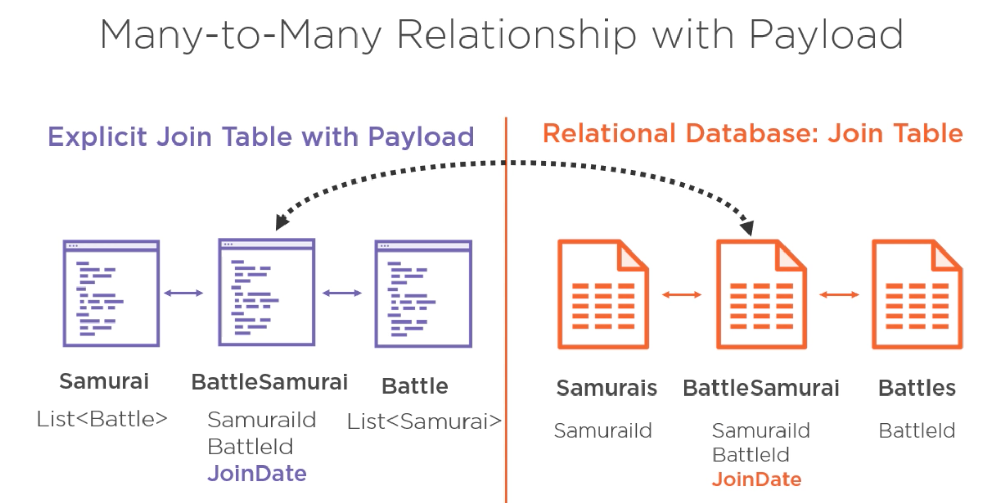
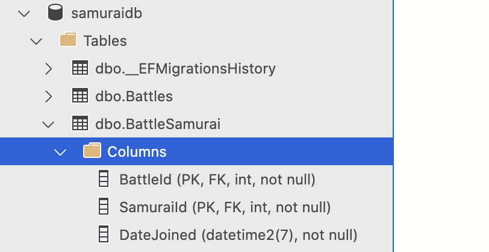

# `Many-To-Many` with `Payload`


## Relation `Many-To-Many` avec données additionnelle


On veut ajouter une date à la relation.

Pour ce faire on doit explicitement créer une classe de jointure `BattleSamurai` et lui ajouter la propriété voulue :

```cs
using System;

namespace SamuraiApp.Domain
{
    public class BattleSamurai
    {
        public int BattleId { get; set; }
        public int SamuraiId { get; set; }
        public DateTime DateJoined { get; set; }
    }
}
```




## Ajout d'un `mapping` dans `SamuraiContext`

`EF Core` utilise des conventions pour créer le Mapping entre le `Domain` et la `BDD`.

On peut `overrider` le comportement par défaut avec `Fluent API`.

```cs
modelBuilder.Entity<Quotes>()
    .Property(q => q.Text)
	.HasColumnName("Line");
```

Les possibilités sont gigantesques.

On peut aussi utiliser les `Data Annotations` directement dans les classes du `Domain` :

```cs
[Column("Line")]
public string Text { get; set; }
```

### Description de `Many-ToMany`

```cs
modelBuilder
    .Entity<Entity1>
    .HasMany(e1 => e1.Entity2List)
    .WithMany(e2 => e2.Entity1List)
```

On définit la relation avec `HasMany` et `WithMany`.

### `OnModelCreating`

```cs
protected override void OnModelCreating(ModelBuilder modelBuilder)
{
    modelBuilder.Entity<Samurai>()
        .HasMany(s => s.Battles)
        .WithMany(b => b.Samurais)
        .UsingEntity<BattleSamurai>(
        	bs => bs.HasOne<Battle>().WithMany(),
        	bs => bs.HasOne<Samurai>().WithMany()
    	)
        .Property(bs => bs.DateJoined)
        .HasDefaultValueSql("getdate()");
}
```


Ici c'est ce que déduit `EF Core` automatiquement en observant le modèle.

Ensuite on ajoute une propriété à la table de jointure avec `Property` et on attribue une valeur par défaut donné par la base de données (`getdate()`).


## Mapper les noms de colonne avec `Fluent`

```cs
modelBuilder.Entity<BattleSamurai>()
    .Property(bs => bs.SamuraiId)
    .HasColumnName("samId")
```

Par exemple.


## Mapper les noms de table

La table prend le nom du `DbSet`.

Si comme dans le cas d'une table de jointure, il n'y a pas de `DbSet`, la table prend le nom de la classe.

Sinon avec le `modelBuilder` :

```cs
modelBuilder
    .Entity<MaClasse>()
    .ToTable("SuperTable");
```


## `Migration`

```bash
dotnet ef migrations add BattleSamuraiPayload
```


### `migrations list`

```bash
dotnet ef migrations list

20210508141620_Battle
20210508142456_BattleId
20210508153407_BattleSamuraiPayload (Pending)

dotnet ef database update
```

On a le status de la `migration` en attente : `pending`.



