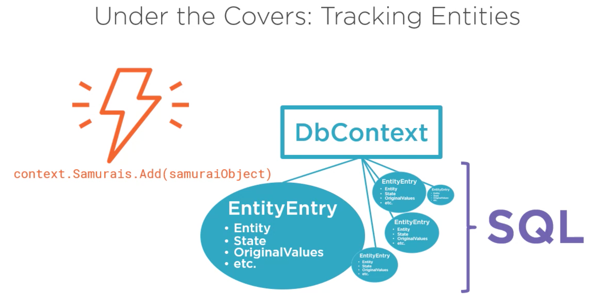
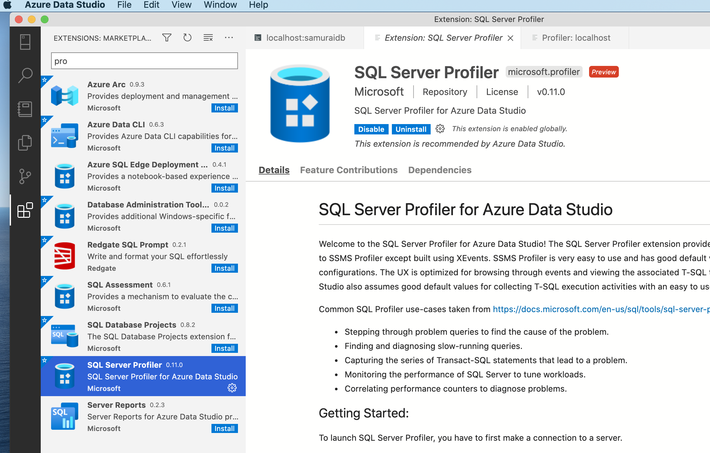
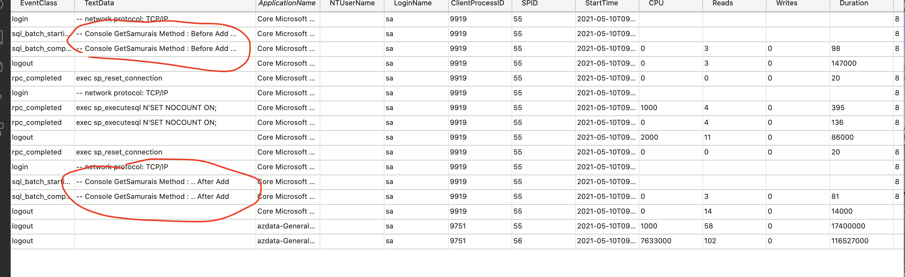

# 10 `SQL` construit par `EF Core`


## Modification de `AddSamurai`

```cs
void AddSamurai(params string[] names)
{

    foreach (string name in names)
    {
        _context.Samurais.Add(new Samurai { Name = name });
    }

    _context.SaveChanges();
}
```

`params string[] names` permet de transformer une liste de `string` de taille indéterminée en tableau :

```cs
AddSamurai("Tobi", "Perci");
```


## `EntityEntry`

`EntityEntry` est une classe interne de `DbContext`.



`EF Core` crée des `EntityEntry` pour suivre (`tracker`) les changements dans le `context`.

Ensuite toutes ces `EntityEntry` sont transformées en requête `SQL` par `EF Core` qui sera exécutée sur la `BDD`.

`EF Core` utilise des `transactions` quand `SaveChanges` est appelée.

Il est possible de modifier le comportement de la transaction, mais c'est un réglage avancé.


## `TagWith`

On peut ajouter des commentaires aux requêtes `SQL` générées par `EF Core` en utilisant `TagWith`.

```cs
using Microsoft.EntityFrameworkCore;

void GetSamurais(string text)
{
    var samurais = _context.Samurais
        .TagWith("Console GetSamurais Method")
        .ToList();
    // ...
```


### SQL Server Profiler

Il faut d'abord installer `SQL Server Profiler` dans `Azure Data Studio `:

 

Ensuite `shift + cmd + p` comme sur `VSCode`.

On peut voire les commentaires ajouté dans le `profiler` :



Les `--` devant permettent d'éviter les attaques par injection.

