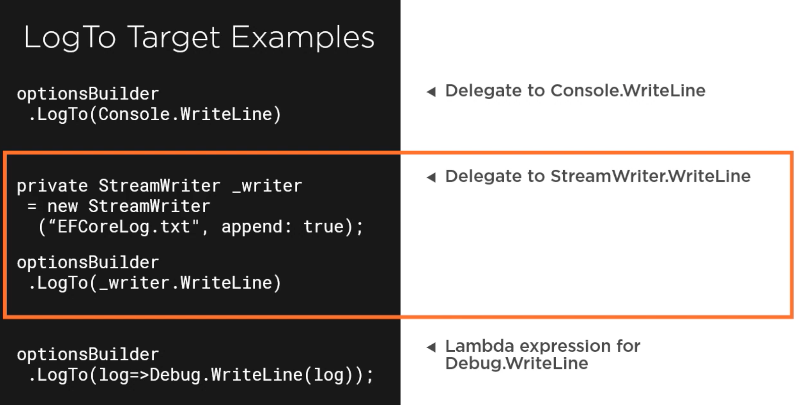
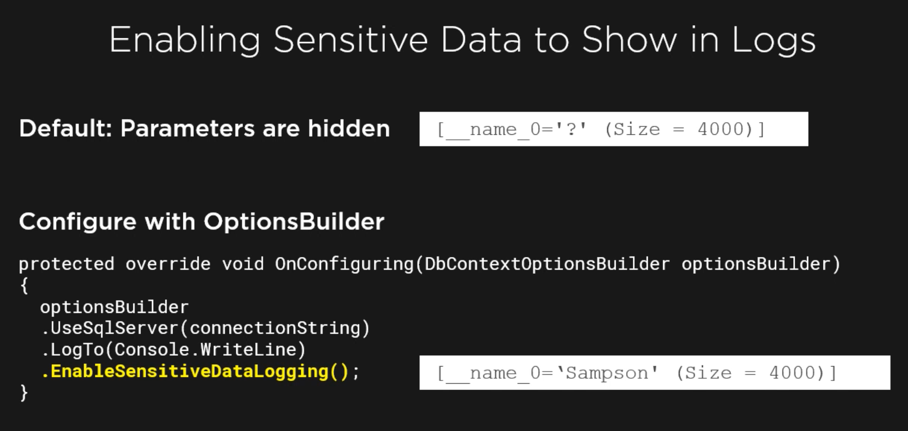

# 11 système de `Log`

## `Microsoft.Extensions.Logging`

On va placer pour l'instant le système de `Logging` directement dans `SamuraiContext`.

Le `Logging` fait parti des options de configuration de `DbContext`.

```cs
protected override void OnConfiguring(DbContextOptionsBuilder optionsBuilder)
{
    optionsBuilder
        .UseSqlServer("Server=localhost,1433; Database=samuraidb; User=sa; Password=huk@r2Xmen99")
        .LogTo();
}
```

### `optionsBuilder.LogTo()`



Je vais implémenter le log dans un fichier :

```cs
private StreamWriter _writer = new StreamWriter("HukerLog.txt", append: true);

optionsBuilder
    	.LogTo(_writer.WriteLine);
```

Le `Log` est très verbeux.

Pour la suite je vais juste afficher les `Logs` dans la `Console` et filtrer ce qui m'intéresse.

```cs
protected override void OnConfiguring(DbContextOptionsBuilder optionsBuilder)
{
    optionsBuilder
        .UseSqlServer("Server=localhost,1433; Database=samuraidb; User=sa; Password=huk@r2Xmen99")
        // .LogTo(_writer.WriteLine);
        .LogTo(Console.WriteLine, new[] { DbLoggerCategory.Database.Command.Name });
}
```

Je n'ai plus que les commandes créer par `EF Core` dans les `Logs` :

```bash
info: 10/05/2021 11:56:18.600 RelationalEventId.CommandExecuted[20101] (Microsoft.EntityFrameworkCore.Database.Command) 
      Executed DbCommand (2ms) [Parameters=[@p0='?' (Size = 4000)], CommandType='Text', CommandTimeout='30']
      SET NOCOUNT ON;
      INSERT INTO [Samurais] ([Name])
      VALUES (@p0);
      SELECT [Id]
      FROM [Samurais]
      WHERE @@ROWCOUNT = 1 AND [Id] = scope_identity();
# ...
      
      SELECT [s].[Id], [s].[Name]
      FROM [Samurais] AS [s]
info: 10/05/2021 11:56:18.618 RelationalEventId.CommandExecuted[20101] (Microsoft.EntityFrameworkCore.Database.Command) 
      Executed DbCommand (2ms) [Parameters=[], CommandType='Text', CommandTimeout='30']
      -- Console GetSamurais Method : .. After Add
      
      SELECT [s].[Id], [s].[Name]
      FROM [Samurais] AS [s]
# ...
```

On va aussi régler le niveau de `Log` :

```cs
using Microsoft.Extensions.Logging;
// ...

optionsBuilder
                .UseSqlServer("Server=localhost,1433; Database=samuraidb; User=sa; Password=huk@r2Xmen99")
                // .LogTo(_writer.WriteLine);
                .LogTo(Console.WriteLine,
                    new[] { DbLoggerCategory.Database.Command.Name },
                    LogLevel.Information);
```

On obtient juste les requête `sql` :

```bash
info: 10/05/2021 14:05:49.228 RelationalEventId.CommandExecuted[20101] (Microsoft.EntityFrameworkCore.Database.Command) 
      Executed DbCommand (15ms) [Parameters=[@p0='?' (Size = 4000)], CommandType='Text', CommandTimeout='30']
      SET NOCOUNT ON;
      INSERT INTO [Samurais] ([Name])
      VALUES (@p0);
      SELECT [Id]
      FROM [Samurais]
      WHERE @@ROWCOUNT = 1 AND [Id] = scope_identity();
info: 10/05/2021 14:05:49.244 RelationalEventId.CommandExecuted[20101] (Microsoft.EntityFrameworkCore.Database.Command) 
      Executed DbCommand (2ms) [Parameters=[@p0='?' (Size = 4000)], CommandType='Text', CommandTimeout='30']
      SET NOCOUNT ON;
      INSERT INTO [Samurais] ([Name])
      VALUES (@p0);
      SELECT [Id]
      FROM [Samurais]
      WHERE @@ROWCOUNT = 1 AND [Id] = scope_identity();
info: 10/05/2021 14:05:49.262 RelationalEventId.CommandExecuted[20101] (Microsoft.EntityFrameworkCore.Database.Command) 
      Executed DbCommand (2ms) [Parameters=[], CommandType='Text', CommandTimeout='30']
      -- Console GetSamurais Method : .. After Add
      
      SELECT [s].[Id], [s].[Name]
      FROM [Samurais] AS [s]
```


## Afficher les données sensibles



Par défaut les `logs` n'affichent pas les données dans les requête, en ajoutant `EnableSensitiveDataLogging`, on récupère ces données :

```cs
info: 10/05/2021 14:09:36.409 RelationalEventId.CommandExecuted[20101] (Microsoft.EntityFrameworkCore.Database.Command) 
      Executed DbCommand (15ms) [Parameters=[@p0='Michel' (Size = 4000)], CommandType='Text', CommandTimeout='30']
      SET NOCOUNT ON;
      INSERT INTO [Samurais] ([Name])
      VALUES (@p0);
      SELECT [Id]
      FROM [Samurais]
      WHERE @@ROWCOUNT = 1 AND [Id] = scope_identity();
```


