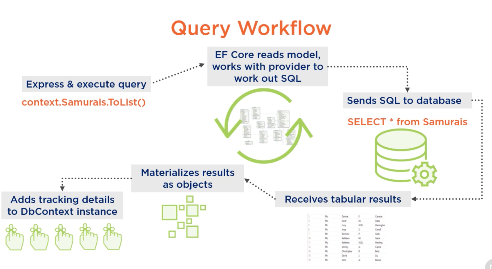
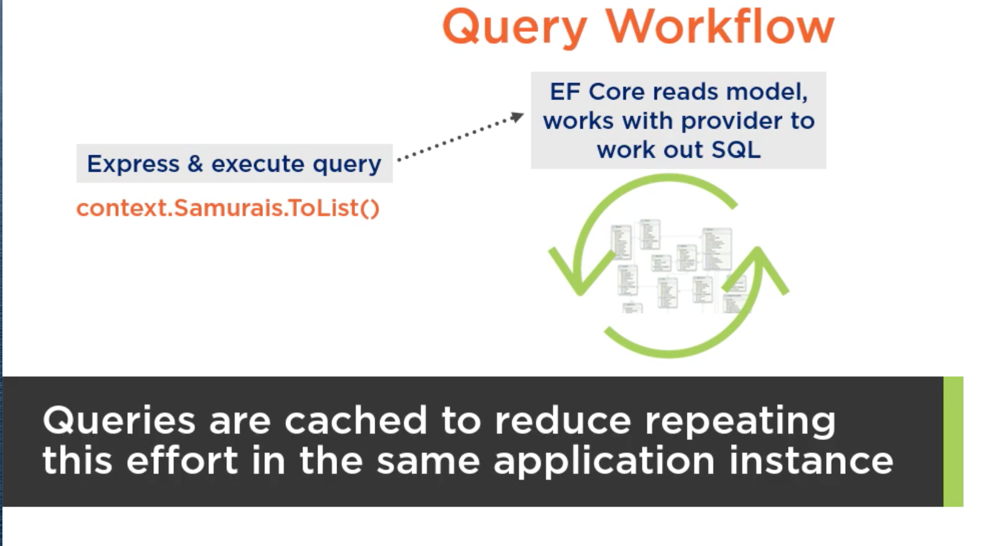
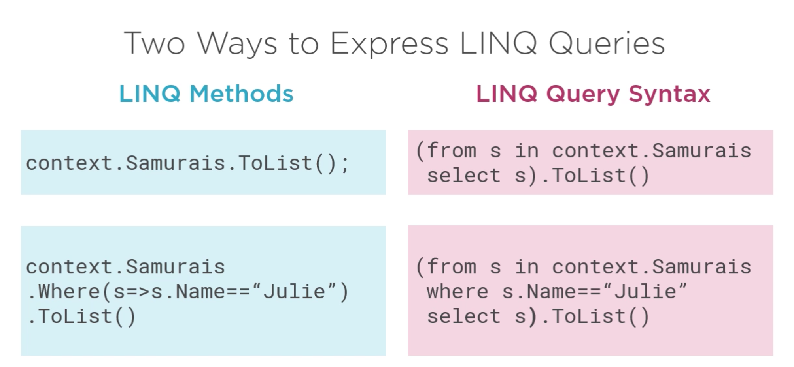
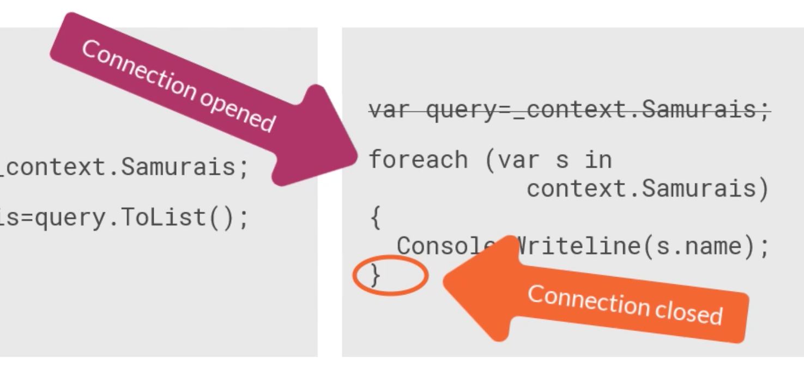

# 13 `Query` Workflow


## `_context.Samurai.ToList()`



La première chose que fait `EF Core` c'est déduire la requête `SQL` du modèle.

`EF Core` est capable de mettre en cache le `sql` créé si besoin.



`DbContext` va créer un `EntityEntry` pour chaque nouvelles entrées afin de pouvoir `tracker` les changements.


## `Linq` deux types de syntaxe




## Exécution de la requête

```cs
var query = _context.Samurais;

var samurais = query.ToList();
```

C'est l'appelle à `ToList` qui va exécuter la requête.

On pourrait itérer directement sur la requête :

```cs
var query = _context.samurais;

foreach( var s in query)
{
    Console.WriteLine(s.Name)
}
```

ou plus simplement :

```cs
foreach(var s in _context.Samurais)
{
    Console.WriteLine(s.Name);
}
```

Mais attention car la connection reste ouverte tout le long du traitement :



Si il y a un traitement conséquent à l'intérieur de la boucle, cela pourrait avoir un impacte sur les autres utilisateurs ou sur les performances.

Il vaut mieux d'abord récupérer les enregistrements puis ensuite les utiliser :

```cs
var samurais = _context.samurais.ToList();

foreach(var s in samurais)
{
    // mon traitement
}
```

