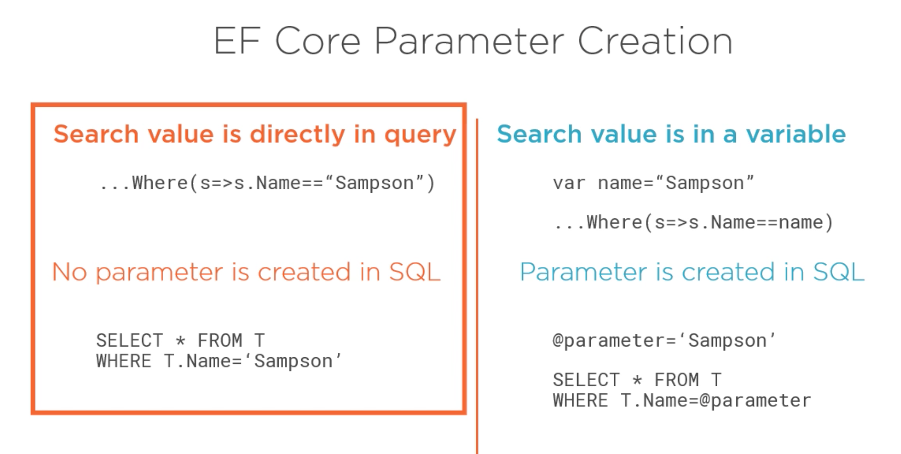
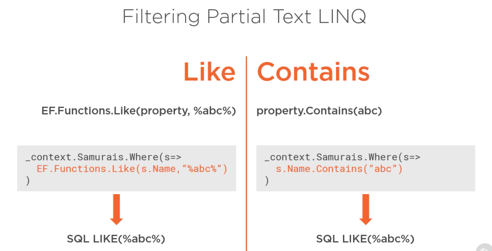

# 14 `Filtering`

## `Where`

```cs
var samurais = _context.Samurais
    						.Where(s => s.Name == "Ido")
    						.ToList();
```

On obtient la requête `SQL` suivante :

```sql
Executed DbCommand (26ms) [Parameters=[], CommandType='Text', CommandTimeout='30']
      SELECT [s].[Id], [s].[Name]
      FROM [Samurais] AS [s]
      WHERE [s].[Name] = N'Robi'
```

Pourquoi la nom est *hard-codé* et pas mis en paramètre ?



Si la valeur vient d'une valeur littéral alors `EF Core` va aussi *hard-coder* cette valeur, car elle est considérée être entrée par le développeur.

Par contre si la valeur vient d'une variable, `EF Core` va utiliser une valeur paramètre car la donnée est probablement passée par l'utilisateur.

```cs
QueryFilter("Robi");

void QueryFilter(string name)
{
    var samurais = _context.Samurais
        .Where(s => s.Name == name)
        .ToList();
}
```

```sql
Executed DbCommand (31ms) [Parameters=[@__name_0='Robi' (Size = 4000)], CommandType='Text', CommandTimeout='30']
      SELECT [s].[Id], [s].[Name]
      FROM [Samurais] AS [s]
      WHERE [s].[Name] = @__name_0
```

#### ` WHERE [s].[Name] = @__name_0`


## `Like`



```cs
var samurais = _context.Samurais.Where(s => EF.Functions.Like(s.name, "P%")).ToList();
```

La méthode `Contains` se traduis aussi par un `Like SQL`.

```sql
Executed DbCommand (18ms) [Parameters=[], CommandType='Text', CommandTimeout='30']
      SELECT [s].[Id], [s].[Name]
      FROM [Samurais] AS [s]
      WHERE [s].[Name] LIKE N'%o%'
```

Si on veut une valeur paramétrée,  on peut passer la chaine âr une variable :

```cs
QueryFilter("%o%");

void QueryFilter(string queryString)
{
    var samurais = _context.Samurais
        .Where(s => EF.Functions.Like(s.Name, queryString))
        .ToList();
}
```

```sql
Executed DbCommand (30ms) [Parameters=[@__queryString_1='%o%' (Size = 4000)], CommandType='Text', CommandTimeout='30']
      SELECT [s].[Id], [s].[Name]
      FROM [Samurais] AS [s]
      WHERE [s].[Name] LIKE @__queryString_1
```

